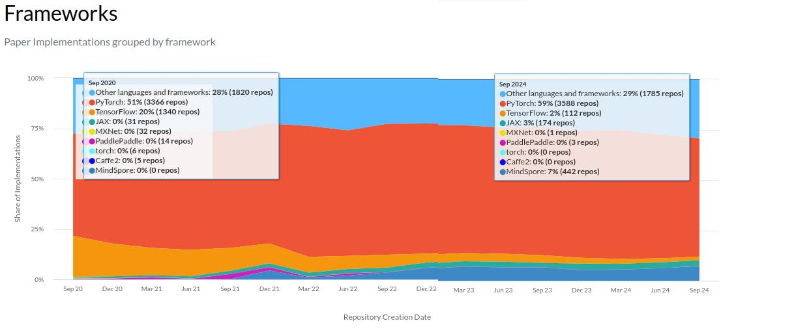

# 深入学习理解Pytorch学习笔记 第0节：引言、目录与学习材料

## 引言
> 时间紧缺、急着学干货的学生和已经非常熟悉AI框架的大佬直接跳过此段，看看目录和材料。这段属于作者的碎碎念，毕竟每本书都有这一栏目，所以写来装装样子，闲人可以随便看看。

在如今的大模型时代（2026年），作为AI infra从业者，深入机器学习底层框架的能力应该是必不可少的。而Pytorch，作为机器学习框架的绝对主流，我觉得是非常值得学习的。下面这是一张截止到2024年9月的，Paper-with-code所收录的学术论文中采用的深度学习框架进行实现的占比。



可以看出，Pytorch在学术界的占比在2024年就已经高达59%。随着这几年ai大模型的涌现，大量模型都在采用Megatron进行训练，采用vLLM、SGLang进行推理。而Pytorch在其中作为这些更上层的训练、推理引擎的基础框架，个人认为其占比很有可能早已超越了60%。只可惜Paper-with-code已经被纳入huggingface，且不再公布这些框架占比数据，具体数据已无从得知。(其实还是可以的，搞个爬虫搜集整理一下就行，用Claude code应该不难实现。挖个坑，以后有机会再填。)

大家都在用着Pytorch，但清楚Pytorch内部机制的人不多。至少在第0节的作者本人，也只是在工作中用到一块学一块，我觉得也顶多一知半解。

总之，出于如上的理由，作者打算深入学习理解Pytorch，并记录下来学习经历。一方面，作为记录，日后可以回顾并提醒自己；另一方面，作为一种学习路线指引，可以帮助其他想要了解AI底层加速的同学。（毕竟我初入AI infra时，根本不知道咋学）

还有最重要的一点：我希望我的读者读到我的文章时，眼前浮现的不是一个老师，而是一个同学，一个共同成长的伙伴。大多数博客都以教学为主，作者都以老师的角色为读者进行讲解。很少有见到以同伴视角进行陪伴式学习叙述的博客。

而此刻的我并不是所谓的专家老师，而是一个即将开启学习的实际从业者。我希望留给读者的是一条切实可行的道路，因为**我就这么走过**。于是在后面每一节博文中，我都会以相对标准化的文章格式进行叙述，格式如下：

```markdown

## 资料来源
由于本博文是我对资料的理解、加工与整理，附带了我的个人实践与思考，可能并非完全准确。考虑到不可避免地会对读者产生一些引导，我会在开头先给出学习资料的来源，便于读者获取第一手资料进行一同学习。

## 先猜再学
在正式进入学习之前，先根据文章标题、资料标签等关于资料的元信息和我自己起初的想法，预想可以从中学到的东西。增强在学习过程中的主动参与感，带着问题找答案。

### 当前状态背景
每个人的学习经历和背景是不同的。在此会阐明我个人关于本次学习主题上的既有知识与能力背景。读者如果遇到认为叙述过于简略或者理解不清的部分，可以参考我的背景补充学习相应的知识。

### 期望回答的问题
预测想要学习到的内容。除了单纯根据学习资料本身，还会根据我平时的实践情况，带上我平时的一些疑问。即：
- 资料主题的疑问
- 实践中的问题（如有）

### 我的直觉
关于以上问题，我会给出我的直觉上的简单想法。对于来自我平时实践中的疑问，我还会给出实践中的一些处理办法，不一定是最优的，但至少能做到临时解决。即：
- 直觉上的简单想法
- 实践中的解决方案（如有）


## 学习过程
过程章节应该是博文的主要组成部分。在这里，我会按照主题进行分别总结叙述，不会按照原资料的自然顺序。在每一个主题中，我主要会讲述：
1. 原文的主要思想；
2. 我的思考与理解：
    1. 对问题的质疑和反思；
    2. 有时产生的误解；
    3. 对难点的理解。
3. 可能的图示（我会借助AI工具生成一些可交互动图）；
4. 源码 / 文档锚点 ；
5. 反直觉点；
6. 尚未理解的问题。
其中第1和第2大点在每个主题里应该都会存在，但其他部分不是一定会有。

## 读后回顾
带上这些疑问，完整学习完一遍资料之后。重新回顾有没有解决预先提出的疑问，并将我的直觉想法与解决办法和资料中提出的办法之间进行对比。
- 回答预先提出的疑问
- 对比我的直觉与资料提出的思路办法

## 实践
实践是检验真理的唯一标准。
在学习完资料之后，我会开展一些小型的实验进行测试验证，加深理解。
但实践实验相对单纯学习资料会需要更多工作，我不一定在文章初次发布时就带上实践实验，可能会在节假日开展相关实验。

## 下游透镜
在这个板块，我会将学习到的内容与实际中工作和面试相联系。让知识不止停留在学和简单的实践demo，而是真正地用起来。
### 过往经验
如果这部分与过去的工作相关，我会额外分享一些过往的处理经验。不一定普适，但可作为参考借鉴。

### 面试问题Q&A
很多人学习AI的目的都是想找一份AI相关的工作，那么这一节总是不可或缺的。我会构造几个可能在面试中问到的问题，并给出我的理解和想法。同样不一定准确，恳请各位读者大佬补充指正。

## 思维导图总结
在这个板块，我会将整体思路整理成思维导图形式，凝练逻辑，并且便于快速后续回顾。

## 后续预告
有时学完整个流程，依旧会存在一些尚不清晰的点。所以此板块主要会涉及以下内容：
- 依旧迷惑的问题
- 由此延伸出的一些想法
- 按照既定学习计划的下一节博文预告

```

采用以上文章格式是我与Claude 对话中总结的。一方面采用相对固定的格式可以让我这个第一次写博客文章的新人易于上手，另一方面读者也可以快速找到想看的内容。缺点是固定的格式缺少了一些文章的变化趣味，未来会考虑改进这一点。

最后，有个事先说在前头：本系列博文并非对代码、机制与理论等等事物的直接解读，而是对资料的整理总结。直接阅读博文可能会产生一些不明所以的疑问。我会尽量做到没看过原始资料的读者也依旧能够无卡顿地阅读完博文，但强烈推荐与原始资料一同阅读，或者看完原始资料之后再来阅读。

那么，让我们开始吧！