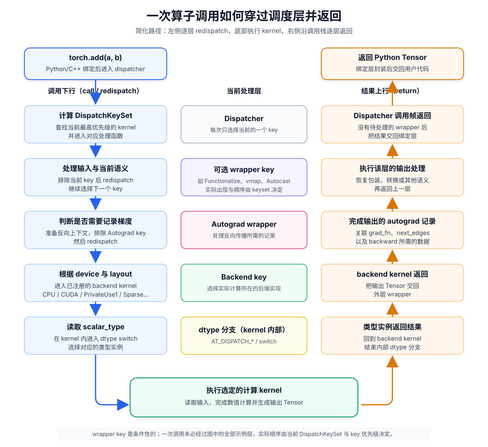
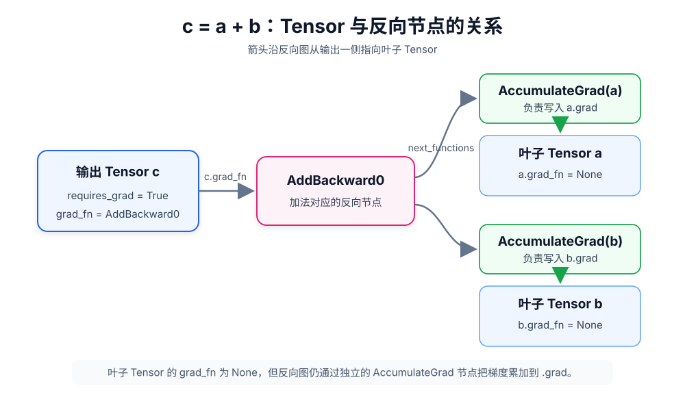
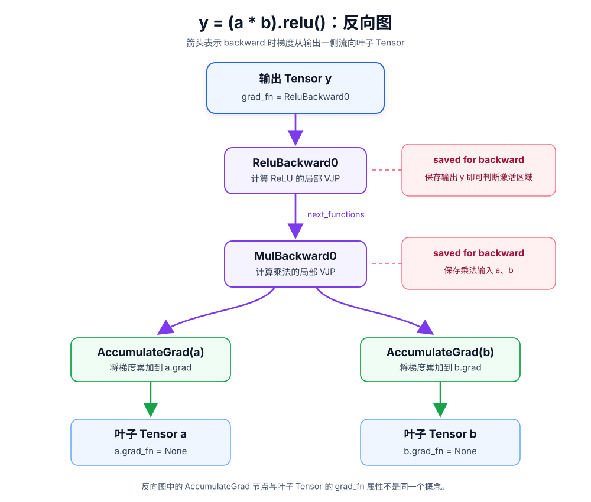
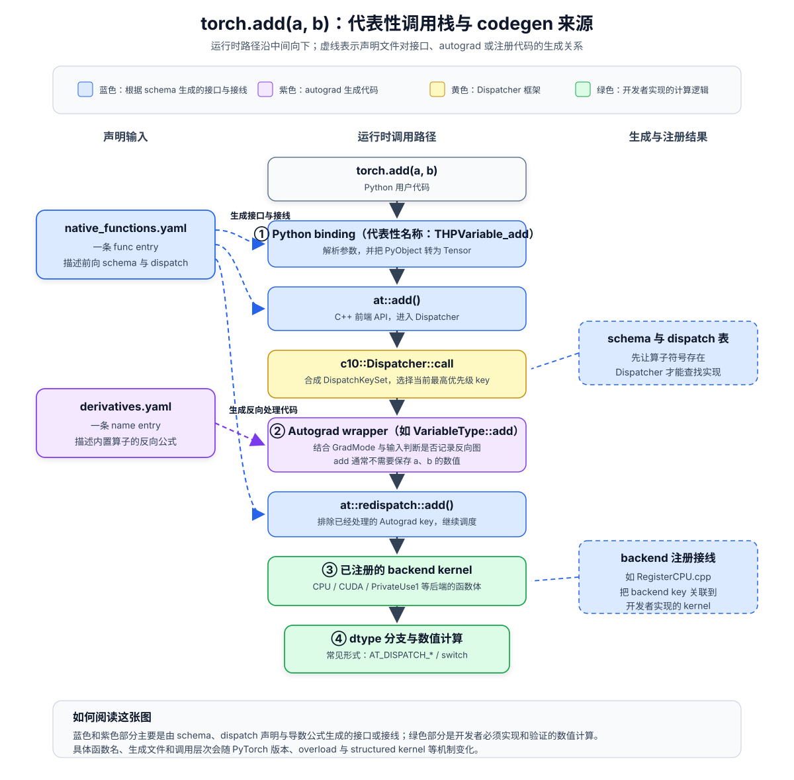

# 深入学习理解 PyTorch 学习笔记 第 1 节：基本内部机制

## 资料来源

1. Ezyang：[《PyTorch Internals》](https://blog.ezyang.com/2019/05/pytorch-internals/)，2019 年
2. PyTorch 官方文档：[Tensor Attributes](https://docs.pytorch.org/docs/stable/tensor_attributes) 与 [`torch.Tensor.stride`](https://docs.pytorch.org/docs/stable/generated/torch.Tensor.stride)
3. PyTorch 官方文档：[Autograd mechanics](https://docs.pytorch.org/docs/stable/notes/autograd)
4. PyTorch 官方文档：[`torch.utils.checkpoint`](https://docs.pytorch.org/docs/stable/checkpoint)
5. PyTorch 官方文档：[Extending the dispatcher for a new backend in C++](https://docs.pytorch.org/tutorials/advanced/extend_dispatcher.html)
6. Vijay Korthikanti 等：[《Reducing Activation Recomputation in Large Transformer Models》](https://arxiv.org/abs/2205.05198)

## 先猜再学

《PyTorch Internals》由 PyTorch 核心开发者 Edward Z. Yang 编写，介绍了 PyTorch 的底层架构、张量存储、派发系统和自动微分。这篇文章发布于 2019 年，其中一些实现细节已经变化，也不包含 PyTorch 2.0 以后的特性。因此，本文主要学习其中相对稳定的设计思路，并在涉及现代 PyTorch 时另行说明。

### 当前知识背景

PyTorch 在我的工作中处于上下层软件之间：向上支持深度学习训练和推理框架，向下对接自研芯片的高性能算子库、通信库和运行时。为了适配新模型并排查问题，我经常需要阅读和修改 PyTorch 源码。我对 `ProcessGroup` 和自定义算子较为熟悉：前者来自自定义 `ProcessGroup` 的适配工作，后者来自新模型的算子补充工作。

### 期望回答的问题

根据文章开头和各级标题，原文大致可以分为两部分：一部分介绍 Tensor、layout 和 autograd 等概念，另一部分介绍算子调用、新算子开发和代码贡献工作流。阅读之前，我希望回答以下问题。

- 从工程实践出发，我希望了解：

  1. Tensor 的数据结构是如何设计的？为什么要这样设计？
  2. PyTorch 内置支持哪些数据布局？
  3. 自动微分在工程上是如何实现的？
  4. 从 Python 层的 PyTorch 代码到底层 kernel，完整的算子调用链是怎样的？
  5. 编写新算子的标准化流程是怎样的？
  6. 为 PyTorch 开源仓库贡献代码的常见流程是怎样的？
- 工作实践中遇到的问题：

  7. 能否自定义 Tensor 数据布局？有没有较为标准的实现方式？
  8. 调试自定义算子时，能否让自定义实现和标准实现同时执行，并自动比较二者的精度？
  9. 编写新算子时，`native_functions.yaml` 的注册语法应该如何理解？
- 如果我对 PyTorch 了解不多，还需要回答：

  10. 什么是 Tensor？为什么需要 Tensor？
  11. 为什么需要多种数据布局？
  12. 自动微分在数学上的原理？
  13. 为什么一个算子可能要有多种调用链，而不是统一的实现方式？

### 我的直觉

1. Tensor 的数据结构是如何设计的？为什么要这样设计？

对于较为复杂的数据容器，我的直觉是将元数据与实际数据分离，类似 C++ 标准库中的一些数据容器。这样可以更快地读取形状等信息，也能避免不涉及数据内容的操作直接处理底层存储。

2. PyTorch 内置支持哪些数据布局？

我当时只了解基于 offset 和 stride 的连续或非连续表示，不确定是否还有其他内置布局。

3. 自动微分在工程上是如何实现的？

我当时猜测，每个开启自动微分的 Tensor 都会记录生成它的上一次操作，反向传播再根据链式法则将梯度逐层传给输入，直到没有上游记录的 Tensor。

4. 从 Python 层的 PyTorch 代码到底层算子，完整的调用链是怎样的？

我当时认为，Python 层的算子操作会经过以下步骤：

- 通过 Python 与 C++ 之间的 binding，将操作映射到 C++；
- 根据输入 Tensor 所在的设备，选择对应后端的算子实现；
- 再根据 Tensor 的其他属性，如稀疏表示和数据布局，选择最终的实现。

5. 编写新算子的标准化流程是怎样的？

在我的工作中，编写新算子主要分为两部分：

- 在自定义高性能算子库中，使用自研 AI 加速芯片的 C++ 类 DSL 编写芯片算子。这部分不在 PyTorch 仓库中。
- 在 PyTorch 中添加算子调用代码：
  1. 根据算子的功能实现 C++ 调用逻辑；
  2. 检查输入的数据类型、Tensor 形状和数据布局；
  3. 调用算子库，并在需要时加入精度对比；
  4. 在 `native_functions.yaml` 中声明算子的输入和输出。

6. 为 PyTorch 开源仓库贡献代码的常见流程是怎样的？

我猜测这与其他 GitHub 开源项目类似：

- fork 开源仓库并创建分支；
- 完成修改后，验证功能并通过 CI；
- 按照贡献文档的要求提交 PR。

7. 能否自定义 Tensor 数据布局？有没有较为标准的实现方式？

我当时不了解 PyTorch 是否提供了直接定义数据布局的方法。在我们的实现中，程序只会提示用户将输入转换为指定布局，并提供对应的转换算子。补丁版 PyTorch 本身不会记录这种布局变化。

8. 有时出于调试的需求，能否同时执行多条分支调用链？比如对于一个自定义算子，我想比较我写的算子和标准算子之间有无精度差异，能否同时自动调用二者进行比较？还是需要手动切换算子？

我们当时会将输入复制到 CPU，使用参考实现重新计算，然后比较两端的输出。我不确定 PyTorch 是否提供了现成的自动机制。

9. 编写新算子时，应该如何理解 `native_functions.yaml` 的语法？

`native_functions.yaml` 包含许多细节，例如 `!`、函数名末尾的 `_` 以及 `dispatch:` 段。README 虽然提供了说明，我实际添加算子时仍经常需要参考类似算子的条目。我希望通过本文弄清这些符号各自的含义。

10. 什么是 Tensor？为什么需要 Tensor？

Tensor 可以理解为标量、向量和矩阵向更高阶的推广。

- 标量是 0 阶的，例如数字 5；
- 向量是 1 阶的，例如 `[1, 2, 3]`；
- 矩阵是 2 阶的，包含行和列两个轴，例如 `[[1, 2], [3, 4]]`；
- Tensor 可以继续推广到任意阶数。

例如，一张高为 $H$、宽为 $W$ 的 RGB 图像可以表示为形状 `[H, W, 3]` 的 3 阶 Tensor；$N$ 张图像则可以表示为 `[N, H, W, 3]` 的 4 阶 Tensor。这类数据无法只用单个标量、向量或矩阵完整表达。

11. 为什么需要多种数据布局？

在我的工作经验中，Tensor 的数据布局会显著影响算子性能。对一些存在特定访存限制的加速芯片来说，性能瓶颈可能来自数据访问方式，而非计算能力。

12. 自动微分在数学上的原理？

自动微分的数学基础是链式法则。AI 模型可以看作多个函数的复合。例如，从输入 $x$ 到输出 $y$ 经过以下变换：

$$
u = f(x), \quad v = g(u), \quad y = h(v)
$$

那么整体函数是

$$
y = h(g(f(x)))
$$

根据链式法则：

$$
\frac{dy}{dx}
=
\frac{dy}{dv}
\frac{dv}{du}
\frac{du}{dx}
$$

PyTorch 会记录中间操作，并在调用 `.backward()` 时从输出向输入传播梯度，逐层应用局部导数。

对向量、矩阵和 Tensor 求导时，还需要使用雅可比矩阵。

13. 为什么一个算子可能要有多种调用链，而不是统一的实现方式？

不同硬件后端的实现方式差异很大。CPU 算子可能使用 AVX-512 等 SIMD 指令集，GPU 算子通常使用 CUDA 基于 SIMT 模型编程，NPU 和 TPU 等加速器又有各自的编程模型和运行时。因此，底层 kernel 很难共享同一份实现。

Triton 和 TileLang 等高层并行编程语言尝试将更多工作交给编译器，因此有可能在更高层共享部分算子代码。这个主题不在本文范围内。

## 学习过程

原文面向希望参与 PyTorch 工程开发和代码贡献的读者，内容分为概念与机制两部分。我根据学习过程将它重新组织为五个主题：Tensor、autograd、基本代码结构、算子开发和高效工作流。前两个主题对应原文的概念部分，后三个主题对应机制部分。

### 1. Tensor

这一章介绍 Tensor 的基本概念、stride 表示、基于 Tensor 属性的算子调度，以及 PyTorch 的 Tensor 扩展方式。

#### 1.1 Tensor 的基本概念

Ezyang 将 Tensor 定义为一种可以存储任意阶数数据的结构，可以视为向量和矩阵向更高阶的推广。Tensor 需要使用一组属性描述自身，其中最基本的是阶数和形状。例如，下面是一个 3 阶 Tensor：

```Plaintext
[
    [
        [0, 8, 9],
        [6, 0, 4],
        [9, 7, 8]
    ],
    [
        [0, 3, 1],
        [4, 1, 3],
        [0, 3, 5]
    ],
    [
        [3, 5, 3],
        [9, 0, 1],
        [4, 2, 2]
    ]
]
```

它的阶数为 3，形状为 `(3, 3, 3)`。PyTorch 中常使用 sizes 或 shape 表示这组尺寸。

在计算机中表示 Tensor 时，还需要记录与数值类型、存储位置和数据布局相关的属性。

1. **dtype（数据类型）**：计算机使用有限位宽表示数值，因此不同 dtype 会带来不同的表示范围、精度和存储成本。常见类型包括 int32、int64、float32 和 float64。深度学习对数值误差存在一定容忍度，因此也大量使用 int8、int4、fp8 和 fp4 等低精度类型。

2. **device（计算设备）**：Tensor 所在的设备决定了数据存放的位置，也决定了算子应该使用 CPU、GPU、NPU 或其他后端的实现。

3. **stride（步长）和 layout（数据布局）**：它们描述逻辑索引如何对应到底层存储。下一节将详细介绍 stride。

这些用于描述 Tensor 的属性统称为元数据，与 Tensor 实际存储的数值数据相对。

#### 1.2 Strided Representation（步长表示）

上一节列出了 stride 属性，本节进一步说明它的含义。原文没有单独给出形式化定义，而是通过索引到物理存储位置的映射来解释 stride。

> To find out where any element for a tensor lives, I multiply each index with the respective stride for that dimension.

这句话省略了最后一步求和。完整计算方式是：将每个索引与对应维度的 stride 相乘，再将结果相加，得到相对于 Tensor 起始位置的元素偏移。

原文通过功能解释 stride，[PyTorch 官方文档](https://docs.pytorch.org/docs/stable/generated/torch.Tensor.stride) 的定义更直接：

> Stride is the jump necessary to go from one element to the next one in the specified dimension dim.

译：Stride 是沿指定维度从一个元素移动到下一个元素时，需要跨过的元素数。

例如，假设有一个 dtype 为 int32、形状为 `(2, 2)` 的 2 阶 Tensor `A`，数据按行优先顺序连续存储：

```Plaintext
A = [
    [2, 8],
    [6, 0]
]
```

同时，假设物理内存上的情况可以表示为：

| 内存地址 | 内存数据 |
| :------: | -------- |
|    0    | 2        |
|    4    | 8        |
|    8    | 6        |
|    12    | 0        |

每个 int32 元素占 4 字节，因此表中的地址每次增加 4。沿第 0 维从 `A[0, 0]` 移动到 `A[1, 0]` 需要跨过 2 个元素；沿第 1 维从 `A[0, 0]` 移动到 `A[0, 1]` 只需跨过 1 个元素。因此，`A` 的 stride 是 `(2, 1)`。

这两种描述分别对应相对距离和元素位置。已知各维度的 stride 后，可以计算任意索引相对于 Tensor 起始位置的元素偏移。例如，`A[1, 0]` 的偏移为：

$$
1 \times 2 + 0 \times 1 = 2
$$

这里的偏移单位是“元素”，而不是“字节”。使用带类型的 C/C++ 指针访问数据时，指针加 1 会自动跨过一个元素的字节数。因此，用元素数表示 stride 无需将 dtype 的字节数重复编码到元数据中。

使用同样的方法，`A[1, :]` 中两个元素的偏移分别为：

$$
1 \times 2 + 0 \times 1 = 2
$$

对于 `A[1, 1]`：

$$
1 \times 2 + 1 \times 1 = 3
$$

因此，第二行对应偏移 2 和 3。一个完整的 view 还需要记录形状和 stride；只有 storage offset 并不足以描述这一行数据。

第一列 `A[:, 0]` 中两个元素的偏移分别为：

$$
0 \times 2 + 0 \times 1 = 0
$$

对于 `A[1, 0]`：

$$
1 \times 2 + 0 \times 1 = 2
$$

第一列对应偏移 0 和 2，这两个元素在底层存储中不连续。Stride 让同一套索引规则可以同时表示连续和非连续数据。

切片和转置等操作可以通过修改 Tensor 的元数据来改变访问方式，而不复制底层数据。例如：

```Python
import torch
A = torch.tensor([
    [2, 8],
    [6, 0]
])
B = A[:, 1]
```

`B` 是 `A` 的第二列，两者共享底层存储。修改 `B` 会同时修改 `A` 中对应的数据。如果需要独立副本，可以调用 `clone()`：

```Python
import torch
A = torch.tensor([
    [2, 8],
    [6, 0]
])
B = A[:, 1].clone()
```

基于 stride 的表示可以支持多种零拷贝 view。Ezyang 也提供了一个 [stride 可视化工具](https://ezyang.github.io/stride-visualizer/index.html)，可以查看不同参数对逻辑视图和底层存储的影响。

这种能力依赖 Tensor 元数据与底层存储的分离。TensorImpl 记录 sizes、strides、storage offset、dtype 和 device 等元数据，Storage 管理底层存储。多个 TensorImpl 可以引用同一个 Storage，同时使用不同的形状、stride 和 offset 解释数据。

原文还提到，当时的 PyTorch 团队希望逐步降低 Storage 作为独立抽象的存在感。现代 PyTorch 中 Storage 的实际定位还需要结合当前源码确认，本文将这个问题保留到后续的源码阅读。

#### 1.3 基于 Tensor 属性的算子调度

已知 Tensor 包含 device、dtype、layout 和 stride 等属性后，下一个问题是：当程序调用 `torch.add(a, b)` 时，PyTorch 如何根据这些属性选择实际执行的 kernel？

我在学习前猜测，调用会先经过 Python 到 C++ 的 binding，再按 device 和数据布局选择目标实现。这个方向基本正确，但缺少 autograd 这一层，也混淆了 layout 和连续性。这个根据输入属性和当前上下文选择实现的过程称为 dispatch。

按照 Ezyang 在 2019 年文章中的说法，一次算子调用从外到内大致经过以下几层 dispatch：

- 外层是 **variable（autograd）调度**。原文将它的工作概括为 *unwrapping variables, calling the underlying implementation, and then rewrapping the results*。这一层不选择计算 kernel，而是处理反向传播所需的记录。

- 再向内是 **device 与 layout 调度**。这一层决定使用 CPU 还是 CUDA 等后端，以及处理 strided 还是 sparse 等布局。

- 最内层是 **dtype 分支**。在 Ezyang 介绍的这类 kernel 中，dtype 通过 kernel 内部的 switch 选择对应类型的实现。

下面把一次调用拆成下行和返回两条路径。左侧表示调用如何逐层进入：wrapper 处理当前语义后，通过 redispatch 继续选择下一个 key，直到进入 backend kernel 和 kernel 内部的 dtype 分支。底部完成计算后，结果沿右侧按照相反顺序返回，每个 wrapper 再完成自己的输出处理。



*图 1.3-1：一次算子调用的调度与返回路径（简化）。*

图中的 Functionalize、vmap 和 Autocast 只是 wrapper key 的示例，并不表示每次调用都会经过全部这些层。实际路径由当前 DispatchKeySet 和 key 的优先级决定。Dispatcher 每次选择当前最高优先级的 key；wrapper 排除自身的 key 后调用 redispatch，Dispatcher 再继续选择下一层。

我学习前把“连续性”误当成了 layout 的分类依据。在原文的分类中，layout 指 strided、sparse 和 Mkldnn（现为 oneDNN）等整体布局类型。连续的 dense Tensor 和转置后的非连续 view 都属于 strided layout，因此会 dispatch 到同一类 kernel。现代 PyTorch 已经增加更多 sparse 布局和 jagged layout，但“layout 不等于连续性”这个区别仍然成立。

连续性通常在 kernel 内部处理。Element-wise 算子可以使用 TensorIterator 按 stride 访问非连续数据，并为连续数据保留快速路径。调用 BLAS 或 cuDNN 的 matmul、conv 等算子，则可能先将输入转换为连续布局。因此，连续性一般不参与这一层 kernel 选择。

我的第二处误解是把 autograd 当成计算完成后的附加步骤。在 Ezyang 描述的调用链中，variable 层位于 backend kernel 之外，因此算子调用会先经过 autograd 处理，再进入实际计算的后端。

Variable 层不负责选择 backend kernel，而是在算子执行前后处理 autograd 记录。因此，dispatch 不只用于选择计算 kernel，也可以叠加多层算子处理逻辑。Autograd、autocast、`torch.func` 中的 vmap/grad 和 functionalization 都使用了这套机制。

在这个简化模型中，device 和 layout 合成 backend key，例如 CPU、CUDA 和 SparseCUDA；dtype 通常在 kernel 内部通过 switch 或 `AT_DISPATCH_*` 宏处理。因此，可以将调用链概括为：variable 处理 → backend key 调度 → kernel 内的 dtype 分支。Dispatch key 定义在 `c10/core/DispatchKey.h`，dtype 分支宏定义在 `aten/src/ATen/Dispatch.h`。

这也回答了一个算子为什么需要多份 kernel：device、layout 和 dtype 构成组合空间，其中的不同组合可能需要不同实现。

现代 PyTorch 已经合并 `Variable` 和 `Tensor`。在当前实现中，原文所说的“剥开 variable”主要对应 redispatch 时排除 autograd key。第 2 章会继续说明 variable 层记录的内容。

#### 1.4 PyTorch 的 Tensor 扩展

如果现有的 device、layout 和 dtype 无法表达新的 Tensor 类型，就需要扩展 PyTorch。这与我日常的自研后端适配直接相关。

Ezyang 使用 device、layout 和 dtype 三个维度描述 Tensor：device 说明数据的存储位置，layout 说明如何在逻辑上解释存储，dtype 说明每个元素的数值类型。扩展这三个维度的工作量并不相同。

对我的自研设备适配工作来说，沿 device 维度扩展的覆盖面最广。一个新设备需要为大量算子提供 kernel，并适配内存分配、stream、profiler、通信和 graph capture 等运行时能力。新 layout 可以只覆盖需要该布局的算子，也可以向更大的算子面扩展，成本取决于目标范围。新 dtype 也不只是在 `AT_DISPATCH_*` 中增加一个分支，还可能涉及类型提升、标量转换、序列化和算子覆盖。

许多场景不需要直接扩展 Tensor。更轻量的方式是编写 Python wrapper，将普通 Tensor 作为成员。Ezyang 给出的一个判断条件是，新对象是否需要作为 Tensor 参与 autograd 的反向传播。普通 wrapper 不会被 dispatcher 视为 Tensor，但只要它的方法在内部调用普通 PyTorch 算子，autograd 仍可以跟踪其中 Tensor 的梯度。只有当新对象本身需要参与全套 dispatch 和 autograd 语义时，wrapper 才不足够。可以根据需求选择以下三种方式：

| 需求                                                  | 手段                     | 是否需要在源码仓库中修改 |
| ----------------------------------------------------- | ------------------------ | ------------------------ |
| 只需要组织普通 Tensor，不参与全套 dispatch          | wrapper 包装类           | 可完全 out-of-tree       |
| 需要一个可导的新算子（如 STE）                        | 自定义 autograd.Function | 可 out-of-tree           |
| 新对象要作为 Tensor 参与全套 dispatch 与 autograd       | Tensor subclass 或原生扩展 | 取决于所需能力；现代方案可 out-of-tree |

这三种方式可以分别对应到以下实践案例。

1. PackedSequence 是 wrapper 的一个例子，用于 RNN 的变长批处理。一个 batch 中的序列长度不同时，直接填充后输入 LSTM 会计算无效的 pad 位置；如果不额外处理，hidden state 还会继续受到 pad 步影响。`pack_padded_sequence` 会先按长度排列序列，再按时间步重新组织有效数据：data 先存放所有序列的第 0 步，再存放尚未结束序列的第 1 步，以此类推。三条长度为 [4, 3, 1] 的序列会排列为：

```
t=0: s1₀ s2₀ s3₀   batch_sizes[0] = 3
t=1: s1₁ s2₁       batch_sizes[1] = 2   ← s3 结束，之后不再占位
t=2: s1₂ s2₂       batch_sizes[2] = 2
t=3: s1₃           batch_sizes[3] = 1
```

data 一共有 8 行，等于 sum(lengths)，其中不存放 pad。按长度降序排列后，每个时间步仍在运行的序列构成 batch 前缀，kernel 可以读取连续的数据块。RNN 每一步根据 `batch_sizes[t]` 读取数据并更新 hidden state，已经结束的序列不再参与后续计算，因此计算量和相关激活只与有效 token 数量有关。这里使用 wrapper 就足够了：梯度通过 data 这个普通 Tensor 传播；batch_sizes 是整数计数，sorted_indices 是重排索引，都不需要求导。NestedTensor 则希望让变长数据参与更广泛的算子调度，因此采用了 Tensor 扩展。
2. QAT（量化感知训练）中的 STE 适合使用自定义 `autograd.Function`。Fake quantization 在前向中包含 round，而 round 的导数几乎处处为零。STE 在前向保持量化操作，在反向中使用近似导数传递梯度；具体实现可能直接传递上游梯度，也可能在量化范围外使用 mask。这里新增的是带有自定义导数规则的运算，输入和输出仍然是普通浮点 Tensor。梯度反转层、手写融合 kernel 和外部库算子也可以使用同类方法接入 autograd。

3. 稀疏张量需要让 dispatcher 和算子理解其索引与数值的存储结构，因此不能只依靠普通 Python wrapper。复数也需要完整的 dtype、算子和 autograd 语义。早期代码有时用最后一维长度为 2 的实数 Tensor 表示复数；PyTorch 后来提供了 complex64 和 complex128 这两种正式 dtype。

训练后量化（PTQ）提供了一个反例：qint8 Tensor 配合 QuantizedCPU 后端主要用于推理，不需要参与反向传播，但仍然采用了 Tensor 扩展。这说明 autograd 需求只是选择 Tensor 扩展的一个条件。量化 Tensor 还需要透明的 dispatch，让 conv2d、matmul 等算子自动选择 FBGEMM 或 QNNPACK kernel，并需要底层 storage 真正保存 int8 数据。

这套分类也可以用于检查我们过去的一项实现。为了让数据布局更适合自研硬件，我们实现了布局转换算子，以及使用这种特殊布局的计算算子。这个方案停留在算子层：补丁版 PyTorch 不记录转换后的布局，autograd、`.contiguous()`、view、序列化和通用算子都无法识别它，因此每条相关路径都需要单独处理。

如果变化只是 strided layout 内部的轴顺序，可以使用 `memory_format`，例如 channels_last。我们的场景采用了不同的分块打包方式，更接近 oneDNN 的 blocked layout，因此完整方案需要将布局注册为 PyTorch 能识别的 Tensor 属性，并定义相应的 dispatch 和 autograd 行为。

这里还需要补充现代 PyTorch 的变化。2019 年时，完整 Tensor 扩展通常需要修改仓库内部代码；后来出现的 Tensor subclass 和 `__torch_dispatch__` 支持 out-of-tree 开发，torchao 的部分量化 Tensor、NF4 和 DTensor 都使用了相关机制。它能否满足影子执行和轻量布局扩展等具体需求，还需要通过后续源码阅读和实验确认。Storage 在现代 PyTorch 中的定位也保留到后续文章继续检查。

以上几种方案分别适用于 wrapper、自定义可导算子和 Tensor 扩展。下一章继续分析 variable 层记录了哪些信息，以及反向图如何建立。

### 2. 自动微分

这一章先复习从导数到矩阵求导所需的数学，再依次说明 Variable 记录的内容、反向模式的选择、autograd 与 dispatch 的关系，以及 saved tensors 带来的显存成本。

#### 2.0 数学预备：从导数到矩阵求导

理解 autograd 的工程实现需要链式法则、梯度、雅可比和矩阵求导。后文会反复使用公式 $\text{grad\_input} = \text{grad\_output} \cdot J_\text{local}$，因此先在这里整理相关数学。已经熟悉这些内容的读者可以直接跳到第 2.1 节。

以下内容从微分关系出发，将一元导数依次推广到梯度、雅可比和矩阵导数。本文将梯度写成列向量。

深度学习训练通常使用梯度下降最小化标量 loss $L$，参数按照下式更新：

$$
\theta_{new} \leftarrow \theta_{old} - \text{lr} \cdot \frac{\partial L}{\partial \theta}
$$

其中，$\theta$ 表示模型参数，$\frac{\partial L}{\partial \theta}$ 表示 loss 对参数的导数，$\text{lr}$ 表示学习率。梯度指向 loss 局部上升最快的方向，因此参数沿负梯度方向更新。训练所需的结果是 $L$ 对所有参数 $\theta$ 的偏导。本文采用“梯度与参数同形”的约定，便于直接进行参数更新。

**① 一元微分：局部线性近似。** 对 $f:\mathbb{R}\to\mathbb{R}$，$f'(x)$ 给出函数在 $x$ 附近的一阶变化率：

$$
df = f'(x)\,dx
$$

也就是说，当输入发生微小变化 $dx$ 时，输出的一阶变化约为 $f'(x)\,dx$。将这一关系与链式法则 $(f\circ g)'(x)=f'(g(x))g'(x)$ 推广到多输入、多输出函数，就得到后续自动微分使用的数学形式。

**② 多元、单输出：梯度。** 对 $f:\mathbb{R}^n\to\mathbb{R}$，将所有偏导排列成与输入同形的列向量，就得到梯度：

$$
\nabla f = \left[\frac{\partial f}{\partial x_1},\dots,\frac{\partial f}{\partial x_n}\right]^\top
$$

在欧氏度量下，它指向函数局部上升最快的方向，因此梯度下降使用 $-\nabla f$。全微分写成 $df=\nabla f^\top dx$，沿方向 $v$ 的方向导数则是 $\nabla f^\top v$。

> **注：为什么负梯度是下降最快的方向？** 可微意味着 $L$ 在局部可以由线性函数 $\nabla L\cdot v$ 近似。根据 Cauchy–Schwarz 不等式，在单位向量中，$\nabla L$ 方向取得最大的方向导数，$-\nabla L$ 方向取得最小值。这个结论描述的是局部一阶近似；有限步长还会受到二阶项 $\frac{1}{2}d^\top Hd$ 的影响。若函数满足 $L$-smooth 条件，合适的学习率可以保证 loss 下降。“最陡”还依赖所选度量：欧氏度量对应 $-\nabla L$，Fisher 度量则对应自然梯度 $-F^{-1}\nabla L$。

**③ 多元、多输出：雅可比矩阵。** 对 $f:\mathbb{R}^n\to\mathbb{R}^m$，雅可比矩阵 $J\in\mathbb{R}^{m\times n}$ 将每个输出对每个输入的偏导排列在一起，第 $i$ 行第 $j$ 列为 $J_{ij}=\partial f_i/\partial x_j$：

$$
J = \begin{bmatrix} \dfrac{\partial f_1}{\partial x_1} & \dfrac{\partial f_1}{\partial x_2} & \cdots & \dfrac{\partial f_1}{\partial x_n} \\ \dfrac{\partial f_2}{\partial x_1} & \dfrac{\partial f_2}{\partial x_2} & \cdots & \dfrac{\partial f_2}{\partial x_n} \\ \vdots & \vdots & \ddots & \vdots \\ \dfrac{\partial f_m}{\partial x_1} & \dfrac{\partial f_m}{\partial x_2} & \cdots & \dfrac{\partial f_m}{\partial x_n} \end{bmatrix}
$$

它满足 $df=J\,dx$。

雅可比的第 $i$ 行是第 $i$ 个输出梯度的转置。标量输出对应 $m=1$，此时雅可比等于 $\nabla f^\top$。若 $x \xrightarrow{f} h \xrightarrow{g} y$，链式法则的矩阵形式为：

$$
J_{g\circ f} = J_g \cdot J_f
$$

因此，多层网络的导数可以写成 $J=J_LJ_{L-1}\cdots J_1$。

当网络最终输出标量 loss 时，可以写成 $\nabla L^\top = J_L \cdot J_{L-1} \cdots J_1$，形状为 $1\times n$。矩阵连乘的结合顺序决定了导数从输入端还是输出端开始累积，这对应正向模式和反向模式的区别，第 2.2 节会继续分析。

**④ 矩阵求导。** 模型参数 $W$ 经常是矩阵。本文约定标量对矩阵的导数 $\partial L/\partial W$ 与 $W$ 同形。微分迹法将标量微分写成 $dL=\mathrm{tr}((\partial L/\partial W)^\top dW)$；如果推导得到 $dL=\mathrm{tr}(M\,dW)$，那么 $\partial L/\partial W=M^\top$。下面列出几个后文会用到的结论：

> **注：迹法为什么成立、怎么使用。** 由于 $\mathrm{tr}(A^\top B)=\sum_{ij}A_{ij}B_{ij}$，而全微分的定义是 $dL=\sum_{ij}(\partial L/\partial W_{ij})\,dW_{ij}$，所以 $dL = \mathrm{tr}\!\left((\partial L/\partial W)^\top dW\right)$。实际推导可以分为三步：① 按矩阵规则求微分，例如 $d(XY)=(dX)Y+X(dY)$；② 使用 $\mathrm{tr}(ABC)=\mathrm{tr}(CAB)$ 和 $\mathrm{tr}(A)=\mathrm{tr}(A^\top)$，将表达式整理为 $\mathrm{tr}(M\,dW)$；③ 得到 $\partial L/\partial W=M^\top$。矩阵乘积不能随意换序，但迹允许循环移位，因此可以将 $dW$ 调整到固定位置并读取其系数。这个方法可以用于推导 VJP 和 `derivatives.yaml` 中的反向公式。

| 前向               | 导数 / 梯度                                                                                                           |
| ------------------ | --------------------------------------------------------------------------------------------------------------------- |
| $L = a^\top x$   | $\partial L/\partial x = a$                                                                                         |
| $y = Wx$         | $J = W$                                                                                                             |
| $L = x^\top A x$ | $\partial L/\partial x = (A+A^\top)x$                                                                               |
| $Y = XW$         | $\partial L/\partial X = G\cdot W^\top$，$\partial L/\partial W = X^\top\cdot G$（$G = \partial L/\partial Y$） |

表格最后一行实际就是**线性层的 backward**：用迹法验证，$dL = \mathrm{tr}\!\left(G^\top(dX\cdot W + X\cdot dW)\right) = \mathrm{tr}(WG^\top dX) + \mathrm{tr}(G^\top X\,dW)$，两项分别读出 $\partial L/\partial X = GW^\top$、$\partial L/\partial W = X^\top G$。这条恒等式，我们在 $\S$ 2.1、$\S$ 2.2 会反复用到。

从一元导数到矩阵求导，导数的形式从数扩展为梯度、雅可比和结构化矩阵运算，但 $df = (\text{导数}) \cdot dx$ 与链式法则始终成立。后文主要使用四个结论：链式法则；梯度由偏导组成并与参数同形；雅可比描述多输入、多输出函数的导数；反向传播从标量 loss 一端开始累积雅可比乘积。

微分迹法 $dL = \mathrm{tr}(G^\top dW)$ 和上表中的矩阵恒等式，可以作为后续推导反向公式的参考。

#### 2.1 Variable 记录了什么：grad_fn、saved tensors 与反向图

自动微分是 PyTorch 区别于普通数组库的重要能力。前文已经提到，dispatch 外层的 variable 处理不负责选择计算 kernel，而是记录反向传播需要的信息。本节具体说明这些记录的内容。

PyTorch autograd 主要实现反向模式自动微分。前向阶段依次执行算子并记录必要信息，反向阶段按照相反方向遍历计算关系，沿途组合局部导数。第 2.2 节会解释选择反向模式的原因。

为了在反向阶段重新访问前向计算关系，前向阶段必须保存额外信息。Ezyang 在 2019 年的结构中使用 variable 包装 Tensor，并在 AutogradMeta 中保存调用 `loss.backward()` 所需的元数据。现代 PyTorch 已经合并 Variable 与 Tensor，但相应的 autograd 元数据仍然存在。

我在学习前猜到 Tensor 会记录生成它的操作，并沿计算关系将梯度传到叶子节点。但这还不够：反向公式通常还依赖前向阶段的输入、输出或其他中间值。因此，variable 层至少需要记录以下两类信息：

1. **grad_fn（反向函数句柄）**：标记这个张量是被哪个算子算出来的，从而知道反向该调哪段代码。比如 `c` 由加法得到，`c.grad_fn` 会指向类似 `AddBackward0` 的节点，而叶子 `a`、`b` 的 `grad_fn` 是 `None`。具体类名后缀可能随版本和 overload 变化。
2. **saved tensors（反向要用的前向张量）**：因为绝大多数算子的反向都要用到前向的某些值。$z = x \cdot y$ 的反向 $\partial z/\partial x = y$、$\partial z/\partial y = x$，要用到输入 $x$、$y$；$y = \exp(x)$（即 `x.exp()`）的反向 $\partial y/\partial x = \exp(x) = y$，要用到输出 $y$。这些值在前向时由对应的 grad_fn 节点保存，反向执行时再取用。



*图 2.1-1：输出 Tensor、grad_fn、next_functions 与叶子 Tensor 的关系。*

我最初以为 `relu` 的反向必须保存输入，因为导数取决于输入是否大于 0。PyTorch 的反向公式可以改用输出 `y` 判断相同条件，因此保存输出也足够。一个算子保存输入还是输出，取决于反向公式实际需要哪些值，而不是固定保存输入。

`c.backward()` 从 `c` 对应的 grad_fn 开始。该节点通过 `next_functions` 指向输入对应的 grad_fn，所有节点由此连接成一张反向图。前向数据从 `a`、`b` 流向 `c`，反向图中的边则从 `c.grad_fn` 指向输入一侧，方向与前向数据流相反。

以 `y = (a * b).relu()` 为例，其中 `a` 和 `b` 都是 `requires_grad=True` 的叶子 Tensor。前向阶段先计算 `tmp = a * b`，再计算 `y = relu(tmp)`；反向图可以简化为 `ReluBackward0 → MulBackward0 → AccumulateGrad(a) / AccumulateGrad(b)`。



*图 2.1-2：`y = (a * b).relu()` 的反向图与 saved tensors。*

这里需要区分两个细节：

- 叶子 Tensor `a` 和 `b` 的 `grad_fn` 是 `None`，因为它们不是由其他算子生成的；但反向图中仍有对应的 `AccumulateGrad` 节点，负责将梯度累加到 `a.grad` 和 `b.grad`。因此，叶子 Tensor 的 `grad_fn` 属性与反向图中负责处理它的节点不是同一个概念。
- 梯度默认采用累加语义。若不希望保留上一轮的梯度，需要在适当位置调用 `zero_grad()` 或将梯度设为 `None`。

`backward()` 从输出节点开始，按照反向拓扑顺序遍历这张图。每个节点调用自己的 backward，使用 saved tensors 计算对输入的梯度，再沿边传递给下一组节点，最终由 AccumulateGrad 写入叶子 Tensor 的 `.grad`。

这张反向图不是预先定义的。前向阶段每执行一个需要记录的算子，autograd 就创建相应节点并连接边。这就是 PyTorch 的 define-by-run 动态图。

这一过程可以概括为：grad_fn 指定反向函数，saved tensors 提供反向所需的前向值，next_functions 连接反向图，AccumulateGrad 将结果累加到叶子 Tensor。接下来分别讨论为什么选择反向模式、autograd 如何接入 dispatch，以及 saved tensors 带来的显存成本。

#### 2.2 为什么是反向模式（reverse-mode）自动微分

$\S$ 2.0 留下了一个问题：网络到标量 loss 的雅可比连乘 $\nabla L^\top = J_L \cdot J_{L-1} \cdots J_1$，应该按照什么顺序计算？不同的结合顺序对应两种自动微分模式。

- **右结合** $J_L(\cdots(J_1 v))$：从靠近输入的 $J_1$ 开始，每一步计算雅可比与向量的乘积（Jacobian-vector product，JVP）。导数沿输入到输出的方向累积，这就是正向模式。
- **左结合** $((u^\top J_L)J_{L-1})\cdots$：从靠近输出的 $J_L$ 开始，每一步计算向量与雅可比的乘积（vector-Jacobian product，VJP）。导数沿输出到输入的方向累积，这就是反向模式，也就是反向传播。

正向模式不是数值微分。数值微分通过 $(f(x+h)-f(x))/h$ 近似导数，会受到截断误差和舍入误差的影响。正向模式和反向模式都直接应用链式法则，只是累积方向不同。正向模式可以让每个数值同时携带一个方向导数，并在前向计算中按照解析求导规则更新。一次计算先选定一个输入方向 $v$，因此只能得到该方向上的导数；若要得到对每个输入分量的完整导数，通常需要更换方向并重复计算。

|          | 每步运算              | 完整雅可比所需传播次数主要取决于 | 适合           |
| -------- | --------------------- | ------------------------------ | -------------- |
| 正向模式 | JVP（雅可比 × 向量） | 输入维度                       | 输入少、输出多 |
| 反向模式 | VJP（向量 × 雅可比） | 输出维度                       | 输出少、输入多 |

选择时可以从维度较小的一端开始累积。深度学习训练的目标通常是一个标量 loss，而输入包含大量参数。反向模式从输出端以 $u=1$ 为种子，一次反向传播即可得到所有参数的梯度。传播次数不随输入维度增加；但实际计算量仍然取决于模型规模和算子成本。若使用正向模式求完整梯度，则需要针对许多输入方向重复计算，因此训练通常采用反向传播。

正向模式适合输入少、输出多的场景。例如，Hessian-向量积可以组合正向模式与反向模式，在不构造完整 Hessian 的情况下计算 $Hv$；可微仿真和敏感度分析也经常需要计算少数设计参数对大量输出的影响。RTRL 则沿时间正向维护敏感度，不需要像 BPTT 那样保存整段轨迹，但它自身的敏感度状态可能很大。PyTorch 提供了 `torch.func.jvp` 等正向模式接口。

$\S$ 2.1 中，每个 grad_fn 节点使用 saved tensors 计算梯度。用这里的术语描述，每个 backward 节点都在计算一次 VJP：

$$
\text{grad\_input} = \text{grad\_output} \cdot J_\text{local}
$$

从输出端传入的向量就是 `grad_output`。对于标量 loss，初始种子是 $dL/dL=1$；对于非标量输出，调用者需要通过 `y.backward(gradient=u)` 明确提供输出方向，否则 PyTorch 无法自动创建这一初始梯度。

实现 VJP 时通常不会显式构造 $J_\text{local}$，而是利用算子的结构直接计算乘积。例如，逐元素函数 $y=\exp(x)$ 的局部雅可比是 $n\times n$ 的对角矩阵 $\mathrm{diag}(y)$。显式构造它需要 $O(n^2)$ 的存储和计算，而 VJP 可以直接写成逐元素乘法：

$$
\text{grad\_x} = \text{grad\_y} \odot y
$$

线性层 $y=xW^\top$ 也不需要构造完整雅可比。若只考虑 $y$ 对 $x$ 的雅可比，并令 $x$ 和 $y$ 都包含约 $10^6$ 个元素，完整矩阵约有 $10^{12}$ 个 fp32 元素，占用约 4 TB。实际反向只需要结构化的矩阵乘法：$\text{grad\_x}=\text{grad\_y}\cdot W$，以及 $\text{grad\_W}=\text{grad\_y}^\top\cdot x$。因此，PyTorch 为算子实现 VJP，并沿反向图组合这些计算，而不是保存或构造完整雅可比。

编写新算子时，可以从 VJP 公式反推需要保留的信息：backward 使用的前向值必须被保存、由其他已保存信息推导出来，或者在反向阶段重新计算。saved tensors 并不必然等于局部雅可比依赖的全部前向值，具体保存内容取决于实现采用的公式和重计算策略。

反向模式还需要保留反向公式依赖的部分前向中间量，这些 saved tensors 构成训练激活显存的重要部分。$\S$ 2.4 将继续讨论这项内存成本。

#### 2.3 Autograd 是如何挂在 dispatch 机制上的

$\S$ 2.1 说明了 autograd 记录哪些信息，$\S$ 2.2 则把 backward 描述为 VJP。本节进一步说明 autograd 如何接入 dispatcher，以及 `Variable` 与 `Tensor` 合并后，原文所说的 “unwrap variable” 在现代 PyTorch 中对应什么操作。

autograd 通过一组 dispatch key 接入调度流程。`AutogradCPU`、`AutogradCUDA` 和 `AutogradPrivateUse1` 等 key 位于相应 backend key 之上。需要注意，Tensor 的 keyset 是否包含 Autograd key，不能简单地等同于该 Tensor 的 `requires_grad` 值；进入 autograd kernel 后，还会结合 grad mode 和输入的 `requires_grad` 判断本次操作是否需要记录反向图。

以 `y = op(x)` 为例，当本次调用需要记录梯度时，流程可以概括为：

1. dispatcher 先进入 Autograd kernel。该 kernel 判断是否需要梯度，并准备反向节点及其边关系。
2. Autograd kernel 排除当前 autograd 层后执行 redispatch，调用对应 backend kernel 完成前向计算。
3. Autograd kernel 根据导数公式保存必要的输入、输出或元数据，并通过 `set_history` 等操作把反向节点关联到结果。

redispatch 时排除 autograd 层，可以避免再次选择同一个 Autograd kernel。

2019 年以前，`Variable` 曾经是包在 `Tensor` 外的一层对象，因此 “unwrap” 可以理解为去掉包装。现代 PyTorch 已经合并二者，不再存在这一层对象包装。对应的实现动作主要是 redispatch 到 autograd 层之下，后续由 backend kernel 完成计算。

Autograd key 按后端细分，例如 `AutogradCPU`、`AutogradCUDA` 和 `AutogradPrivateUse1`。自研后端因此也有对应的 autograd 调度入口。

我过去一直以为前向和反向都在 `native_functions.yaml` 中注册。实际上，对于 PyTorch 内置算子，二者来自不同的声明：

| 注册什么           | 注册在哪                                            | 挂在哪个 key                         |
| ------------------ | --------------------------------------------------- | ------------------------------------ |
| 算子 + 前向 kernel | `native_functions.yaml`（schema + `dispatch:`） | `CPU` / `CUDA` / `PrivateUse1` |
| 反向公式（导数）   | `tools/autograd/derivatives.yaml`                     | codegen 生成的 `Autograd` kernel   |

`native_functions.yaml` 描述算子 schema 和前向 dispatch，`derivatives.yaml` 提供导数公式，codegen 据此生成 autograd kernel。对于 out-of-tree 自定义算子，一般不修改这两个文件，而是使用 `torch.autograd.Function` 或 `torch.library.register_autograd(...)`。

反向公式通常由其他 ATen 算子组成。例如，`mul` 的反向仍然会调用 `mul`。如果这些基础算子已经在自研后端上实现，backward 中的调用会重新 dispatch 到该后端，因此不需要为每条导数公式单独编写芯片 kernel。只有反向依赖新的底层原语或专用融合实现时，才需要额外的 backward kernel。

`torch.no_grad()` 通过线程局部的 grad mode 让计算不再记录反向图，即使输入原本 `requires_grad=True`，也不会为这些操作创建 `grad_fn` 或保存反向所需的 Tensor。`inference_mode()` 在此基础上还会关闭额外的 autograd 开销，并对推理模式下创建的 Tensor 施加更严格的使用限制。二者都能减少反向图和 saved tensors 带来的内存占用。

<details>
<summary><b>进阶：dispatcher 内部的 TLS / RAII 机制（普通读者可跳过）</b></summary>

redispatch 到 autograd 层之下时，会用到 TLS 和 RAII 两类机制。

**RAII** 是常见的 C++ 资源管理方式：对象在构造时修改状态，在析构时恢复状态。即使作用域因异常退出，析构函数仍会执行。

每个线程有一份 `c10::impl::LocalDispatchKeySet`，其中包含两个集合：

```cpp
struct LocalDispatchKeySet {
  DispatchKeySet included_;  // 强制「加上」的 key
  DispatchKeySet excluded_;  // 强制「去掉」的 key
};
// 最终 keyset ≈ (输入 tensor 的 keyset │ included_) − excluded_，再取最高优先级
```

将相应 key 加入 `excluded_` 可以在当前线程和作用域中忽略该 key，而不修改 Tensor 自身保存的 keyset。

相关 guard 包括 `ExcludeDispatchKeyGuard`、`IncludeDispatchKeyGuard` 和 `AutoDispatchBelowADInplaceOrView`。`AutoGradMode(false)` 修改的是线程局部的 GradMode；`InferenceMode` 还会调整与 autograd 和 view 追踪有关的 dispatch 状态。这几种机制作用不同，不应简单视为同一层层递进的开关。

下面用伪代码表示生成 wrapper 的主要职责，具体顺序和 helper 名称以目标版本源码为准：

```cpp
// torch/csrc/autograd/generated/VariableType_*.cpp（自动生成，简化）
at::Tensor mul_Tensor(c10::DispatchKeySet ks,
                      const Tensor& self, const Tensor& other) {
  // 1) 结合 GradMode 和 requires_grad 判断是否需要记录
  std::shared_ptr<MulBackward0> grad_fn;
  if (compute_requires_grad(self, other)) {
    grad_fn = std::make_shared<MulBackward0>();
    grad_fn->set_next_edges(collect_next_edges(self, other));
  }

  // 2) redispatch 到 autograd 之下
  auto result = ([&]() {
    at::AutoDispatchBelowADInplaceOrView guard;              // RAII：TLS 里排除 autograd
    return at::redispatch::mul(ks & c10::after_autograd_keyset, self, other);
  })();                                                       // lambda 返回，guard 析构，TLS 自动恢复

  // 3) 按导数公式保存必要信息，并把反向节点关联到结果
  if (grad_fn) {
    grad_fn->self_  = SavedVariable(self,  /*is_output=*/false);
    grad_fn->other_ = SavedVariable(other, /*is_output=*/false);
    set_history(result, grad_fn);
  }
  return result;
}
```

这里同时使用传入 redispatch 的 keyset 和作用域 guard：前者限制本次 redispatch 可选择的 key，后者影响作用域内的相关嵌套调用。

TLS 保证线程之间的状态互不干扰，RAII 则保证作用域结束后恢复原状态。如果 backend kernel 抛出异常，guard 的析构函数仍会执行。

排查某个算子没有建立反向图时，可以同时检查输入的 `requires_grad`、当前 GradMode、是否处于 `no_grad` 或 `inference_mode`，以及 `c10::impl::tls_local_dispatch_key_set()` 中的 `included_` 和 `excluded_`。不能只根据 `grad_fn is None` 判断 dispatch key 被排除了，因为叶子 Tensor 的 `grad_fn` 本来就是 `None`。

</details>

#### 2.4 saved tensors 的内存代价：激活显存、重计算与 in-place 陷阱

$\S$ 2.2 提到，反向模式需要保存部分前向中间量；$\S$ 2.3 则说明了 `no_grad` 为什么能够避免这部分记录。本节进一步讨论 saved tensors 的内存成本及其常见优化方式。

反向公式需要的中间值通常要保留到相应 backward 节点执行。这些 saved tensors 是训练激活显存的重要组成部分，但二者不宜完全画等号：激活还可能包括暂存值和算子工作区，而某些 saved tensors 也可以只保存元数据、经过压缩，或者通过钩子转移到其他设备。

常见的三类处理方式如下：

| 方式                   | 做法                   | 主要代价                      |
| ---------------------- | ---------------------- | ----------------------------- |
| 重计算                 | gradient checkpointing | 增加计算量                    |
| 减少临时分配           | in-place 操作          | 别名关系和 autograd 限制      |
| 转移 saved tensors     | offload                | CPU/NVMe 容量、带宽与传输延迟 |

**① 重计算（gradient checkpointing）。** 前向阶段不保留选定区域中的部分中间激活，反向需要时再执行一次该区域。分段策略不同，节省的内存和增加的计算量也不同，不能统一写成固定的 33%。PyTorch 提供 `torch.utils.checkpoint`；其中 reentrant 与 non-reentrant 两种实现对前向图记录、重计算范围和 API 支持的行为并不相同，因此也不能笼统地说 checkpoint 重计算都在 `no_grad` 下执行。

**② in-place 操作与 version counter。** `x.add_()`、`relu_()` 等操作直接修改已有 Tensor，可能减少一次输出分配。但如果被修改的值已经被保存供 backward 使用，反向阶段就可能读到错误内容。PyTorch 使用 version counter 检测这类问题：`SavedVariable` 保存当时的版本，反向取值时再与当前版本比较；若不一致，就会报错。

version counter 属于 Tensor 的 autograd/`TensorImpl` 语义，而不是简单绑定在 `Storage` 上。view 通常与 base Tensor 共享 version counter，但两个碰巧引用同一块 storage 的独立 Tensor 不一定共享同一计数器。

```text
one of the variables needed for gradient computation has been modified by an
inplace operation: ...; expected version N but got version M
```

version counter 不参与梯度计算，它用于把可能产生错误梯度的修改转成显式错误。

**③ 如何判断 in-place 是否可用。** backward 不得依赖已经被覆盖、又无法恢复的值；同时还要考虑 view、别名关系、叶子 Tensor 限制，以及计算图中其他使用者。导数公式只使用 `result` 而不使用 `self`，只能说明保存输入的需求较少，不能单独证明 in-place 一定安全。在 grad mode 中，PyTorch 会禁止部分明显不合法的操作，例如直接修改 `requires_grad=True` 的叶子 Tensor；对于已保存且版本发生变化的 Tensor，则会在 backward 时通过 version counter 报错。工程上应优先使用 out-of-place 版本，只有在验证内存收益并理解别名关系后再采用 in-place。

**④ saved tensors offload。** `torch.autograd.graph.saved_tensors_hooks` 可以注册 pack/unpack 钩子，在保存和取回 Tensor 时执行自定义处理。例如，把 Tensor 转移到 CPU，反向使用前再移回原设备。若要使用 NVMe，还需要应用层自行实现相应的序列化、存储和异步传输逻辑。offload 保留数据但改变存储位置，主要以带宽和延迟换取设备显存。

至此，自动微分部分已经说明数学基础、反向图、反向模式、dispatch 接入方式和 saved tensors 的内存成本。下面再把 saved tensors 放回训练显存的整体构成中观察。

##### 扩展：训练显存量分布与多场景占比

训练显存可以先分为模型状态、激活和其他临时占用：

| 类别                  | 包含                                           | 随什么增长                       | 受 batch 影响 |
| --------------------- | ---------------------------------------------- | -------------------------------- | ------------- |
| 模型状态 model states | 参数 + 梯度 + 优化器状态                       | 参数量$P$、优化器、精度        | ❌            |
| 激活 activations      | 前向留给反向的中间值（saved tensors）          | $b \times s \times h \times L$ | ✅            |
| （残留/临时）         | 通信桶、kernel 临时 buffer、碎片、CUDA context | 杂项                             | 部分          |

模型状态主要随参数量、优化器和精度配置变化；激活则通常随 batch、序列长度和网络深度变化。优化前应先确认哪一部分占主导。

下面给出一种常见但并非通用的 Adam 混合精度配置。不同框架版本、优化器实现、梯度精度和 master weight 策略都会改变每参数字节数。

| 项                 | 字节/参数           |
| ------------------ | ------------------- |
| fp16 权重          | 2                   |
| fp16 梯度          | 2                   |
| fp32 master 权重   | 4                   |
| fp32 一阶动量$m$ | 4                   |
| fp32 二阶动量$v$ | 4                   |
| **合计**     | **16 B/参数** |

在这项配置下，master weight 与两个 Adam 动量合计 12 B/参数，模型状态总计约 16 B/参数。因此，1B 参数约需 16 GB，7B 参数约需 112 GB。这个估算尚未包含 allocator 碎片、通信 buffer 和临时工作区。换用 SGD、8-bit optimizer 或不保留 fp32 master weight 时，结果都会变化。LoRA/PEFT 可以省去冻结基座参数的梯度和优化器状态，但前向过程中仍会产生激活。

激活通常随 batch、序列长度、隐藏维度和层数增加。Megatron 论文《Reducing Activation Recomputation in Large Transformer Models》给出过一项特定 Transformer 配置下的近似式：

$$
\text{每层} \approx s\,b\,h\left(34 + 5\,\frac{a\,s}{h}\right) \text{字节}\quad(a=\text{注意力头数})
$$

这个近似式表明，激活随 batch $b$ 线性增长，注意力相关项还包含 $s^2$。具体常数取决于模型结构和实现，不能直接套用到所有 Transformer。FlashAttention 通过分块和在线 softmax 等方式避免将完整 $s\times s$ 注意力矩阵写入高带宽内存，从而降低这部分内存访问和中间状态开销。

不同场景的常见主导项如下，但最终应以 profiler 和内存快照为准：

| 场景                                           | 主导块                | 为什么                                                           | 对症手段                              |
| ---------------------------------------------- | --------------------- | ---------------------------------------------------------------- | ------------------------------------- |
| 大模型 + 小 batch（LLM 预训练/全参微调）       | 模型状态              | $16P$ 巨大、激活相对小                                         | ZeRO/FSDP、优化器 offload、8-bit Adam |
| 小模型 + 大 batch（BERT 大批量、视觉高分辨率） | 激活                  | $b$ 大、$P$ 小                                               | checkpointing、减 batch、激活 offload |
| 长上下文训练                                   | 激活（注意力$s^2$） | $5as/h$ 随 $s^2$ 爆炸                                        | FlashAttention、序列并行、重算        |
| LoRA/PEFT 微调                                 | 激活 + 冻结权重       | 冻结参数不保存梯度与优化器状态，前向激活仍然存在                 | 重算 + 量化基座（QLoRA）              |
| **推理**                                 | 参数 + KV cache       | 无梯度/优化器/反向激活，KV cache 随$b\cdot s\cdot L\cdot h$ 涨 | PagedAttention、KV 量化、KV offload   |

各类优化针对的内存组成不同：

| 手段                            | 砍哪块                         | 拿什么换            |
| ------------------------------- | ------------------------------ | ------------------- |
| gradient checkpointing          | 激活                           | 算力                |
| in-place                        | 激活（省分配）                 | autograd 正确性风险 |
| `saved_tensors_hooks` offload | 激活                           | CPU/NVMe 带宽       |
| ZeRO-1/2/3、FSDP                | 模型状态（优化器/+梯度/+参数） | 通信量              |
| 8-bit / online 优化器           | 优化器状态                     | 少量精度            |
| 张量并行 / 序列并行             | 参数 + 激活                    | 卡间通信            |
| FlashAttention                  | 注意力中间状态与内存访问     | 分块、在线归一化及部分重计算 |

推理通常不需要梯度、优化器状态和供 backward 使用的激活，主要占用转为参数、KV cache、临时工作区和 allocator 预留内存。训练侧关注 saved tensors，推理侧关注 KV cache，二者都涉及中间状态的容量、存储位置和生命周期管理。

### 3. 基本代码结构

进入原文的「机制」部分。这一章把前两章抽象的 dispatch 与 autograd 落到真实的代码组织上：先看 PyTorch 的目录分层各管什么（$\S$ 3.1），再跟着一次 `torch.add` 调用走一遍从 Python 到 kernel 的代码旅程（$\S$ 3.2）。

#### 3.1 四大目录分层：c10 / ATen / torch/csrc / torch

前两章介绍了 dispatch 和 autograd。本节从源码目录出发，观察这些机制分别位于哪些模块。PyTorch 的目录很多，这里只讨论原文涉及的四个主要层次。

我原来把 c10 和 ATen 看成平级目录。实际依赖关系中，ATen 使用 c10 提供的基础设施。此前的工作经验只让我熟悉两个具体位置：ProcessGroup 位于 `torch/csrc/distributed/c10d`，内置算子的许多 kernel 实现位于 `aten/src/ATen/native/`。

按 Ezyang 的划分，四个目录自底向上分工如下：

- **`c10/`**（名字来自 Caffe2 + ATen 的合并）——**设备无关的核心底座**。最核心、要被所有后端共用的数据结构都在这：`TensorImpl`、`StorageImpl`、`DispatchKey` / `DispatchKeySet`、`Device`、`ScalarType`、`Allocator`，以及 **Dispatcher 本体**。
- **`ATen/`**（A Tensor library，目录 `aten/`）——**算子库**。内置算子 kernel 实现落在 `aten/src/ATen/native/`（CPU 在本层、CUDA 在 `native/cuda/`），schema 声明文件 `native_functions.yaml` 也在这。
- **`torch/csrc/`**——**C++ 前端**。autograd 引擎、生成的 `VariableType`、C++ API（`api/`）、ProcessGroup（`distributed/c10d`）、JIT（`jit/`）都在这。
- **`torch/`**——**Python 包**。包括 `import torch` 后使用的 Python 模块，以及与生成绑定相关的代码。

按这项简化模型，主要依赖方向如下：

```text
c10/        ← 核心抽象与设备无关基础设施
  ↑
ATen/       ← 算子库：native/ 里的真实 kernel、native_functions.yaml
  ↑
torch/csrc/ ← C++ 前端：autograd 引擎 + 生成的 VariableType、distributed/c10d、jit
  ↑
torch/      ← Python 包：.py + 生成的 _C 绑定
```

可以将其概括为“核心基础设施 → 算子库 → C++ 前端与 autograd → Python 包”。真实源码中还存在生成代码、工具和少量跨层细节，这里只保留理解主体结构所需的依赖方向。

c10 提供多个后端共同依赖的设备无关抽象，例如 `TensorImpl`、`DispatchKey` 和 `Dispatcher`。这些类型不能依赖某个具体设备实现，否则 CPU、CUDA、移动端和 PrivateUse1 等后端就难以共享同一套调度基础设施。

第三方加速器适配通常会涉及多个目录：PrivateUse1 的 `DispatchKey` 定义在 `c10/core/DispatchKey.h`，算子 kernel 通过 ATen 相关代码注册到 dispatcher，自定义 ProcessGroup 则位于 `torch/csrc/distributed/c10d`。

“kernel 实现位于哪里”和“kernel 是否已注册”是两个问题。函数体可以位于 `aten/native/`，但 dispatcher 还需要建立 `(算子, DispatchKey) → kernel` 的映射。这个映射可以由 codegen 生成，也可以通过 `TORCH_LIBRARY_IMPL` 等接口显式注册，$\S$ 4.1 会继续讨论。

通信还需要区分两条调用路径。传统 collective 可以直接调用 `ProcessGroup` 的 C++ 方法，再进入 NCCL 或自研 CCL；functional collectives 则以 `torch.ops._c10d_functional` 等算子形式进入 dispatcher。修改 ProcessGroup 与为普通 ATen 算子增加 backend kernel，涉及的扩展点并不相同。

下一节以 `torch.add` 为例，把这些目录对应到一次算子调用中。

#### 3.2 一次调用的代码旅程：torch.add 从 Python 到 kernel 的调用栈

这里使用 `torch.add(a, b)` 说明从 Python 入口到 CPU kernel 的主要调用层次。假设 `a` 是 CPU 上、`requires_grad=True` 的 float32 Tensor。下面的函数名和生成文件名用于表达结构，可能随 PyTorch 版本和具体 overload 发生变化。

完整调用栈大致四跳：

```text
torch.add(a, b)                          # Python
  └─ THPVariable_add                     # ① 生成，python_torch_functions.cpp，PythonArgParser 解析+解包
       └─ at::add → c10::Dispatcher::call    # 进入调度器并计算 DispatchKeySet
            └─ VariableType::add         # ② autograd 那跳，注册在 Autograd key
                 │  判断是否记录、建立 AddBackward0 与 next_edges
                 └─ at::redispatch::add  # redispatch 到 autograd 层之下
                      └─ at::native::add     # ③ 落到 CPU backend kernel，经生成的 RegisterCPU.cpp
                           └─ TensorIterator + AT_DISPATCH(float32)   # ④ kernel 内 dtype switch
```

我原以为 Python 到 C++ 的第一层由 pybind11 直接绑定。原文所描述的常见路径使用 codegen 生成的 CPython C API 代码和 `PythonArgParser`，例如生成的 `THPVariable_add` 负责解析参数并把 `PyObject` 转成 `at::Tensor`。现代版本中应以当前生成代码为准。

进入 C++ 后，`at::add` 通过 `c10::Dispatcher::call` 参与调度。Autograd key 位于对应 backend key 之上；进入 autograd kernel 后，再结合 GradMode 与输入的 `requires_grad` 决定是否记录反向图。

我还曾把 autograd 理解成调用栈中的一个图对象。更准确地说，反向图是 autograd kernel 执行后的结果。生成的 `VariableType::add` 一类函数注册在 Autograd key 上，负责按需创建 `AddBackward0`、连接 `next_edges`，并保存导数公式需要的信息。`add` 的反向不依赖输入数值，因此这里不需要保存 `a` 和 `b` 的 Tensor 内容。

autograd kernel 不负责加法本身，而是调用 `at::redispatch::add` 进入 autograd 层之下。随后，CPU key 选择相应的 backend kernel；该 kernel 可以使用 `TensorIterator` 处理 shape、stride 和广播，并在内部按 dtype 选择具体实现。

因此，$\S$ 1.3 的三层可以对应为：autograd 层由生成的 VariableType kernel 处理，backend 层由 CPU 或其他设备 kernel 处理，dtype 则常在 kernel 内部继续分派。具体算子可能使用不同的实现结构，不一定都经过完全相同的函数名。

`VariableType` 相关代码由 codegen 根据 `tools/autograd/derivatives.yaml` 等输入生成；backend 注册代码则与 `native_functions.yaml` 中的声明有关。下一章将继续说明二者的分工。

下面的调用栈示意图同时标出了主要调用层次和各层代码的生成来源，下一章还会继续使用。



*图 3.2-1：`torch.add(a, b)` 的代表性调用栈与 codegen 来源。*

##### 扩展：autograd 如何复用后端算子

`at::redispatch` 使 autograd 可以复用 backend kernel，但这不表示新后端只实现一个前向 kernel 就一定能完整支持训练。它成立需要若干前提。

第一，导数公式通常可以跨后端复用。`mul` 在 CPU、CUDA 和 PrivateUse1 上遵循相同的求导规则，生成的 autograd 逻辑不需要为每种硬件重写一套数学公式。

第二，反向公式通常由其他 ATen 算子表达。对于 $z=x\cdot y$，反向计算包含 `grad_z * y` 和 `grad_z * x`。这些乘法会再次进入 dispatcher。如果 PrivateUse1 已经覆盖所需的 `mul` 及相关辅助算子，反向公式就可以直接在该后端执行。

autograd 引擎和许多导数公式可以共享，但后端仍要覆盖反向公式调用到的算子、dtype、布局和设备语义。缺少其中任何一项，都可能在 backward 中遇到未实现的 kernel。因此，更准确的说法是 autograd 降低了后端实现反向传播的重复工作，而不是无条件提供完整可导性。

如果新算子由已有且可导的 ATen 算子组合而成，计算图可以记录这些子算子，通常不需要另写反向公式。若新算子是外部库调用或单体融合 kernel，autograd 无法观察其内部计算，就需要通过 `derivatives.yaml`、`torch.autograd.Function` 或 `torch.library.register_autograd` 等方式显式定义反向。反向是否还需要专用芯片 kernel，取决于其公式能否由后端已覆盖的算子组成。

至此，目录分层和算子调用路径已经建立联系。下一章继续分析 `native_functions.yaml` 与 `derivatives.yaml`。

### 4. 编写算子

有了代码地图，这一章按原文的「写一个 kernel」走查：算子怎么注册、kernel 骨架怎么搭、计算核与并行怎么写。这一章最贴工程实践，也兑现「先猜」里关于 native_functions.yaml 语法与新算子流程的疑问。

#### 4.1 注册总览：声明表 native_functions.yaml × 求导表 derivatives.yaml

$\S$ 3.2 涉及 `native_functions.yaml` 和 `derivatives.yaml`。本节先说明两者分别生成什么，以及开发者还需要编写哪些内容；下一节再讨论具体语法。

- **`native_functions.yaml` 描述前向接口**：它声明算子名称、schema、变体和 dispatch 信息。codegen 据此生成 Python/C++ 接口和部分注册代码，但不会生成 kernel 的数值计算逻辑。
- **`derivatives.yaml` 描述内置算子的反向公式**：codegen 据此生成相应的 autograd 处理代码。
- **开发者编写 kernel 函数体，并按算子的实现方式提供反向定义**：反向可能来自 `derivatives.yaml`、已有 ATen 算子的可导组合，或 out-of-tree API。

可以沿 $\S$ 3.2 的调用路径理解一条 `native_functions.yaml` entry 带来的生成物：

1. 用户在 Python 写 `torch.add(a, b)` → 得有东西接住 Python 调用、把 `PyObject` 解包成 `Tensor` → **Python 绑定 `THPVariable_add`**。
2. 绑定总得调一个 C++ 函数 → **C++ API `at::add()`**。
3. dispatcher 要识别该算子 → **schema 注册**。
4. autograd 需要处理该算子的导数 → **由 `derivatives.yaml` 等信息生成的 VariableType 代码**。
5. autograd 处理后继续调用后端 → **`at::redispatch::add()`**。
6. backend key 要找到实现 → **`RegisterCPU.cpp` 等生成的注册代码**。
7. kernel 执行数值计算 → **开发者编写的函数体**。

其中，Python 绑定、C++ API、schema、redispatch API 和部分 backend 注册代码由 codegen 生成；autograd 代码还依赖导数声明；kernel 函数体则需要人工实现。具体生成范围会随算子类别和 PyTorch 版本变化。

图 3.2-1 同时标出了运行时调用顺序与各层代码的生成来源。将二者放在一张图中，可以区分“运行时调用了什么”和“构建时由什么文件生成”。

注册和实现也需要分开理解。`at::native::add` 的函数体实现数值计算；把函数关联到 CPU key 的注册代码则可以由 codegen 生成。二者都位于 backend 调用路径中，但承担的职责不同。

可以概括为：yaml 声明接口和导数，codegen 生成接口与注册代码，开发者实现数值计算，并在需要时补充反向定义。

##### 扩展：三种注册方式

内置算子常见的注册方式可以简化为以下三类。实际选择还要考虑 structured kernel、Meta kernel、functionalization 和 out-of-tree API，这里只比较本文涉及的 autograd 与 backend 关系。

**方式一：backend kernel + `derivatives.yaml`。** 为目标后端实现前向 kernel，并提供反向公式。它适合专用或融合实现，但需要分别考虑后端覆盖和反向支持。

**方式二：`CompositeImplicitAutograd`。** 实现由已有 ATen 算子组成，autograd 可以记录这些子算子，其他后端也可以复用相同分解，前提是它们覆盖分解所需的算子。下面用简化示例表达这一结构：

```yaml
- func: my_gelu(Tensor self) -> Tensor
  variants: function, method
  # 无 dispatch: 段 → 默认 CompositeImplicitAutograd
```

```cpp
Tensor my_gelu(const Tensor& self) {
  return self * 0.5 * (1.0 + (self / std::sqrt(2.0)).erf());  // 全是 mul/add/div/erf
}
```

调用该实现时，计算被分解为 `mul`、`add` 和 `erf` 等子算子。反向图由这些可导子算子构成，PrivateUse1 等后端也可以调用各自的子算子 kernel。代价是 eager 执行下会产生多次 dispatch 和中间结果；编译器能否进一步融合，则取决于编译路径和算子支持。

**方式三：`CompositeExplicitAutograd`。** 一份 composite 实现可以供多个后端复用，但该注册方式不依靠内部子算子自动建立该算子的 autograd 语义，因此仍需显式提供相应的反向支持。

三者摆一起：

| 注册方式                          | 前向                   | 反向支持                   | 后端覆盖                         |
| --------------------------------- | ---------------------- | -------------------------- | -------------------------------- |
| backend kernel + derivatives.yaml | 逐后端实现，可使用融合 | 显式公式                   | 取决于各后端实现                 |
| CompositeImplicitAutograd         | 一份 ATen 算子组合     | 由可导子算子形成           | 取决于子算子的后端覆盖           |
| CompositeExplicitAutograd         | 一份 composite 实现    | 需要显式提供               | 可复用实现，但仍受底层能力限制   |

对于以正确性验证为先、再优化热点的场景，可以先用已有 ATen 算子编写 composite 参考实现，确认数值和梯度，再为性能关键路径增加融合 backend kernel 及对应反向。这一策略不能自动保证所有后端都可用，仍需检查分解中每个子算子的覆盖情况。

下一节继续分析 `_`、`!`、`dispatch:` 以及 out、in-place、functional 三种变体的语法。

#### 4.2 native_functions.yaml 语法精讲

$\S$ 4.1 把 `native_functions.yaml` 定义为前向接口声明。本节以 `add` 的三种变体为例，说明 `_`、`!`、`dispatch:` 等语法。过去我能看懂已有条目，但很难独立判断每个标记的作用，因此需要把命名约定和机器读取的 alias annotation 分开理解。

三条签名：

```yaml
add.Tensor(Tensor self, Tensor other, *, Scalar alpha=1) -> Tensor
add_.Tensor(Tensor(a!) self, Tensor other, *, Scalar alpha=1) -> Tensor(a!)
add.out(Tensor self, Tensor other, *, Scalar alpha=1, Tensor(a!) out) -> Tensor(a!)
```

它们是同一算子的三种输出方式：

- **functional**（`add`）：不修改输入，返回一个新的结果 Tensor。
- **in-place**（`add_`）：末尾的 `_` 是命名约定；结果写回并返回 `self`。
- **out**（`add.out`）：调用方通过 `out` 参数提供输出 Tensor，算子将结果写入其中。必要时，out 变体仍可能调整输出的 shape 或重新分配其 storage，因此“调用方预分配”不等于任何情况下都零分配。

参数中的 `*` 是关键字参数分隔符，不是表示可变数量参数的 `*args`。`*` 之后的参数必须具名传递，例如 `torch.add(a, b, alpha=2)`。这可以减少位置参数误用，也便于以后扩展可选参数。

`Tensor(a!)` 是机器可读的 alias annotation：

- **`!`** 表示该参数会被修改，标记作用于具体参数。
- **`a`** 是 alias set 标签。输入和输出使用同一标签，表示二者可能存在别名关系。它描述的不只是“数据指针相同”，还用于表达 view 和 mutation 语义。

对于 `add_`，`self` 与返回值都标记为 `(a!)`。codegen 据此理解返回值与被修改的 `self` 存在相同 alias 关系，而不是从函数名末尾的 `_` 推断语义。

常见注解可以简化为：

| 注解                 | 含义                                 | 算子类型                                                 |
| -------------------- | ------------------------------------ | -------------------------------------------------------- |
| `Tensor`（无注解） | 全新张量，不与谁共享                 | functional                                               |
| `Tensor(a)`        | 与同标签者存在别名关系，不修改 | view（如 `transpose(Tensor(a) self,...) -> Tensor(a)`） |
| `Tensor(a!)`       | 与同标签者存在别名关系，并修改 | in-place / out                                          |

因此，`_` 和 `!` 位于不同层次：

- **`_`（名字后缀）= 给人看的命名约定**：提示这是 in-place 变体。
- **`(a!)`（签名注解）= 给 codegen 读取的信息**：说明哪个参数会被修改，以及返回值与哪个参数存在 alias 关系。

命名约定方便使用者识别 in-place 变体，alias annotation 则让 codegen、functionalization 和 autograd 等机制了解 mutation 与别名关系。自定义 in-place 算子不能只依靠名称表达语义。

alias annotation 还会影响生成的 mutation、view 与 autograd 处理代码。view 通常与 base Tensor 共享 version counter，因此修改 base 也会改变 view 观察到的版本。需要注意，version counter 的维护并不是 dispatcher 仅根据一个 `!` 字符完成的；它涉及 codegen 生成的 wrapper、`ADInplaceOrView` 和 autograd 相关逻辑。

最后是 **`dispatch:` 段**，它声明不同 backend key 对应的 kernel：

```yaml
dispatch:
  CPU: add_cpu
  CUDA: add_cuda
  PrivateUse1: add_privateuse1
```

每行是一条 backend key 到 kernel 函数名的映射。codegen 可以据此生成 `RegisterCPU.cpp` 或 `RegisterPrivateUse1.cpp` 中的注册代码；kernel 函数体仍需单独实现。对于本文讨论的这类 in-tree native function，省略 `dispatch:` 往往表示使用 composite 实现，但实际行为还要结合其他 yaml 字段和 codegen 规则判断，不能把“删除该段不会报错”作为通用结论。

如果 composite 实现内部直接操作裸指针或调用外部加速库，这些计算不会自动表现为一组可导的 ATen 子算子。结果可能是输出不带预期的 autograd 历史、backward 报错、梯度为 `None`，也可能因为图中还有其他路径而较晚才暴露。不能假设前向数值正确就代表反向已经建立。

对于外部库或裸内存实现，应显式注册 backend kernel，并通过适合当前扩展方式的接口定义反向，例如 in-tree 算子的 `derivatives.yaml`，或 out-of-tree 算子的 `torch.autograd.Function`、`torch.library.register_autograd`。我们的芯片算子主要调用外部库，因此只实现前向并不足以保证训练可用。

以上内容区分了 `_`、`.out`、`*`、`Tensor(a!)` 和 `dispatch:` 的职责。下一节转向 kernel 函数体，讨论错误检查、输出分配和 dtype 分派。

#### 4.3 kernel 骨架：错误检查 → 分配输出 → dtype 派发

$\S$ 4.1 和 $\S$ 4.2 讨论了声明与生成代码。本节转向 kernel 函数体，按错误检查、输出分配、dtype 分派和数值计算四个部分组织。

我的工作流程原来写成三步：检查输入、按 dtype 调用外部库、对比结果。对照 Ezyang 的划分后，我意识到输出分配被包含在调用外部库前的准备工作中。更完整的流程是：检查输入、准备输出、选择 dtype 实现、执行计算，随后按需运行 CPU 参考实现做结果对比。

**第一步：错误检查。** 工具箱分三层，按检查的性质选：

| 工具                                    | 场景                                       |
| --------------------------------------- | ------------------------------------------ |
| `TORCH_CHECK(cond, msg...)`           | 任意条件：整除约束、维度大小关系、业务规则 |
| `TensorArg` + `checkAllSameType` 等 | 多张量一致性（同 dtype / 同卡 / 同 shape） |
| `AT_DISPATCH_*` 的 default 分支       | 未支持 dtype 的兜底报错（见第三步）        |

`TORCH_CHECK` 可以表达一般条件。报错信息应包含算子名、期望条件、实际值，以及必要的约束原因：

```cpp
TORCH_CHECK(self.size(1) % 128 == 0,
    "my_op: expected dim 1 of 'self' to be divisible by 128 (hardware tile size), "
    "but got self.sizes() = ", self.sizes());
```

这里的 `self.sizes()` 给出实际 shape，`hardware tile size` 说明约束来源，`my_op:` 则标明报错算子。用户可以直接判断是否需要 padding，而不必先查源码。

`TensorArg` 等工具可以处理多 Tensor 之间的一致性检查，并保留参数名称和位置：

```cpp
TensorArg self_arg{self, "self", 1}, other_arg{other, "other", 2};
CheckedFrom c = "my_op";
checkAllSameType(c, {self_arg, other_arg});
checkAllSameGPU(c, {self_arg, other_arg});
```

这些工具能生成包含算子、参数位置、期望值和实际值的错误信息。相关 API 和错误文本可能随版本变化，使用时应查看当前 `aten/src/ATen/TensorUtils.h`。一般条件可用 `TORCH_CHECK`，多 Tensor 一致性则优先复用现有检查函数。

输入检查通常放在分配和 kernel launch 之前，以便尽早返回可理解的错误。是否需要在热路径中合并或下沉检查，应以实际性能数据为准。

**第二步：分配输出。** $\S$ 4.2 的三种变体在 schema 中使用不同签名，在实现中也对应不同的输出准备方式：

| 变体       | 输出内存从哪来                               |
| ---------- | -------------------------------------------- |
| functional | 准备新的输出 Tensor，可能由 structured/meta 层统一完成 |
| out        | 使用传入的 `out`，必要时可能 resize 或更换 storage    |
| in-place   | 输出与 `self` 存在别名关系，直接修改其内容             |

这三种变体既体现在 $\S$ 4.2 的 schema 和 alias annotation 中，也体现在输出准备方式上。现代 ATen 的 structured kernel 还会把 shape 与元数据推导放入 meta 函数，把数值填充留给 impl，从而让多个变体复用输出元数据逻辑。

**第三步：dtype 派发。** 在本文讨论的常见 kernel 结构中，dtype 由 kernel 内部的 switch 处理，而不是作为普通 backend key 选择。in-tree 实现常使用 `AT_DISPATCH_*` 宏家族：

```cpp
AT_DISPATCH_FLOATING_TYPES(self.scalar_type(), "my_op", [&] {
    // 这里 scalar_t 已是当前 dtype 对应的 C++ 类型（float / double...）
    my_op_impl<scalar_t>(self, other, out);
});
```

宏会根据 `scalar_type()` 选择对应的 C++ 类型，并将其定义为 `scalar_t` 后执行 lambda。不同宏覆盖不同类型集合，例如 `AT_DISPATCH_FLOATING_TYPES` 通常覆盖 float 和 double，`_AND{N}` 变体可以加入额外类型。选择宏等于限定该段 kernel 的 dtype 实例化范围，但增加 switch case 还不代表底层算法已经正确支持该 dtype。为 PrivateUse1 增加 bfloat16 时，除了扩展 dispatch 宏，还要验证外部库实现、累加精度和数值容差。

**第四步：真正计算**——访问数据与并行，留给 $\S$ 4.4。

内置 element-wise kernel 常通过 TensorIterator 按 stride 处理非连续 Tensor。外部库若只支持连续输入，可以在 wrapper 中调用 `.contiguous()`，也可以明确检查并拒绝非连续输入。前者会引入拷贝，后者会收紧算子接口，需要结合性能和兼容性选择。

##### 扩展：当 kernel 靠字符串路由——AT_DISPATCH 之外的 dtype 派发

`AT_DISPATCH` 适合一份模板源码对应多种 C++ 类型实例化的场景。我的外部库则通过字符串选择已经编译好的 kernel，例如 `kernel.launch("add_bf16_tensor")`。这条路径不需要得到编译期 `scalar_t`，可以直接维护集中的 `ScalarType → kernel 名称` 映射：

```cpp
const char* dtypeSuffix(at::ScalarType t) {
  switch (t) {
    case at::kBFloat16: return "bf16";
    case at::kHalf:     return "fp16";
    case at::kFloat:    return "fp32";
    default: TORCH_CHECK(false, "mylib: unsupported dtype ", t);
  }
}
kernel.launch(std::string("add_") + dtypeSuffix(self.scalar_type()) + "_tensor");
```

集中映射可以统一命名规则、不支持类型的错误处理和 dtype 支持清单。

这项映射假设名称遵循一致规则，但外部库中可能同时存在 `bf16`、`bfloat16` 或无后缀等历史命名。此时无法按规则生成名称，仍可以使用显式登记表集中维护：

```cpp
// 显式登记表：无规律没关系，逐条登记
static const std::map<std::pair<std::string, at::ScalarType>, const char*> kKernelNames = {
  {{"add",    at::kBFloat16}, "add_bf16_tensor"},   // 规范的
  {{"matmul", at::kFloat},    "matmul_float"},       // 不规范的，照登
  {{"softmax",at::kHalf},     "softmax"},            // 没后缀的，也照登
};
```

if-else 与登记表都能表达例外，区别在于维护位置。集中登记便于统一错误处理、审核 dtype 覆盖和修改名称，同时不要求外部库先完成重命名。已有 if-else 是否迁移，应根据维护成本和实际故障率决定。

因此，dtype 分派工具应与 kernel 的选择方式一致：模板实例化可以使用 `AT_DISPATCH`，字符串路由则更适合集中映射表。

下一节继续讨论数值计算中的数据访问和并行方式。

#### 4.4 计算核与并行：TensorAccessor / TensorIterator 与 parallel_for

$\S$ 4.3 已经讨论输入检查、输出准备和 dtype 分派。本节关注数据访问与循环并行。

对于二维 float Tensor，直接使用 `float* p = t.data_ptr<float>()` 并通过 `p[i * ncols + j]` 访问元素，隐含了 stride 为 `(ncols, 1)` 的连续性假设。若 `t` 来自转置或切片，这个索引会读取错误位置而不一定报错。使用裸 `data_ptr` 前，应明确保证 Tensor 连续，或者根据 stride 计算偏移。

TensorAccessor 提供了带 size 和 stride 的多维访问接口：

```cpp
auto a = t.accessor<float, 2>();   // <元素类型, 维数>，维数不符直接报错
float v = a[i][j];                  // 根据 stride 计算偏移
```

`a[i][j]` 会根据 stride 计算元素位置，不会复制 Tensor 数据。CUDA kernel 中可以使用适合 device 传参的 `PackedTensorAccessor`。这类接口适合需要自定义循环结构、同时又要支持非连续 Tensor 的场景。

许多 ATen element-wise kernel 使用 TensorIterator 统一处理遍历逻辑，例如：

```cpp
auto iter = TensorIteratorConfig().add_output(out).add_input(a).add_input(b).build();
cpu_kernel(iter, [](float x, float y) { return x + y; });   // 只写"一对元素怎么算"
```

TensorIterator 可以根据配置承担以下部分工作：

1. **广播**：`(3,1,5) + (4,5)` 的形状对齐、扩维；
2. **类型提升**：`float + int` 该出什么 dtype；
3. **输出准备**：部分配置可以结合 structured kernel 或 helper 处理输出 shape、dtype 与分配；
4. **维度合并**：在 stride 关系允许时合并相邻维度，简化迭代；
5. **并行切分**：相关 CPU helper 可以把较大的迭代范围分配给多线程；
6. **向量化接口**：配合 `cpu_kernel_vec`、`Vectorized<T>` 等 helper 提供 SIMD 路径；并非所有 `cpu_kernel` 调用都会自动获得向量化。

对于适合这一抽象的算子，kernel 作者主要提供单元素或向量化计算逻辑，遍历、广播和部分并行细节由公共基础设施处理。

CPU 线程级并行可以使用 `at::parallel_for`。它为不同并行后端提供统一入口：

```cpp
at::parallel_for(0, n, GRAIN_SIZE, [&](int64_t begin, int64_t end) {
    for (int64_t i = begin; i < end; i++) { /* 处理第 i 个 */ }
});
```

该接口将 `[0,n)` 分成多个区间，对每个区间执行同一个 lambda。`GRAIN_SIZE` 用于控制任务粒度，数据量较小时可以不启用并行。示例中每个区间只写各自的输出范围，因此不需要为输出元素加锁；若 lambda 访问共享可变状态，仍需由开发者处理同步。具体线程池实现取决于 PyTorch 的构建配置。

这里需要区分线程级并行、SIMD 指令级并行和调用 BLAS 等外部库。三者解决的层次不同，也可以组合使用。算子内部的多线程通常称为 intra-op 并行；多个算子或任务之间的并发则属于 inter-op 并行。

把这节收成一张梯子，从裸到高三层：

| 层 | 工具                                  | 你写什么                    | 适用                                     |
| -- | ------------------------------------- | --------------------------- | ---------------------------------------- |
| 低层 | `data_ptr`                          | 自行处理 stride、shape 和并行 | 已保证 contiguous，或向外部库传指针       |
| 中层 | `TensorAccessor` + `parallel_for` | 自定义循环，按 stride 寻址    | 循环结构不适合 TensorIterator              |
| 高层 | `TensorIterator` + CPU helper      | 提供标量或向量计算逻辑        | 常见 element-wise 及适用的迭代型算子       |

我的主要工作位于较低层：芯片执行循环，PyTorch wrapper 只向外部库传递指针。CPU 参考实现则可以优先由现有 ATen 算子组合，以复用已经验证的 stride、广播和类型提升语义。若必须自行编写 element-wise 逻辑，可以考虑 TensorIterator；特殊循环可以使用 TensorAccessor。直接使用 `data_ptr` 也不是绝对禁止，但必须把连续性或 stride 假设写成明确检查，并为非连续输入补充测试。参考实现以正确性为主，不需要为了速度引入未经验证的索引优化。

$\S$ 4 介绍了算子声明、kernel 结构、数据访问和并行。下一章讨论大型 C++/CUDA 代码库中的编译与测试工作流。

### 5. PyTorch 中的高效工作流

最后一章是原文的「workflow efficiency」：在这套庞大的 C++/CUDA 代码上高效迭代的实践经验。

#### 5.1 编译效率：不改头文件、ccache、避免全量重编

大型 C++ 代码库中的编译时间会直接影响迭代效率。Ezyang 给出的建议也可以与我维护 patch 版 PyTorch 的经历相互对照。

在我们的 fork 和构建环境中，全量编译约需 20–30 分钟，长期使用的命令是 `USE_CUDA=0 DEBUG=0 python setup.py develop`。其中，关闭不需要的 CUDA 构建可以减少编译范围，非调试构建也能降低编译和产物成本。`setup.py develop` 是这套分支和环境中的现有做法；它不应当被写成所有现代 PyTorch 版本的统一推荐，使用其他版本时应先查看该分支的构建文档。

应尽量把局部修改放在 `.cpp` 中，避免无必要地修改高扇出的头文件。原因不是普通 `.h` 变化会触发 codegen，而是 C++ 的包含和依赖模型：一个头文件被多少翻译单元依赖，它的变化就可能使多少翻译单元失效。构建系统通常依据依赖关系和文件状态判断是否重编，并不理解一次修改在语义上是否影响生成代码。相比之下，修改单个 `.cpp` 通常只需要重新编译该翻译单元并链接。

头文件越靠近依赖链底层，被间接包含的范围通常越大。修改 `c10/core/TensorImpl.h` 可能影响大量目标，而修改 `aten/native/` 中的单个 `.cpp` 往往只影响局部。因此，我们尽量把后端补丁放在 `.cpp` 或自有扩展库中；必须修改 c10/ATen 公共头文件时，再集中安排并预留完整构建时间。

ccache 可以复用相同编译输入对应的产物，在切换分支或重建 build 目录时尤其有用。其 direct mode、preprocessor mode 和 sloppiness 配置会影响缓存键与命中行为，因此不能保证修改注释后一定命中。可以通过 `ccache -s` 查看命中率，并检查实际编译命令是否经过 ccache；也不能只根据系统安装了 ccache 就断定当前构建已经启用。

团队内可以使用以下检查清单：

1. **减少公共头文件改动**——依赖范围越广，潜在重编目标越多。
2. **安装并验证 ccache**——切分支或重建时复用相同编译输入的产物。
3. **`USE_CUDA=0` + `DEBUG=0`**——用不上的设备代码不编，调试信息按需。
4. **固定当前分支验证过的增量构建方式**——我们的环境使用 `setup.py develop`，其他版本以官方构建说明为准。

#### 5.2 开发环境：本地内环与 CI 外环的分工

第二组经验涉及编译环境、本地测试和 CI 的分工。

**其一，使用合适的编译资源。** 原文提到使用专用 build server。我们的团队也使用核数较多的编译机，减少开发者等待完整构建的时间。

**其二，区分本地快速验证与 CI 完整验证。** 本地运行与改动直接相关的测试，例如 `python test/test_ops.py -k test_my_op`，用于缩短反馈时间。CI 再覆盖不同平台、设备配置和 sanitizer 构建。是否需要在提交前运行更大的本地测试集合，应根据改动风险和 CI 成本决定，不能把“本地只跑最小测试”写成固定规则。

**其三，CI 还能覆盖硬件个体与驱动状态差异。** 我们遇到过同一代码和配置在不同芯片上表现不一致的情况，原因可能涉及硬件个体、固件、驱动或机器环境。应先区分稳定可复现的配置问题与非确定性硬件问题。前者通过补充矩阵和复现环境定位；后者需要结合重试统计、known issue、设备健康检查和必要的硬件分档处理。

#### 5.3 测试工具：expecttest

最后介绍 expecttest，它用于维护 expected-output 测试中的预期值。

当报错信息、生成代码或计算图 dump 较长时，手工更新多处 expected 字符串容易出错。expecttest 可以把预期值内联在测试源码中：

```python
self.assertExpectedInline(str(result), """tensor([1., 2., 3.])""")
```

正常运行时它执行断言；确认行为变化符合预期后，可以通过 `EXPECTTEST_ACCEPT=1 python test_foo.py` 更新测试文件中的内联结果。更新后仍需检查 `git diff`，确认变化来自预期行为，而不是把错误结果固化进测试。

如果对拍脚本也包含大段稳定文本输出，可以借鉴“自动更新、人工审查”的流程；数值容差和动态输出仍需要单独设计。

至此，正文已经讨论张量、自动微分、源码结构、算子开发和工作流。下面回顾开篇问题，并联系实际工作经验。

## 读后回顾

### 直觉成立的

- **Q10（什么是张量）**：将标量、向量和矩阵推广到更高阶数组，并用 `[N,H,W,3]` 表示一批图像，这项理解基本成立。
- **Q6（贡献流程）**：fork、测试、提交 PR 的流程没有被原文否定。原文主要补充了本地构建、CI 和 expecttest 等效率问题。
- **Q1 前半（元数据与数据分离）和 Q12 前半（链式法则）**：方向正确，但还缺少 view 共享 Storage 和 VJP 两项关键内容。

### 对了一半的

- **Q1 后半**：多个 TensorImpl 可以引用同一个 Storage。transpose 和许多切片操作只创建新的 size、stride 与 offset 元数据，不复制底层数据。可以简化为：view = 新元数据 + 共享的底层数据。
- **Q3（autograd 工程实现）**：autograd 不只记录生成操作，还要保存 backward 需要的 Tensor 或元数据，并通过 `next_functions` 连接反向图。Autograd kernel 进入 backend 前会执行 redispatch；反向公式中的 ATen 算子也会继续按照各自的 keyset 调度。
- **Q4（调用链）**：我原来遗漏了 autograd 层，也把 Python 绑定统一理解为 pybind11。以文中的版本和 overload 为例，Python 入口可由 codegen 生成的 CPython C API 代码处理；随后进入 dispatcher、autograd 和 backend。具体函数名需要以目标版本源码为准。
- **Q12 后半**：反向传播通常不显式构造完整雅可比，而是让每个 backward 节点计算 VJP，再沿反向图组合。标量 loss 使反向模式只需一次反向传播即可得到所有参数梯度。
- **Q13（为什么存在多条调用路径）**：除了设备差异，还要考虑 layout、dtype、autograd 是否记录、composite 分解、Tensor subclass 和其他 dispatch key。它们会改变最终选择的 kernel 或调用层次。

### 需要纠正的

- **Q2 + Q11（数据布局）**：连续性不是一种独立 layout，而是 strided Tensor 的 stride 与 shape 关系所表现出的属性。现代 PyTorch 还包含多种 sparse layout、`torch.jagged` 等形式，因此不能把 layout 固定概括为 strided、sparse、mkldnn 三种。
- **Q9（yaml 语法）**：`_` 是面向使用者的命名约定，`(a!)` 是机器读取的 alias 与 mutation 信息。mutation 的版本维护还涉及生成 wrapper 和 `ADInplaceOrView`，不能简化成 `!` 直接让 dispatcher 给 version counter 加一。省略 `dispatch:` 的结果也应结合完整 yaml 与 codegen 规则判断；若实现调用外部库，还必须单独定义 autograd 语义。
- **Q7（自定义布局）**：自定义布局或 Tensor 行为有多种实现层级，包括 Python Tensor subclass 与 `__torch_dispatch__`、wrapper subclass、专用 TensorImpl/dispatch key 等。需要的算子覆盖面和实现成本差异很大，不能统一描述为“新 TensorImpl + 新 key”。我们当前的提醒与手动转换方案属于应用约定，不会自动进入 PyTorch 的 dispatch 和 view 语义。
- **Q5（标准流程）**：对于 in-tree 算子，yaml 声明会参与 codegen，并生成接口和注册相关代码；开发者仍要实现 kernel，并按实现方式提供 autograd 支持。out-of-tree 扩展则通常使用 `TORCH_LIBRARY`、`TORCH_LIBRARY_IMPL` 与 `torch.library` 等接口，不修改 PyTorch 内部 yaml。
- **Q8（自动对拍）**：我没有发现可以直接满足当前需求的统一开关，所以现有 CPU 对拍宏仍是自建方案。`__torch_dispatch__` 可以拦截 Tensor 操作，但能否稳定实现通用影子执行，还要处理递归、别名、随机性、设备转换、性能和不经过 dispatcher 的路径，不能先写成已经成立的方案。

## 实际工作与面试

### 过往经验

**自建对拍宏：用于算子精度回归。** 我们的自定义算子调用外部高性能算子库，PyTorch 不会自动同时运行 CPU 参考路径并比较结果。为此，我们实现了一个由环境变量控制的对拍宏：开启后，把输入同步到 CPU，运行参考实现，再将其结果与自研芯片 kernel 的输出比较，误差超过设定范围时报告失败。

参考实现应尽量由已有 ATen 算子组合，并覆盖非连续输入、广播和类型提升等语义。如果直接使用裸 `data_ptr` 手写索引，就必须明确处理 stride；否则参考实现本身也可能出错，使对拍失去判断依据。

**容差需要结合算子、dtype 和硬件实现确定。** 我们遇到过两类情况：

- **计算路径不同**：我们的向量单元以 fp32 执行部分 bf16 算子，再将结果转换回 bf16。它与 CPU 参考实现的指令和舍入路径不同，即使都满足精度要求，结果也不一定逐位一致。
- **底层精度受限**：矩阵乘单元主要支持 bf16 时，fp32 接口可能通过低精度计算近似实现，与 CPU fp32 结果存在稳定差异。若要提高精度，可能需要分解或补偿算法，并付出更多计算成本。

CPU 结果不是所有场景下的逐位标准，但仍可以作为参考路径。容差应基于高精度基准、误差分布、输入规模和算法特性分别制定，并同时检查绝对误差、相对误差以及 NaN/Inf 等特殊值。不能只为消除失败而统一放宽阈值。

`__torch_dispatch__` 可能用于实现更通用的影子执行，但仍需验证递归控制、别名、随机算子、设备同步和性能成本，本文暂不作结论。

### 面试问题 Q&A

- **Q：一次 `torch.add(a, b)` 调用会经过哪些 dispatch 层？**
  A：简化来看，会经过 Python/C++ 绑定、dispatcher、Autograd key、backend key，以及 kernel 内部的 dtype 分派。Autograd kernel 是否记录反向图，还要结合 GradMode 和输入的 `requires_grad`。Tensor subclass、functionalization、autocast 等 key 也可能加入实际调用路径。
- **Q：连续和非连续的 dense tensor，调同一个算子会 dispatch 到同一个 kernel 吗？**
  A：通常会进入同一 backend kernel，因为二者都属于 strided layout。kernel 可以通过 TensorIterator 按 stride 访问，也可以选择连续快路径或调用 `.contiguous()`。个别算子可能在内部继续选择不同实现，因此“同一 dispatch kernel”不代表执行完全相同的代码路径。
- **Q：为什么 PyTorch 给一个算子要准备这么多份 kernel？**
  A：device、layout、dtype、稀疏格式和性能特化都会影响实现。概念上可以看成多维组合，但 PyTorch 会通过模板、TensorIterator、composite decomposition 和 fallback 复用代码，并不是每个组合都必须拥有独立函数体。
- **Q：自研 PrivateUse1 后端的某算子只实现了 float32，用户传 bfloat16 会怎样、怎么修？**
  A：如果同一个 backend kernel 已注册且仅在内部限制 dtype，调用会进入该 kernel，再由 `AT_DISPATCH_*` 或显式检查报告不支持 bfloat16；如果注册方式按 dtype 或算子路径另有区分，也可能更早失败。修复不只是扩大宏的类型集合，还要提供正确的底层实现，并验证累加精度、类型提升和数值容差。
- **Q：反向传播为什么不直接构造雅可比矩阵？它的替代方案是什么？**
  A：完整雅可比的大小是输出元素数乘输入元素数，通常远大于实际需要。反向模式让每个 backward 节点直接计算 $\text{grad\_output}\cdot J_\text{local}$，也就是 VJP，再沿反向图组合这些结果。对于标量 loss，初始向量是 1。这样只保存和计算梯度传播需要的结构化结果，不构造完整雅可比。
- **Q：给 PyTorch 新增一个算子，`native_functions.yaml` 里一个条目到底生成了什么？哪些还得你自己写？**
  A：对于 in-tree native operator，该条目参与生成 Python/C++ 接口、schema、redispatch API 和部分 backend 注册代码。开发者仍需实现 kernel 数值逻辑，并根据算子类型提供 meta、functionalization 和 autograd 等支持。`derivatives.yaml` 是内置算子提供反向公式的一种方式，不能把所有新增算子都简化为只填写两个位置。
- **Q：一个算子在 yaml 里不写 `dispatch:` 节会怎样？什么情况下这是陷阱？**
  A：在本文讨论的 in-tree 场景中，它可能使用 composite 实现，但必须结合完整 yaml 字段和当前 codegen 规则确认。如果实现完全由可导的 ATen 算子组成，autograd 可以记录子算子；若内部使用裸指针或外部库，则必须显式定义 backend 和 autograd 行为。前向测试通过不能替代梯度测试。
- **Q：为什么自研后端只写前向 kernel，autograd 就能工作？边界在哪？**
  A：更准确的说法是：如果该算子的导数公式已经存在，而且公式调用的所有 ATen 算子都被自研后端覆盖，那么 backward 可以复用这些 backend kernel。缺少基础算子、dtype、layout 或设备语义时，反向仍会失败。对于外部库或融合单体 kernel，还需要显式注册 autograd 公式，必要时实现专用 backward kernel。

## 思维导图总结

- **PyTorch 基本内部机制**
  - **$\S$ 1 张量**
    - TensorImpl 保存 sizes、strides、offset、dtype、device、keyset 等信息，并通过 Storage 访问底层数据
    - view 使用新的元数据解释共享数据；transpose 和部分切片可零拷贝，reshape 是否复制取决于 stride 条件
    - 连续性是 strided Tensor 的属性，不是独立 layout；现代 PyTorch 还有多种 sparse 和 jagged layout
    - 扩展方式包括新 device、dtype、layout、Tensor subclass 和 wrapper，成本与能力边界不同
  - **$\S$ 2 自动微分**
    - 数学：链式法则 → 反向模式（loss 通常是标量）→ VJP / matrix-free（不构造完整雅可比）
    - 记录什么：grad_fn（反向函数句柄）+ saved tensors（反向要用的前向值）+ next_functions（连成反向图）
    - 调用路径：Autograd kernel 判断是否需要记录，再 redispatch 到 backend
    - 内存：saved tensors 是激活显存的重要组成；重计算以算力换显存，version counter 检测部分非法 in-place 修改
  - **$\S$ 3 代码结构**
    - 简化依赖：c10 提供底层基础设施，ATen 提供算子库，torch/csrc 包含 autograd 与 C++ 前端，torch 提供 Python 包
    - `torch.add` 的代表路径：Python 绑定 → C++ API → dispatcher → Autograd kernel → redispatch → backend kernel → dtype 分派
    - autograd 可以复用后端已有算子，但反向依赖的算子、dtype 与 layout 都必须被后端覆盖
  - **$\S$ 4 编写算子**
    - `native_functions.yaml` 声明内置算子接口与 dispatch，`derivatives.yaml` 提供一部分内置算子的反向公式
    - yaml 语法：functional / in-place / out 三种变体；`_` 是命名约定，`(a!)` 描述 alias 与 mutation，`*` 之后是关键字参数
    - kernel 常见结构：错误检查 → 输出准备 → dtype 分派 → 数值计算
    - 数据访问层级：`data_ptr` 需要明确连续性或 stride；TensorAccessor 支持按 stride 索引；TensorIterator 统一处理常见迭代语义
  - **$\S$ 5 高效工作流**
    - 公共头文件变化可能触发大量翻译单元重编；ccache 是否生效需要查看实际命中率
    - 我们当前分支的构建基线：`USE_CUDA=0 DEBUG=0 python setup.py develop`；其他版本以对应构建文档为准
    - 本地运行相关测试，CI 覆盖完整配置矩阵和硬件差异；测试范围按改动风险决定
    - expecttest：`EXPECTTEST_ACCEPT=1` 更新预期输出，随后人工审查 diff

## 后续预告

- **需要继续验证的问题**：
  1. **现代 Storage 的接口边界**：2019 年原文中的 Storage 与当前 `untyped_storage()`、TensorImpl 和 allocator 之间是什么关系？
  2. **`__torch_dispatch__` 的能力边界**：它能否稳定支持影子执行式对拍和轻量布局扩展？需要具体测试递归、别名和设备语义。
  3. **复数与稀疏实现的源码位置**：选取当前实现，确认它们分别使用哪些 TensorImpl、layout 与 dispatch 机制。
  4. **structured kernel**：继续分析 meta 与 impl 的职责，以及它对 functional、out 和 in-place 变体的复用方式。
- **可以单独展开的主题**：
  - 低精度数据类型：int8、int4、fp8、fp4
  - Triton、TileLang 与编译器能否减少多后端算子实现的重复工作
  - 梯度下降中的二阶项、descent lemma、学习率上限和自然梯度
- **下一篇预告**：文章 2《从 `torch.add` 追到 kernel》将以一个确定的 PyTorch 版本为基准，逐步核对本文 $\S$ 3.2 的代表调用路径，并补充 dispatcher 的 key 计算细节。
