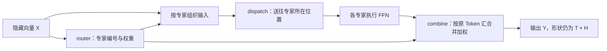

# W2 单元一：MoE／EP 与并行策略 · 可追溯可见文本对话

> 此文件是规则化提取的“可追溯可见文本对话”，不是完整客户端 Session，也不代表已经匿名化。
> system、developer、reasoning、工具事件、客户端注入和附件正文默认不包含在内。

结构化学习记录：[查看记录](<../log/2026-09-28-w2-u1-moe-ep-parallelism.md>)

---

**001 · 用户** · `2026-09-25T03:53:09.172Z` · `msg-64fd6243f6a461fbf93e`

很好。我现在想要开启W2吧。请按照guide-learning skill的规范流程开始吧。

---

**002 · 助手 / 过程更新** · `2026-09-25T03:53:13.783Z` · `msg-be8642b66b16fe9f3c81`

我会使用 `guide-learning` 技能，先核对已确认的 W2 安排和学习断点，再从单元一的 MoE 全景与小型路由算例开始。

---

**003 · 助手 / 过程更新** · `2026-09-25T03:53:43.644Z` · `msg-a0a9020131b50f0fa987`

首次使用时可以浏览[技能说明](/root/workspace/learning/PlanA/.agent-skills/docs/user-guides/guide-learning.md)和[组合指南](/root/workspace/learning/PlanA/.agent-skills/docs/learning-skills-user-guide.md)，里面说明了讲解、练习、验收和记录各环节需要你参与的部分；现在可以直接开始学习。

W2 的内容与既定计划一致。我会先建立 MoE 的整体模型，再逐步进入路由、数据重排、通信和专家计算。

---

**004 · 助手 / 正式回答** · `2026-09-25T03:54:53.320Z` · `msg-cdbd9b575502d98cfbfd`

现在开始 W2。先进入两种课程划分都共用的**单元一：MoE／EP 原理与并行策略**。

W1 让你能够沿着请求找到 ModelRunner 和设备执行边界。W2 要继续进入模型内部：**一次 MoE 层计算中，每个 Token 怎样选择专家，数据怎样送到专家所在位置，结果怎样回到原 Token。**理解这条链后，我们才能判断通信量、负载倾斜，以及 DeepEP 等实现究竟优化了哪个环节。

本单元围绕三个目标展开：

| 目标 | 完成证据 | 所需维度 |
|---|---|---|
| 解释并追踪 MoE 数据流 | 完成小型路由、重排与结果还原算例 | 概念、手算实践 |
| 将专家映射到设备并推导通信量 | 明确 Token、expert、rank、bytes 的对应关系 | 概念、推导实践 |
| 区分并组合六类并行策略 | 五个组合题至少四个无提示正确 | 概念、迁移实践 |

本单元不要求硬件性能实测。先讲模型，再逐节点检查，最后串联与迁移；达到标准后由你确认关闭。课程划分确认后，记录沿用 `W2.md`、`历史记录/W2-学习验收记录.md` 和唯一 `学习断点.md`，不预建后续单元的空记录。

我们的学习顺序是：**MoE 数学关系 → 路由与重排 → 多设备 dispatch／combine → 通信量与负载 → 并行策略组合**。今天先建立第一步。

普通 Transformer 的前馈层，可以把每个 Token 的隐藏向量 \(x_t\) 送入同一组 FFN 参数。稀疏 MoE 则准备多组 FFN，每组称为一个 **expert（专家）**，由 router 为每个 Token 选择其中少数几个。

这样可以增加专家参数总量，同时让单个 Token 只执行一部分专家。但系统还需要保存专家权重、组织不同专家的输入，并在跨设备时搬运数据。Mixtral 论文的 §2.1 给出了这套基本关系；本轮用其 **2024-01-08 的 v1** 核对数学定义，具体框架实现留到固定源码版本后讨论。[Mixtral of Experts](https://arxiv.org/html/2401.04088v1#S2.SS1)

先固定我们自己的教学算例：

- 输入 \(X\) 的形状为 \([T,H]\)：\(T\) 个 Token，每个隐藏向量有 \(H\) 个分量。
- 有 \(E=4\) 个专家，每个专家接收一个 \(H\) 维向量，也返回一个 \(H\) 维向量。
- 每个 Token 选择 \(K=2\) 个不同专家。
- 暂时假定容量足够，没有 Token 被丢弃，也没有额外的共享专家。

这里的 \(x_t\) 是 Token **在当前层的隐藏向量**，不是词表里的 Token ID。

router 对 \(x_t\) 产生四个专家分数，选出最高的两个，并得到对应权重。假设某个 Token 选中了专家 \(E_0\)、\(E_2\)，权重分别为 \(0.7\)、\(0.3\)，那么：

\[
y_t=0.7E_0(x_t)+0.3E_2(x_t)
\]

两个专家都处理完整的 \(x_t\)，各自产生一个 \(H\) 维结果；最后逐元素加权求和，得到这个 Token 的一个 \(H\) 维输出。这是所选 top-k 加权方式下的数学关系，不能直接推广成所有 MoE 模型都采用相同的权重归一化规则。[Mixtral 的门控公式](https://arxiv.org/html/2401.04088v1#S2.SS1)

把这条数学关系变成执行过程，就会出现后续要学的各个环节：



图中的路由信息必须能把专家结果对应回原 Token：它属于哪个 Token、来自哪个专家分支、使用哪个权重。后面讲 permutation 时，我们会具体追踪这些映射。

**EP（Expert Parallelism）是在设备之间分配专家参数的一种方式。**例如设备 0 放专家 \(E_0,E_1\)，设备 1 放专家 \(E_2,E_3\)。被路由到远端专家的隐藏向量需要传过去，专家结果也需要参与原 Token 的结果还原。因此，MoE 的数学计算与专家放在哪个设备上，是两层相互关联的问题。[Mixtral 对 EP 的说明](https://arxiv.org/html/2401.04088v1#S2.SS1)

先停在这里做一个理解检查：

> 一个 Token 选中了分别位于两张卡上的两个专家。两个专家计算完成后，这个 MoE 层应为该 Token 输出**一个隐藏向量还是两个隐藏向量**？如果把这两个专家放到同一张卡上，数学结果与跨卡通信分别会发生什么变化？

按你的理解解释即可；哪里还不清楚，也可以先追问。

---

**005 · 用户** · `2026-09-26T04:08:10.852Z` · `msg-878f982879eff1fcd389`

我同意W2 四个单元各作为一课。在理解检查中，MoE层应为一个Token输出一个隐藏向量。如果两个专家放在同一张卡上，数学上的结果应该不变。但跨卡通信从原本的需要一次跨卡通信变成了不需要跨卡通信，只需要卡内计算就行。

---

**006 · 助手 / 过程更新** · `2026-09-26T04:08:29.801Z` · `msg-e17c4d656f093e1e0e70`

W2 就按四个单元分别成课，当前只激活单元一。我会同步课程记录和恢复位置。

你对输出向量和数学结果的判断正确。通信部分需要补上一个条件：输入原本在哪张卡、结果需要回到哪里。刚才题目没有交代这一点，下面会把它说清楚。

---

**007 · 助手 / 过程更新** · `2026-09-26T04:10:03.879Z` · `msg-c6b142f8840cd81edf50`

单元一已经登记为当前课程，后续三个单元保留为候选。首次检查只记录了已成立的概念证据；接下来会用输入、输出位置都明确的例子，检查通信路径。

---

**008 · 助手 / 正式回答** · `2026-09-26T04:10:56.230Z` · `msg-59c2313d365bb68e4c34`

已确认 W2 分为四课，当前激活单元一，[课程记录](/root/workspace/learning/PlanA/计划/八周冲刺进度/W2.md)和恢复位置已同步，配置校验通过。

**你的数学判断正确，通信判断在附加条件下也成立：两个专家都放到输入与最终输出所在的那张卡上。**刚才题目没有明确输入、输出的设备归属，这是题意缺失。

把条件固定下来：输入 \(x_t\) 在卡 0，最终输出 \(y_t\) 也留在卡 0；专家 \(E_0\) 在卡 0，专家 \(E_2\) 在卡 1。

这时的数据流是：

1. **dispatch：**将 \(x_t\) 从卡 0 送到卡 1，让远端专家 \(E_2\) 处理；本地专家 \(E_0\) 使用卡 0 上的输入。
2. **专家计算：**两张卡分别得到 \(E_0(x_t)\) 和 \(E_2(x_t)\)。
3. **combine：**将 \(E_2(x_t)\) 返回卡 0，再计算  
   \[
   y_t=0.7E_0(x_t)+0.3E_2(x_t).
   \]

所以，“一次跨卡通信”需要再拆清楚：这里有**输入送出去、专家结果返回来两个逻辑方向**。具体对应多少次通信调用、怎样打包，取决于实现。

如果将 \(E_2\) 也放到卡 0，上述专家数据的跨卡往返就消失了。因此，判断通信路径需要同时看：**输入位置、专家位置、输出归属**。

做一个小迁移，巩固这个关系：

> 输入 \(x_t\) 在卡 0，两个被选中的专家现在都在卡 1，约定最终加权求和在卡 0 完成。  
> 请用“卡 0 → 卡 1 → 卡 0”的形式，标出各阶段传递什么、在哪里计算。此时“两个专家在同一张卡”能否消除跨卡通信？

---

**009 · 用户** · `2026-09-26T07:54:22.334Z` · `msg-acab5b872f2a30c5a7e5`

1. dispatch:卡0 -> 卡1，将x\_t从卡0送到卡1，让两个选中的远端专家处理；
2. 专家计算：卡1计算，卡1通过计算处理得到E\_2(x\_t)和E\_3(x\_t)；
3. combine：卡1 ->卡0，将结果E\_2(x\_t)和E\_3(x\_t)返回卡0，然后计算y\_t=0.7E\_2(x\_t)+0.3E\_3(x\_t)。

此时两个专家在同一张卡无法消除跨卡通信。

我有一个问题，再启动EP时，每个卡上面处理的原始输入token是不一样的吗？EP会对输入token激活值进行切分吗？

---

**010 · 助手 / 过程更新** · `2026-09-26T07:54:41.233Z` · `msg-ef3a8fe112ba76715dfa`

你的三步推导正确：输入和最终输出归属卡 0，两个专家在卡 1，因此仍有跨卡往返。

这个问题要区分“专家参数放在哪里”和“进入 MoE 前，Token 激活值怎样分布”。我会核对框架对这两层的处理，再用一个小例子说明。

---

**011 · 助手 / 正式回答** · `2026-09-26T07:55:59.784Z` · `msg-4eaa7e3fd9985613a088`

你的三步推导正确，这个变式通过。你已经把**专家计算的位置**和**Token 输入、输出的归属位置**区分开了。

关于新问题：**常见配置下，各卡最初处理不同的 Token；但不能仅凭“开启 EP”就断定这一点。EP 会重新分发激活值，而单个 Token 的隐藏向量是否被切分，要看是否还组合了其他并行方式。**

先把激活矩阵写成：

\[
X\in\mathbb{R}^{T\times H}
\]

这里有两个不同的轴：

- **沿 \(T\) 分：**把不同 Token 分给不同卡，每个 Token 仍有完整的 \(H\) 维向量。
- **沿 \(H\) 分：**把同一个 Token 的隐藏向量拆成几段。

EP 的核心划分对象则是**专家参数**：哪些专家由哪些设备负责。这和上面两个激活轴的划分需要分别说明。[Megatron Core 并行策略说明](https://docs.nvidia.com/megatron-core/developer-guide/latest/user-guide/parallelism-guide.html#expert-parallelism-ep)

我们先采用一个明确配置：**Attention 使用 DP，每张卡独立处理一批请求；MoE 专家跨两张卡分布，不叠加专家内部的 TP。**vLLM 支持这种 Attention 用 DP、专家层用 EP 的组合。[vLLM 官方说明](https://docs.vllm.ai/en/latest/serving/data_parallel_deployment/)

进入 MoE 前，可以是：

| 设备 | 本来负责的 Token 激活 | 本地保存的专家 |
|---|---|---|
| 卡 0 | \(x_0,x_1\) | \(E_0,E_1\) |
| 卡 1 | \(x_2,x_3\) | \(E_2,E_3\) |

**这张表的两列是不同的归属关系。**卡 0 保存 \(E_0\)，不代表 \(E_0\) 只处理卡 0 原有的 Token。

例如，router 为 \(x_0\) 选择 \(E_0\) 和 \(E_2\)：

- 卡 0 的 \(E_0\) 处理完整的 \(x_0\)。
- 卡 1 的 \(E_2\) 也处理完整的 \(x_0\)，因此需要把这个激活向量送过去。
- 两路专家结果最终合成为 \(y_0\)，按本例约定回到卡 0。

所以，本例中的 dispatch 是**根据路由选择，将完整的 Token 向量按目标专家重新组织、分发**。它不会把 \(x_0\) 的前 \(H/2\) 个分量交给 \(E_0\)、后 \(H/2\) 个分量交给 \(E_2\)：两个专家各自需要完整输入。top-k 还意味着同一个 Token 会被多个专家消费，不能把它理解成简单地将输入平均分成互不重叠的两半。

至于为什么不能说“EP 开启后原始 Token 一定不同”：**进入 MoE 前的布局可能来自 TP，也可能来自 DP 或 SP。**例如，本地固定快照中的 Qwen3 MoE 在开启 sequence parallel 时，会在专家执行前沿 Token 维切分激活，之后沿第 0 维收集输出。这说明“切 Token 行”是需要明确配置和实现位置的操作。[固定版本源码](https://github.com/vllm-project/vllm/blob/1dc464d42681d22f38caf1fdc1eb632dc4421c45/vllm/model_executor/models/qwen3_moe.py#L215-L234)

接下来做一个很小的检查，沿用上表的配置：

> \(x_2\) 原本在卡 1，router 为它选择卡 0 的 \(E_1\) 和卡 1 的 \(E_3\)。送给卡 0 的应当是完整的 \(H\) 维 \(x_2\)，还是其中一部分？combine 后的 \(y_2\) 应归属哪张卡？

---

**012 · 用户** · `2026-09-26T08:17:47.767Z` · `msg-8f3dc3c9064a2d27c5e3`

回答检查问题：送给卡0的是完整的H维x\_2。combine后应归属卡1.
我还有一个问题：那如果我的模型部署配置不开启DP和SP，仅开启TP+EP，那么是不是每张卡都拥有所有的token数据[T,H]大小的tensor？那么此时对于dispatch通信是不是就不需要了？在dispatch阶段，只需要根据router的选择结果，查看哪些token选择了本卡上的专家，然后给这些token进行专家计算，然后计算完之后每张卡再combine通信广播给所有卡？

---

**013 · 助手 / 过程更新** · `2026-09-26T08:18:06.897Z` · `msg-4e907121fe3b5959f8f9`

你的检查回答正确。新的推导在“MoE 入口的各卡确实持有相同的完整激活”这个前提下是成立的：输入已经在本地，就可能省去跨卡分发。

我会核对 vLLM 在这组配置下的执行路径，重点确认入口是否复制，以及最后怎样合并各卡的专家结果。

---

**014 · 助手 / 正式回答** · `2026-09-26T08:19:32.774Z` · `msg-ac4a0b369bb0c5f33559`

你的检查回答正确。**这次的新推导也成立：如果各卡在 MoE 入口已经拥有相同的完整输入，就可以省去跨卡的输入分发，只计算本地专家的贡献，最后归约得到完整输出。**需要调整的是：最后通常用 **AllReduce 求和**来表达，而不只是广播。

在我们核对的 vLLM 固定快照中，Qwen3 MoE 的普通路径确实支持这种情况：`DP=1、TP>1、EP 开启、SP 关闭`，并且没有其他 Token 分片。这里 Attention 使用 TP，MoE 则按 EP 分配完整专家。[专家分配源码](https://github.com/vllm-project/vllm/blob/1dc464d42681d22f38caf1fdc1eb632dc4421c45/vllm/model_executor/layers/fused_moe/config.py#L1240-L1258)

**“各卡都有 \([T,H]\)”描述的是 MoE 入口这个位置**，不能外推成 TP 计算过程中的所有中间张量都完整复制。这里的 \(T\) 也是本次 forward 参与计算的 Token 数，不是全部历史上下文。

沿着你的方案走一遍。假设：

- 两张卡都有相同的 \(X\)，router 的选择和权重也一致。
- 卡 0 拥有 \(E_0,E_1\)，卡 1 拥有 \(E_2,E_3\)。
- \(x_t\) 选择 \(E_0,E_2\)，权重分别为 \(0.7,0.3\)。

那么：

| 阶段 | 卡 0 | 卡 1 |
|---|---|---|
| 输入 | 已有完整 \(x_t\) | 已有完整 \(x_t\) |
| 本地专家计算 | 计算 \(E_0(x_t)\) | 计算 \(E_2(x_t)\) |
| 本地加权贡献 | \(y_t^{(0)}=0.7E_0(x_t)\) | \(y_t^{(1)}=0.3E_2(x_t)\) |
| AllReduce 后 | 获得完整 \(y_t\) | 获得完整 \(y_t\) |

归约执行的是：

\[
y_t=y_t^{(0)}+y_t^{(1)}
\]

AllReduce 在语义上同时完成两件事：**将各卡对应位置的部分贡献相加，让各卡都获得求和结果。**输入虽然重复，但专家归属不同，所以各卡贡献覆盖不同专家，不会因此把完整结果重复累加。

这也解释了你说的 dispatch：

- **跨卡输入传输可以省去**，因为需要的激活已经在本地。
- 本地仍需根据路由结果识别哪些 Token 由本卡专家处理，并按算子需要组织数据；这些操作可能融合在内核中。
- 本地专家的加权结果随后参与归约。该 vLLM 路径确实关闭了相应的 All-to-All 内核路径，并在输出处执行 TP AllReduce。[通信条件](https://github.com/vllm-project/vllm/blob/1dc464d42681d22f38caf1fdc1eb632dc4421c45/vllm/model_executor/layers/fused_moe/config.py#L1059-L1063)、[输出归约](https://github.com/vllm-project/vllm/blob/1dc464d42681d22f38caf1fdc1eb632dc4421c45/vllm/model_executor/layers/fused_moe/runner/moe_runner.py#L490-L496)

相比上一题，**输出布局也变了**：上一题要求每个 Token 的结果返回其来源卡；现在要求所有 TP rank 都持有完整输出，因此 AllReduce 符合这个要求。

这个结论有框架边界。例如 Megatron Core 0.15 的文档要求 TP 与 EP 组合时开启 SP，不能把上述 vLLM 配置直接套过去。[Megatron Core 约束](https://docs.nvidia.com/megatron-core/developer-guide/0.15.0/api-guide/moe.html#parallelism)

再用一个小变式检查“部分贡献”的含义：

> 在当前输入复制的方案中，某个 Token 选中的两个专家都在卡 0。卡 1 对这个 Token 提交给 AllReduce 的向量应该是什么？归约结束后，卡 1 是否也能得到完整的该 Token 输出？

---

**015 · 用户** · `2026-09-26T08:29:18.991Z` · `msg-1e9297b5995330bc4bb1`

回答检查题：卡 1 对这个 Token 提交给 AllReduce 的向量应该是全零向量，应该不做出数值贡献了。allreduce归约结束后，卡1也能得到完整的该token输出。
你提到的allreduce解了我之前的疑惑。我一直以为开启ep之后必定会有all2all通信在moe计算中。原来在纯tp+ep的方案中，依旧采用的是allreduce通信。原来这就是我之前开启profiler检查执行moe模型算子情况时没找到all2all通信的原因，因为不开启dp或sp，只有tp+ep的话，依旧只需要allreduce通信就足够了。

---

**016 · 助手 / 正式回答** · `2026-09-26T08:29:57.711Z` · `msg-ac4a42da42e4d65d41d3`

这题通过。卡 1 提供零贡献，AllReduce 后仍能得到完整输出；你已经理解了“本地部分结果 → 全局完整结果”的关系。

**你之前把 EP 与 All-to-All 必然绑定的理解，可以修正了：EP 描述专家参数的分布，具体通信还取决于激活与输出的布局。**在刚才核对的 vLLM 路径中，各卡已有完整输入，本地专家贡献通过 AllReduce 合并，因此无需再跨卡分发输入。

这与你之前的 profiler 观察一致。不过，**它目前是对那次观察的合理解释，还不能直接确认为历史原因**：还需要当时的框架版本、实际配置和执行路径来对应。另外，某些实现用 AllGather／ReduceScatter 完成专家数据交换，trace 中未出现 `AllToAll` 名称，也不能单独证明没有这类交换。[vLLM 通信后端说明](https://github.com/vllm-project/vllm/blob/1dc464d42681d22f38caf1fdc1eb632dc4421c45/docs/serving/expert_parallel_deployment.md#backend-selection-guide)

现在回到我们的贯穿算例，进入**路由结果怎样变成专家工作量**。

沿用四个专家、每个 Token 选择两个专家的设定，假定不丢弃 Token、暂不加入 padding：

| Token | 选中的专家 |
|---|---|
| \(t_0\) | \(E_0,E_2\) |
| \(t_1\) | \(E_1,E_2\) |
| \(t_2\) | \(E_0,E_3\) |
| \(t_3\) | \(E_2,E_3\) |

例如，\(t_0\) 会形成两条计算分配关系：\((t_0,E_0)\) 和 \((t_0,E_2)\)。两个专家分别消费它的完整隐藏向量。

将“送给专家 \(E_e\) 处理的 Token 数”记为 \(n_e\)。在当前假设下：

\[
\sum_e n_e=T\times K
\]

因为每个 Token 恰好贡献 \(K\) 条专家计算分配。**这里统计的是计算任务数；实际跨卡发送量还要结合专家位置、输入布局和传输实现来算。**

请你根据表格，列出四个专家各自收到哪些 Token，以及对应的 \(n_0,n_1,n_2,n_3\)。这张表会直接成为下一步数据重排的依据。

---

**017 · 用户** · `2026-09-26T08:45:29.187Z` · `msg-b6687e05557a485f9a78`

| Expert | 收到的token         | 处理token数(n\_i) |
| ------ | ---------------- | -------------- |
| $E\_0$ | $t\_0,t\_2$      | 2              |
| $E\_1$ | $t\_1$           | 1              |
| $E\_2$ | $t\_0,t\_1,t\_3$ | 3              |
| $E\_3$ | $t\_2,t\_3$      | 2              |

---

**018 · 助手 / 正式回答** · `2026-09-26T08:46:12.093Z` · `msg-31e29a0702571d3e8791`

表格完全正确，而且满足：

\[
2+1+3+2=8=T\times K=4\times2
\]

现在进入下一步：**把“每个 Token 选择哪些专家”，转换成“每个专家连续读取哪些 Token”**。这样，同一个专家就可以把分配给自己的输入组成一批进行计算。

原始输入按 Token 顺序排列：

\[
X=
\begin{bmatrix}
x_0\\x_1\\x_2\\x_3
\end{bmatrix}
\in\mathbb{R}^{4\times H}
\]

根据你刚才的表，一种按专家排列的逻辑布局是：

| 打包后的行号（从 0 开始） | 输入向量 | 负责的专家 |
|---:|---|---|
| 0 | \(x_0\) | \(E_0\) |
| 1 | \(x_2\) | \(E_0\) |
| 2 | \(x_1\) | \(E_1\) |
| 3 | \(x_0\) | \(E_2\) |
| 4 | \(x_1\) | \(E_2\) |
| 5 | \(x_3\) | \(E_2\) |
| 6 | \(x_2\) | \(E_3\) |
| 7 | \(x_3\) | \(E_3\) |

得到的逻辑输入为 \(P\in\mathbb{R}^{8\times H}\)。这里包含了 **top-k 展开与按专家重排**：四个原始 Token 对应八条专家计算任务，每行仍保留完整的 \(H\) 维。

我们先用这张逻辑表理解执行，不假定实现一定会实际创建完整的 \(8\times H\) 缓冲区。

你给出的计数还能确定每个专家的行区间。用左闭右开的区间表示：

\[
E_0:[0,2),\quad E_1:[2,3),\quad
E_2:[3,6),\quad E_3:[6,8)
\]

因此需要保留两类信息：

- **专家区间：**哪些行交给同一组专家权重处理。
- **来源映射：**每行对应原来的哪个 Token，便于随后把专家结果放回对应输出，并使用正确的路由权重。

这里有一个值得检查的边界：

> 打包后的第 0 行和第 3 行都是同一个 \(x_0\)。既然输入完全相同，能否只计算第 0 行，再把它的专家输出直接复用为第 3 行的结果？为什么？

---

**019 · 用户** · `2026-09-26T14:41:12.892Z` · `msg-198188beb0d73006221a`

这肯定不可以。因为第0行的专家输出结果是E0计算出来的，而第3行的专家输出结果是E2计算出的。虽然二者输入一样，但是进行处理的专家权重不一样。二者最终的结果也很可能不一样，所以不能复用。

---

**020 · 助手 / 正式回答** · `2026-09-26T14:42:05.979Z` · `msg-494ece085ed927fddfa6`

正确。**一条专家计算任务由“Token 输入 + 专家参数”共同确定。**同一个 \(x_0\) 可以供两个专家读取，但不能仅凭输入相同就复用计算结果。

我们先保持 \(E_e(x)\) 这个抽象，把数据流走到输出端，再展开专家内部的矩阵计算。

专家计算完成后，假设结果仍按打包后的八行排列，记为：

\[
Z=[z_0,z_1,\ldots,z_7]^\top\in\mathbb{R}^{8\times H}
\]

沿用刚才的排列，每行对应的原始 Token 编号是：

```text
结果行号：  0  1  2  3  4  5  6  7
原 Token：  0  2  1  0  1  3  2  3
```

例如：

\[
z_0=E_0(x_0),\qquad z_3=E_2(x_0)
\]

若 \(t_0\) 对这两个专家的路由权重分别为 \(0.7、0.3\)，那么：

\[
y_0=0.7z_0+0.3z_3
\]

**combine 需要把八条专家结果合成为四个 Token 输出。**仅仅按原 Token 编号重新排序，还会留下每个 Token 的两条专家结果；还必须应用对应权重并求和。

因此，当前算例需要保留的关系是：

\[
\text{结果行}\longrightarrow
(\text{原 Token 编号},\ \text{对应的路由权重})
\]

专家区间告诉我们“怎样计算”，这组映射告诉我们“计算结果怎样还原”。在数学上，最终输出形状回到 \([4,H]\)。

现在由你完成其中一行：

> \(t_2\) 选择的是 \(E_0,E_3\)，对应权重分别为 \(0.4、0.6\)。根据上面的行映射，\(y_2\) 应取 \(Z\) 的哪两行？请写出加权表达式。

---

**021 · 用户** · `2026-09-26T14:52:29.312Z` · `msg-15d70453ead721a4d38e`

对应第1行和第6行。y_1=0.4z_1+0.6z_6

---

**022 · 助手 / 正式回答** · `2026-09-26T14:53:11.628Z` · `msg-c4547564a6003c635c85`

行号和权重都正确，左侧的输出下标应写成 **\(y_2\)**：

\[
\boxed{y_2=0.4z_1+0.6z_6}
\]

这里要区分两套编号：**\(z\) 的下标是打包后的结果行号，\(y\) 的下标是原始 Token 编号。**因此，第 1、6 行共同还原的是 Token 2 的输出。这个笔误不影响你对映射关系的理解。

现在用同一个算例看**专家负载与设备负载**。继续沿用卡 0 放 \(E_0,E_1\)，卡 1 放 \(E_2,E_3\)：

| 设备 | 专家及各自任务数 | Token–expert 计算任务总数 |
|---|---|---:|
| 卡 0 | \(E_0:2,\ E_1:1\) | 3 |
| 卡 1 | \(E_2:3,\ E_3:2\) | 5 |

两张卡各有两个专家，但本轮的计算任务数并不相同。**均分专家数量，不能保证均分路由后的工作量。**这里先比较任务数；实际耗时还取决于专家结构、批量大小和执行效率。

还要注意，“五条计算任务”不一定代表“五个不同的 Token”。卡 1 上：

- \(E_2\) 处理 \(t_0,t_1,t_3\)；
- \(E_3\) 处理 \(t_2,t_3\)。

请你判断：**参与卡 1 专家计算的不同 Token 一共有几个？为什么它与五条计算任务的数量不同？**

---

**023 · 用户** · `2026-09-26T14:56:53.753Z` · `msg-f75bcef20a6b079a5022`

不同的token只有4个。因为一张卡上可能会有一些专家都要处理某个同一个token。导致五条计算任务中，对于处理的token可能会有重复的token。比如上面例子中t3就同时被E2和E3处理。

---

**024 · 助手 / 正式回答** · `2026-09-26T14:57:45.670Z` · `msg-30191e213a9f0d830e54`

正确。\(t_3\) 是一个 Token，却对应 \((t_3,E_2)\)、\((t_3,E_3)\) 两条计算任务。**不同 Token 数、专家计算任务数，是两种不同的计数。**

接下来把这个区别用到 **dispatch 通信量**上。

为了计算跨卡传输，我们明确采用 **Token 分片输入**：每个 Token 最初只在一张卡上。专家位置仍是卡 0 放 \(E_0,E_1\)，卡 1 放 \(E_2,E_3\)。为突出同一 Token 被同卡多个专家使用的情况，这次将 \(t_3\) 的来源改为卡 0：

| Token | 最初所在设备 | 选中的专家 |
|---|---|---|
| \(t_0\) | 卡 0 | \(E_0,E_2\) |
| \(t_1\) | 卡 0 | \(E_1,E_2\) |
| \(t_2\) | 卡 1 | \(E_0,E_3\) |
| \(t_3\) | 卡 0 | \(E_2,E_3\) |

再固定一个传输规则：**同一个 Token 发往同一个目标设备时，只发送一份激活，由目标设备上的多个专家共同读取。**这是当前算例的明确假设，后面读真实实现时需要核对。

例如 \(t_3\)：

- 它需要在卡 1 执行两条专家计算任务。
- 按上述规则，卡 0 只需向卡 1 发送一份完整的 \(x_3\)。
- 卡 1 的两个专家分别使用这份输入，执行各自的计算。

因此，在这个传输规则下：

\[
B_{r\rightarrow s}
=
U_{r\rightarrow s}\times H\times b
\]

其中，\(U_{r\rightarrow s}\) 是从设备 \(r\) 发往设备 \(s\) 的**不同 Token 数**，\(H\) 是隐藏维度，\(b\) 是每个元素的字节数。

设 \(H=8\)，激活使用 BF16，每个元素 2 字节，则一个完整 Token 向量的载荷为：

\[
8\times2=16\text{ 字节}
\]

当前只统计激活载荷，暂不计路由元数据、padding 和协议开销；本地专家直接读取本地输入，不计入跨卡字节数。

请根据表格，分别列出：

- **卡 0 → 卡 1：**需要发送哪些 Token，共多少字节？
- **卡 1 → 卡 0：**需要发送哪些 Token，共多少字节？

---

**025 · 用户** · `2026-09-27T07:39:46.930Z` · `msg-43ec89430872e4b527d8`

卡0上有E_0（处理t_0,t_2）和E_1（处理t_1），其中t_2需要从卡1发送到卡0，所以卡1需要发送到卡0 token t_2，共16字节。卡1上有E_2（处理t_0,t_1,t_3）和E_3（处理t_2,t_3），其中t_0,t_1,t_3需要从卡0发送到卡1，所以卡0需要发送到卡1 token t_0,t_1,t_3，共48字节。

---

**026 · 助手 / 正式回答** · `2026-09-27T07:40:24.909Z` · `msg-f9f691933b4d2d3d8a1a`

计算正确：

| dispatch 方向 | 发送的 Token | 激活载荷 |
|---|---|---:|
| 卡 0 → 卡 1 | \(t_0,t_1,t_3\) | 48 字节 |
| 卡 1 → 卡 0 | \(t_2\) | 16 字节 |

这一阶段的发送载荷合计为 **64 字节**。接收端看到的是同一批数据，统计总传输载荷时不再把接收量重复加一次。

接下来计算 **combine 的回传量**。这里也要先固定实现规则：**每条专家结果分别回传，还是先在专家所在卡上合并同一 Token 的贡献？**

以卡 1 上的 \(t_3\) 为例，它产生两个专家结果：

\[
E_2(x_3),\qquad E_3(x_3)
\]

有两种数学上成立的处理方式：

- **方案 A：分别回传。**将两个专家结果都送回卡 0，由卡 0 加权求和。
- **方案 B：本地先合并。**假定卡 1 已获得对应路由权重，先计算
  \[
  r_3=g_{3,2}E_2(x_3)+g_{3,3}E_3(x_3)
  \]
  再将一个 \(H\) 维向量 \(r_3\) 送回卡 0。

这里 \(g_{3,2}\)、\(g_{3,3}\) 分别是 \(t_3\) 对两个专家的权重。对于只有部分选中专家位于本卡的 Token，本地合并得到的就是它的**部分加权贡献**，来源卡还要与其他贡献相加。

为了只比较载荷数量，本题约定每个回传向量仍为 \(H=8\)、BF16，即 **16 字节**；暂不讨论内部累加精度与舍入差异。

现在只看 **卡 1 → 卡 0**。需要回传的是 \(t_0,t_1,t_3\) 的相关结果：

> 在方案 A 和方案 B 下，分别需要发送哪些结果、多少个向量、共多少字节？

---

**027 · 用户** · `2026-09-27T14:13:32.817Z` · `msg-0789a7e80f49a1c9ce4b`

对于方案A，那么就需要回传E_2(t_0),E_2(t_1),E_2(t_3),E_3(t_3)这四份结果，共四个H维向量，共16*4=64字节。对于方案B，方案A中的E_2(t_3),E_3(t_3)就可以先合并，其他的结果不变，那么就是三份结果，三个向量，共48字节。

---

**028 · 助手 / 正式回答** · `2026-09-27T14:14:21.365Z` · `msg-5f6fd26f9f67123aa0cf`

计算正确：**方案 A 为 64 字节，方案 B 为 48 字节。**

“其他结果不变”在**向量数量**上成立。按方案 B“回传部分加权贡献”的约定，卡 1 实际返回：

\[
\begin{aligned}
r_0&=g_{0,2}E_2(x_0)\\
r_1&=g_{1,2}E_2(x_1)\\
r_3&=g_{3,2}E_2(x_3)+g_{3,3}E_3(x_3)
\end{aligned}
\]

来源卡收到后与本地贡献相加，不能再重复乘一次路由权重。

现在采用方案 B，完整的通信账本是：

| 阶段 | 卡 0 → 卡 1 | 卡 1 → 卡 0 | 发送载荷合计 |
|---|---:|---:|---:|
| dispatch | 48 字节 | 16 字节 | 64 字节 |
| combine | 16 字节 | 48 字节 | 64 字节 |

两个阶段共发送 **128 字节**。接下来要把“字节数”连接到“通信时间下界”。

**总传输量不能直接除以某一个方向的带宽，就当作经过的时间。**还需要知道两个方向能否同时传输、是否共享带宽。

先固定一个理想模型：

- 两个方向可以同时传输，各自独立拥有带宽 \(B\)。
- 忽略启动延迟、协议开销和其他争用。
- 一个阶段必须等两个方向都完成。

那么该阶段的理想时间下界是：

\[
t_{\min}
=
\max\left(
\frac{D_{0\rightarrow1}}{B},
\frac{D_{1\rightarrow0}}{B}
\right)
\]

因为较小的传输可以与较大的传输同时进行，阶段完成时间由较慢的一侧决定。

做一个便于计算的放大算例：设 dispatch 的两个方向分别发送 **48 MB、16 MB**，每个方向带宽均为 **16 GB/s**。这里统一使用十进制单位，\(1\text{ GB}=1000\text{ MB}\)。

> 按上述模型，dispatch 的理想时间下界是多少毫秒？为什么不直接用 \(64\text{ MB}\div16\text{ GB/s}\)？

---

**029 · 用户** · `2026-09-27T14:28:44.523Z` · `msg-a39c4b123c5d5f391f75`

理想时间下界应该是48(MB)/16(GB/s)=3ms.因为按照如上理想模型，两个方向可以同时传输，那么下界就由传输量较大/较慢的一个方向决定。

---

**030 · 助手 / 过程更新** · `2026-09-27T14:29:31.951Z` · `msg-3bbcb1cde319f0806f8d`

3 ms 的判断正确。这个模型下，阶段完成时间取两个方向传输时间的较大值。接下来把 dispatch 和 combine 的账算完整，再进入计划中的 EP、专家放置和 EPLB，看看通信量与计算负载为什么需要分开分析。

---

**031 · 助手 / 正式回答** · `2026-09-27T14:30:02.217Z` · `msg-2874d9b722d94c249c46`

正确，两个方向分别需要 \(3\text{ ms}\) 和 \(1\text{ ms}\)，同时传输时由较慢的方向决定阶段完成时间。

沿用放大后的载荷，方案 B 的 combine 也是两个方向分别传输 16 MB、48 MB，因此其理想下界同样是 3 ms。**若 dispatch 与 combine 严格串行执行，两阶段通信时间的理想下界合计为 6 ms**；这里尚未计入专家计算、启动延迟等开销。有分块流水或通信计算重叠时，需要重新分析时间线。

现在进入**专家放置与负载均衡**。回到原来的小算例：

\[
(n_0,n_1,n_2,n_3)=(2,1,3,2)
\]

原来卡 0 放 \(E_0,E_1\)，承担三条任务；卡 1 放 \(E_2,E_3\)，承担五条任务。虽然专家数量均分，计算任务却没有均分。

这里需要区分三个关系：

| 概念 | 决定什么 |
|---|---|
| router | 当前 Token 选择哪些**逻辑专家**，使用什么权重 |
| 专家放置（placement） | 每个逻辑专家的参数放在哪张卡 |
| EPLB | 根据负载统计，调整专家的物理分布，改善设备负载不均 |

例如，把 \(E_2\) 从一张卡移动到另一张卡，移动的是 **\(E_2\) 的参数及其执行位置**。Token 仍然选择 \(E_2\)，数学上仍计算 \(E_2(x)\)。不能为了让另一张卡忙起来，直接换成参数不同的 \(E_1(x)\)。

在已核对的 vLLM 实现说明中，EPLB 每次 forward 收集负载统计，并周期性调整专家分布；它与每个 Token 的 router 选择处于不同的工作节奏。[固定版本的 EPLB 说明](https://github.com/vllm-project/vllm/blob/1dc464d42681d22f38caf1fdc1eb632dc4421c45/docs/serving/expert_parallel_deployment.md#expert-parallel-load-balancer-eplb)

用当前算例做一次放置调整。假定专家结构相同，先以计算任务数衡量负载，并忽略移动参数的成本：

> 每张卡仍只能放两个专家，每个专家只有一份。你会怎样重新分配 \(E_0,E_1,E_2,E_3\)，让两张卡各承担四条任务？这个调整是否需要改变 router 为各 Token 选出的逻辑专家？

---

**032 · 用户** · `2026-09-27T14:40:55.773Z` · `msg-7263d78c261da869793a`

我会让一张卡上放E_0,E_3，另一张卡放E_1,E_2.这是因为E_0和E_3都需要处理2条计算任务，而E_1和E_2需要处理1条和3条任务。这样分配就使得每张卡都承担四条任务了。不需要改变router选出的逻辑专家。逻辑上选出的计算专家依旧是那几个。

---

**033 · 助手 / 正式回答** · `2026-09-27T14:41:43.819Z` · `msg-4fb897979021e1d21d1d`

你的分配成立：两张卡的任务数变成 \(2+2=4\) 和 \(1+3=4\)。**调整的是“逻辑专家 → 设备”的映射，“Token → 逻辑专家”的选择保持不变。**

接下来看看单纯调整放置的局限。假设另一批输入产生：

\[
(n_0,n_1,n_2,n_3)=(1,1,6,0)
\]

总共八条任务，平均每卡四条。但如果每个专家只有一份，\(E_2\) 放到哪张卡，那张卡就至少承担六条任务。仅移动整个专家，无法把它的六条任务分开。

这时可以考虑**专家冗余副本**。在推理场景中，让同一个逻辑专家 \(E_2\) 拥有两份参数相同的物理副本，记为 \(E_2^{(a)}\)、\(E_2^{(b)}\)：

- router 仍然选择逻辑专家 \(E_2\)。
- 每条 \((t,E_2)\) 任务选择其中一个副本执行。
- 两个副本承接不同任务，共同分担 \(E_2\) 的负载。
- 额外副本需要额外存储专家权重。[vLLM 的专家冗余说明](https://github.com/vllm-project/vllm/blob/1dc464d42681d22f38caf1fdc1eb632dc4421c45/docs/serving/expert_parallel_deployment.md#expert-distribution-formula)

这里区分了**逻辑专家数量**与**物理副本数量**：增加副本不会自动增加模型的 top-k，也不会把 \(E_2\) 变成两个不同的专家函数。

作为新的纸面算例，我们明确放宽上一题的存储约束，允许额外增加一个专家权重槽位，采用：

| 设备 | 保存的专家／副本 | 除 \(E_2\) 外的任务数 |
|---|---|---:|
| 卡 0 | \(E_0,E_1,E_2^{(a)}\) | 2 |
| 卡 1 | \(E_2^{(b)},E_3\) | 0 |

仍然只按任务数比较负载：

> \(E_2\) 的六条任务应怎样分给两个副本，才能让两张卡各承担四条任务？对于其中一条 \((t,E_2)\) 任务，需要让两个副本都计算并把结果相加吗？

---

**034 · 用户** · `2026-09-27T14:47:25.640Z` · `msg-195d23e1c4264488b6e5`

可以让副本a承担2条计算任务，副本b承担4条计算任务。不需要让两个副本都计算，其中某一条计算任务只要在两个副本中选一个进行计算就行了。

---

**035 · 助手 / 正式回答** · `2026-09-27T14:48:23.933Z` · `msg-e295604d20004901569b`

正确：副本 \(a\) 承担 2 条、副本 \(b\) 承担 4 条，加上其他专家的任务后，两张卡各承担 4 条。**每条 Token–expert 任务只选择一个副本执行，逻辑计算量不会因增加副本而翻倍。**

我需要修正上一轮算例的一个设定遗漏：如果继续沿用“四个 Token、top-2、每个 Token 选择不同专家”，单个专家最多收到四个 Token，不能出现 \(n_2=6\)。

因此，刚才的冗余演示应明确为 **八个 Token、top-1**，对应 \((1,1,6,0)\)。你的分配答案在这个设定下成立。这也给出一个计数检查：在不丢弃分配、每个 Token 选择 \(K\) 个不同逻辑专家时，

\[
\sum_e n_e=TK,\qquad n_e\le T
\]

接下来回到原来的**四个 Token、top-2** 算例，补上此前暂时略过的 **capacity（专家容量）**：

\[
(n_0,n_1,n_2,n_3)=(2,1,3,2)
\]

\(n_e\) 表示路由产生的需求；若采用固定容量方案，\(C_e\) 则表示该专家允许接收的任务上限。假设每个专家的容量都是 2，那么 \(E_2\) 的三条分配会溢出一条。

**容量不足之后怎样处理，是必须明确的策略。**有些方案丢弃超出容量的分配；保持全部分配的方案则需要相应的执行与存储安排。不能仅凭“容量为 2”就默认模型会怎样处理。[Megatron Core 的 Token 分发策略](https://docs.nvidia.com/megatron-core/developer-guide/0.15.0/api-guide/moe.html#token-dispatch-mechanism)

本题明确采用：**只丢弃 \(E_2\) 溢出的那一条 Token–expert 分配，其他分配全部保留**。这不等于删除该 Token 在其他专家上的任务。

> 此时实际保留的专家计算任务一共有多少条？我们还能要求“容量处理后的任务数之和等于 \(TK\)”吗？

---

**036 · 用户** · `2026-09-27T14:54:45.146Z` · `msg-4c9716322f404d36ebaa`

此时保留的专家计算任务一共有7条，此时计算任务总数会小于TK，不能要求之和等于TK。

---

**037 · 助手 / 正式回答** · `2026-09-27T14:55:29.248Z` · `msg-e965b0dfbabefa7a6575`

正确。若把丢弃的 **Token–expert 分配数**记为 \(D\)，那么：

\[
\sum_e n_e^{\text{保留}}=TK-D=8-1=7
\]

容量处理前后的计数要分别记录。

这一小段还需要区分 **有效任务数与 padding 后的槽位数**。假设每个专家的输入都补齐到容量 \(C=2\)：

| 专家 | 原始分配数 | 保留的有效任务数 | 补齐行数 |
|---|---:|---:|---:|
| \(E_0\) | 2 | 2 | 0 |
| \(E_1\) | 1 | 1 | 1 |
| \(E_2\) | 3 | 2 | 0 |
| \(E_3\) | 2 | 2 | 0 |
| 合计 | 8 | 7 | 1 |

此时四个专家的输入张量都可以呈现为 \([2,H]\)，总共八个槽位，但其中只有七条有效任务。

**padding 不会补回被丢弃的计算。**\(E_1\) 的补齐行不对应真实的 Token–expert 分配，combine 必须依据有效计数或映射信息排除它；它不能替代 \(E_2\) 丢掉的那条任务。

这与你之前查看 profiler 的场景也有关：

> 如果 profiler 显示四个专家的输入形状都是 \([2,H]\)，能否据此判断“原来的八条路由分配都得到了计算”？为什么？

---

**038 · 用户** · `2026-09-27T14:58:05.755Z` · `msg-77cf5d41424d32065d2b`

不能，因为输入形状一致的原因是padding补齐导致的，并不代表全部有效的计算任务。

---

**039 · 助手 / 过程更新** · `2026-09-27T14:58:20.103Z` · `msg-86430e1b666aa62f7abb`

判断正确：本例中的八个输入槽位，只有七条有效任务。

接下来沿用这套数据流，展开此前用 \(E_e(x)\) 表示的专家内部计算，再看不同专家的矩阵运算怎样组成 grouped GEMM。

---

**040 · 助手 / 正式回答** · `2026-09-27T14:59:26.290Z` · `msg-bb94852a7ee22fa08b72`

正确。**张量形状描述存储或计算布局，不能单独证明有效路由任务全部保留。**容量与 padding 的区别已经清楚了。

接下来展开专家内部计算。我们回到**不丢弃、无 padding** 的主算例，专家任务数仍为 \((2,1,3,2)\)。

以一个无 bias 的 **SwiGLU 专家**为例。把专家 \(E_e\) 收到的输入记为：

\[
P_e\in\mathbb{R}^{n_e\times H}
\]

其中 \(n_e\) 是输入行数，\(H\) 是隐藏维度。再引入 \(F\)：**专家内部的中间维度**。采用输入行向量的数学约定，三组权重为：

| 权重 | 形状 | 作用 |
|---|---|---|
| \(W_{\text{gate},e}\) | \([H,F]\) | 产生门控分支 |
| \(W_{\text{up},e}\) | \([H,F]\) | 产生另一条特征分支 |
| \(W_{\text{down},e}\) | \([F,H]\) | 投影回隐藏维度 |

计算分三步：

\[
\begin{aligned}
A_e&=P_eW_{\text{gate},e},\quad
B_e=P_eW_{\text{up},e}
&&[n_e,F]\\
U_e&=\operatorname{SiLU}(A_e)\odot B_e
&&[n_e,F]\\
Z_e&=U_eW_{\text{down},e}
&&[n_e,H]
\end{aligned}
\]

这里 \(\operatorname{SiLU}(a)=a\,\sigma(a)\)，逐元素作用；\(\odot\) 表示对应元素相乘。**这个 gate 控制专家内部的特征分量，和 router 选择专家、产生路由权重是两件事。**

源码可能将 gate/up 权重合并并转置存储。例如所核对的 vLLM 未量化路径使用 `[专家数,2F,H]`，因此数学上的三组权重，也不能直接当成三次独立 kernel 调用。[权重构造](https://github.com/vllm-project/vllm/blob/1dc464d42681d22f38caf1fdc1eb632dc4421c45/vllm/model_executor/layers/fused_moe/unquantized_fused_moe_method.py#L56-L98)、[SwiGLU 激活实现](https://github.com/vllm-project/vllm/blob/1dc464d42681d22f38caf1fdc1eb632dc4421c45/vllm/model_executor/layers/activation.py#L112-L137)

**grouped GEMM 就是在执行层组织多个专家各自的矩阵乘法。**例如同一张卡上的 \(E_1\)、\(E_2\)，输入行数分别为 1、3，可以形成两个矩阵乘法任务，共同调度，但各自使用自己的权重。CUTLASS 的 grouped kernel 可以在一次 kernel 启动中调度多个这样的计算问题；这不意味着整个 SwiGLU 专家链只需一次 kernel。[CUTLASS grouped GEMM 说明](https://docs.nvidia.com/cutlass/latest/media/docs/cpp/grouped_scheduler.html)

做一个 shape 迁移检查：

> 设 \(H=8,F=12\)。某一轮 \(E_2\) 收到的 Token 从 3 个增加到 5 个。此时 \(P_2、U_2、Z_2\) 的形状分别是什么？三组专家权重的形状需要随之改变吗？

---

**041 · 用户** · `2026-09-27T15:11:21.580Z` · `msg-8e3c709ef85c4bbe062a`

此时P_2的形状为[5,8]，U_2为[5,12]，Z_2的形状为[5,8]。三组权重的形状不需要改变。

---

**042 · 助手 / 过程更新** · `2026-09-27T15:12:28.951Z` · `msg-37f72625b4011364ca58`

形状判断正确。变化的是专家输入的行数，隐藏维度、中间维度和权重形状都保持不变。

我们已经走过 MoE 的主要数据流。接下来我会先把各阶段串起来，再用一个新算例检查这些关系能否一起用起来。

---

**043 · 助手 / 正式回答** · `2026-09-27T15:13:21.380Z` · `msg-c1663a3b6e129b961eee`

正确。变化的是每个专家的输入行数 \(n_e\)，权重所描述的映射 \(H\rightarrow F\rightarrow H\) 保持不变。

现在把前面各阶段串起来。在**不丢弃路由分配**的情况下，整条执行链要实现的始终是：

\[
y_t=\sum_{e\in S_t}g_{t,e}E_e(x_t)
\]

其中 \(S_t\) 是 Token \(t\) 选中的逻辑专家集合。

1. **router 产生专家编号和权重。**计数得到各专家的需求；容量处理可能丢弃分配，padding 则只改变物理布局。
2. **重排与 dispatch 组织输入。**根据专家的物理位置，将 Token 激活交给对应专家，并保留来源映射。同一逻辑专家有多个副本时，一条分配选择其中一个执行。
3. **专家执行各自的 FFN。**\(P_e:[n_e,H]\rightarrow U_e:[n_e,F]\rightarrow Z_e:[n_e,H]\)。grouped GEMM 可以共同组织多个专家的矩阵运算，各专家仍使用自己的权重。
4. **combine 还原输出。**按原 Token 对齐结果，应用路由权重并求和。可以先在专家所在卡合并局部贡献，再回传。
5. **输出满足约定的布局。**Token 分片输入可以还原到来源卡；此前讨论的输入复制路径则可以通过 AllReduce，让各卡获得完整输出。

下面换一个算例，把这些关系一起用起来。做完这次整合，我们再进入并行策略组合。

假设卡 0 保存 \(E_0,E_1\)，卡 1 保存 \(E_2,E_3\)：

| Token | 来源卡 | 选中的专家 |
|---|---|---|
| \(t_0\) | 卡 0 | \(E_1,E_3\) |
| \(t_1\) | 卡 0 | \(E_0,E_2\) |
| \(t_2\) | 卡 1 | \(E_0,E_1\) |
| \(t_3\) | 卡 1 | \(E_2,E_3\) |
| \(t_4\) | 卡 0 | \(E_1,E_2\) |

固定条件：

- \(H=6,\ F=10\)，不丢弃、不 padding，不使用专家内部 TP。
- 输入激活和回传向量均用 BF16 存储。
- dispatch 对“同一 Token、同一目标卡”只发送一份激活。
- combine 在专家所在卡先合并同一 Token 的加权贡献，再回传来源卡；权重已经可用，不计元数据开销。
- 字节数按发送端计一次。

请完成两部分：

1. 列出各专家、各卡的计算任务数，以及 \(E_1\) 的 \(P_1、U_1、Z_1\) 形状。这里 \(U_1\) 指 **SiLU 后与另一分支逐元素相乘的结果**。
2. 分别列出 dispatch、combine 两阶段中，**卡 0 → 卡 1、卡 1 → 卡 0** 传输的向量对应哪些 Token，以及各自的字节数。

---

**044 · 用户** · `2026-09-28T00:25:41.134Z` · `msg-5efaabf3f4f33c7dae9b`

E0处理t1和t2，E1处理t0,t2,t4，所以卡0的计算任务数为5。E2处理t1,t3,t4，E3处理t0,t3，所以卡1的计算任务数为5。P1形状为[3,6]，U1形状为[3,10]，Z1形状为[3,6]。dispatch中卡0到卡1需要传输t0,t1,t4，一共3*6*2=36字节；卡1到卡0需要传输t2，一共6*2=12字节。combine中卡1到卡0需要传输t0,t1,t4，一共3*6*2=36字节；卡0到卡1需要传输t2，一共6*2=12字节。

---

**045 · 助手 / 过程更新** · `2026-09-28T00:26:34.340Z` · `msg-1096d06321a33b91bea5`

这次整合检查全部正确：专家任务数、张量形状和两个通信阶段的载荷都一致，两阶段合计发送 96 字节。

我会保存这段已取得的学习证据，再进入并行策略部分。下一步先看 TP：把一个专家内部的矩阵计算拆到多张卡上，并从切分方式推导需要的通信。

---

**046 · 助手 / 正式回答** · `2026-09-28T00:28:36.582Z` · `msg-43de3684735a92dc1513`

这次整合检查通过。dispatch 和 combine 各发送 48 字节，两阶段合计 **96 字节**，已记入[阶段记录](/root/workspace/learning/PlanA/计划/八周冲刺进度/历史记录/W2-学习验收记录.md)。

接下来进入并行策略。我们先单独分析 **TP 如何拆分一个专家内部的计算**；后面再连接 DP、PP、SP、CP，最后做组合题。

仍以一个 SwiGLU 专家为例：

\[
P:[3,6],\qquad H=6,\qquad F=10
\]

现在让两张卡共同计算这个专家，约定：

- 两张卡都持有相同的完整输入 \(P\)。
- gate/up 权重沿中间维度 \(F\) 切成两份，各负责五个中间通道。
- down 权重按相同的中间通道分区切分。
- 最终要求两张卡都获得完整输出。
- 暂不考虑 bias 和 SP。

按照我们采用的数学权重布局，各卡持有：

| 对象 | 每张卡的形状 |
|---|---|
| 完整输入 \(P\) | \([3,6]\) |
| \(W_{\text{gate},r}\)、\(W_{\text{up},r}\) | \([6,5]\) |
| 门控相乘后的 \(U_r\) | \([3,5]\) |
| \(W_{\text{down},r}\) | \([5,6]\) |
| 局部下投影结果 \(Z_r\) | \([3,6]\) |

gate/up 必须按**相同的中间通道编号**切分，这样对应元素才能在本卡相乘。SiLU 和逐元素乘都可以在这些通道上独立执行。

关键在最后的下投影。完整的中间激活和权重可以写成：

\[
U=[U_0\ U_1],
\qquad
W_{\text{down}}=
\begin{bmatrix}
W_{\text{down},0}\\
W_{\text{down},1}
\end{bmatrix}
\]

因此：

\[
\begin{aligned}
Z
&=UW_{\text{down}}\\
&=U_0W_{\text{down},0}+U_1W_{\text{down},1}\\
&=Z_0+Z_1
\end{aligned}
\]

**每张卡的 \(Z_r\) 虽然已经是 \([3,6]\)，但数值上只包含部分中间通道的贡献。**完整形状不代表完整结果。

所以，在“每张卡最终都要完整输出”的约定下，需要 **AllReduce(SUM)**：把对应元素的部分和相加，并让各卡都获得结果。AllGather 则用于收集、拼接各卡的片段，它本身不完成这里所需的求和。[固定版本线性层中的局部计算与归约](https://github.com/vllm-project/vllm/blob/1dc464d42681d22f38caf1fdc1eb632dc4421c45/vllm/model_executor/layers/linear.py#L1737-L1758)

这里分析的是一个专家内部的 TP 数学方案，与此前 vLLM 开启 EP 后“各卡完整拥有不同专家”的配置需要分开理解。

换个维度检查：

> 输入为 \(P:[4,6]\)，中间维度 \(F=12\)，采用 **TP=3**，仍按上述方式均分中间通道。  
> 每张卡的 \(U_r\) 和局部下投影结果 \(Z_r\) 分别是什么形状？要让每张卡获得完整输出，应选择 AllGather 还是 AllReduce？请从矩阵切分解释原因。

---

**047 · 用户** · `2026-09-28T01:03:12.121Z` · `msg-d304daa3f98c2c312196`

W\_{gate}=[W\_{gate,0},W\_{gate,1},W\_{gate,2}] 其中每一个切分权重大小为[6,4]\\\\
W\_{up}=[W\_{up,0},W\_{up,1},W\_{up,2}] 其中每一个切分权重大小为[6,4]\\\\
U\_r = SiLU(PW\_{gate,r})\bigodot (PW\_{up,r}) 计算得到每一个卡的U\_r形状为[4,4]\\\\
U = [U\_0, U\_1, U\_2]\\\\
W\_{down} = \begin{bmatrix}
&#x20;W\_{down,0}\\\\
&#x20;W\_{down,1}\\\\
W\_{down,2}&#x20;
\end{bmatrix} 切分的到每一个权重切片为[4,6]\\\\
Z=UW\_{down} = \sum\_{i=0}^2 U\_iW\_{down,i} 局部下投影结果为[4,6]，最终完整输出经过all reduce求和得到，形状也为[4,6]。

---

**048 · 助手 / 过程更新** · `2026-09-28T01:03:45.003Z` · `msg-dfe2c079d5106d17b305`

你的推导完整且正确：每卡的 \([4,6]\) 是部分和，AllReduce 后才成为完整输出。式子里的 \(U=[U_0,U_1,U_2]\) 是数学分块关系，执行时不需要先把它实际拼出来。

顺着这个输出布局，我们先接上 SP：如果下一步只需要每张卡保存一部分 Token 的完整结果，通信会怎样变化。

---

**049 · 助手 / 正式回答** · `2026-09-28T01:04:59.288Z` · `msg-9438963935afb965cabb`

你的推导完整且正确。特别是：

\[
Z=\sum_{r=0}^{2}U_rW_{\text{down},r}
\]

说明各卡提供的是**同一批输出位置的部分和**，所以需要求和。式子中的 \(U=[U_0,U_1,U_2]\) 是数学分块关系，执行时无需先把完整 \(U\) 拼出来。

顺着这个结果，我们先接上 **SP（Sequence Parallelism）**。

TP 的 AllReduce 结束后，各卡都保存相同的完整输出。如果接下来执行 LayerNorm 这类逐 Token 操作，每张卡就会处理重复的 Token。标准 Megatron 式 SP 会在这些位置沿 Token 维分摊激活和计算，使用的仍是同一个 TP 组。[官方 SP 说明](https://docs.nvidia.com/nemo/megatron-bridge/latest/parallelisms.html#sequence-parallelism)

现在单独分析一个 FFN 的 TP/SP，暂不叠加 EP。设：

\[
T=6,\quad H=8,\quad F=12,\quad TP=3
\]

下投影后，每张卡的局部结果都是：

\[
Z_r:[6,8]
\]

三张卡的六行对应**相同的 Token 顺序**，但各自只包含部分中间通道的贡献。

如果接下来只要求每张卡保存两个 Token 的完整结果，可以执行 **ReduceScatter(SUM)**。其数学语义是：将各卡对应位置求和，再把结果分段交给不同卡：

\[
\widehat Z_r
=
\left(\sum_{j=0}^{2}Z_j\right)[I_r,:]
\]

其中 \(I_r\) 是该卡负责的 Token 行区间：

| 设备 | ReduceScatter 后持有的行 | 形状 |
|---|---|---|
| 卡 0 | Token 0、1 的完整输出 | \([2,8]\) |
| 卡 1 | Token 2、3 的完整输出 | \([2,8]\) |
| 卡 2 | Token 4、5 的完整输出 | \([2,8]\) |

**这些是部分 Token 的完整结果，已经完成求和。**ReduceScatter 的实现不必先在每张卡生成完整的 \([6,8]\) 结果再切片。[NCCL 集合通信语义](https://docs.nvidia.com/deeplearning/nccl/archives/nccl_2265/user-guide/docs/usage/collectives.html#reducescatter)

每张卡保留了本地 Token 的完整 \(H\) 维，因此可以独立执行沿隐藏维归一化的 LayerNorm。后续若进入需要完整 Token 输入的列并行线性层，再用 AllGather 拼回各卡的 Token 分片。

于是，一个典型的前向布局转换是：

```text
Token 分片
  → 本地 LayerNorm
  → AllGather：各卡得到完整 Token 输入
  → TP 的上投影、激活、下投影
  → ReduceScatter：各卡得到部分 Token 的完整输出
```

这里节省的是特定位置的重复激活与计算，不能据此认为 Attention 的跨 Token 依赖也已解决；那是后面区分 SP 与 CP 时的重点。

检查一个容易混淆的操作顺序：

> 为什么不能先在每张卡的局部 \(Z_r\) 中，只保留该卡负责的两行，再对这三个 \([2,8]\) 张量执行普通 AllReduce，来代替 ReduceScatter？

---

**050 · 用户** · `2026-09-28T01:25:19.025Z` · `msg-7116e9413589717570e6`

那是不行的。这样做虽然形状上确实一致，但数据计算含义发生了改变。只保留该卡负责的两个token行，就使得其他token行在该卡负责的权重计算上的结果被丢弃了，这部分计算结果信息损失了。然后再对这三个张量执行普通allreduce，这是三个对应不同token的张量，这三者相加没有实际数学含义，最终的结果也是不符合预期的。

---

**051 · 助手 / 过程更新** · `2026-09-28T01:26:37.371Z` · `msg-2b8c1b5cccbcf72f8d36`

你指出的两点都成立：先切片会丢掉其他 Token 所需的部分贡献，随后 AllReduce 又会把不同 Token 的行错误相加。TP 与 SP 这一段的索引关系已经清楚了。

接下来用同样的方法看 CP，重点是 Attention 为什么需要本卡以外的 Token 数据。

---

**052 · 助手 / 正式回答** · `2026-09-28T01:27:37.184Z` · `msg-8d6f0506796fc033248f`

你的解释正确：**既丢失了其他 Token 所需的贡献，又把不同 Token 的行错误地相加了。**这说明选择通信操作时，必须同时看形状、索引和数值含义。

接下来进入 **CP（Context Parallelism，上下文并行）**。这里沿用 Megatron 的术语：

- **SP** 在 LayerNorm 等位置分摊 Token 激活与计算。
- **CP** 将序列分片延续到 Attention 等层，因此必须处理跨分片的上下文依赖。[Megatron Core 0.15 的定义](https://docs.nvidia.com/megatron-core/developer-guide/0.15.0/api-guide/context_parallel.html)

先看一条长度为 6 的序列，使用两个设备、一个 Attention head，暂不叠加 TP。按连续位置分片：

| 设备 | 本地 Query | 最初持有的 Key、Value |
|---|---|---|
| 卡 0 | \(q_0,q_1,q_2\) | \(k_0,k_1,k_2;\ v_0,v_1,v_2\) |
| 卡 1 | \(q_3,q_4,q_5\) | \(k_3,k_4,k_5;\ v_3,v_4,v_5\) |

每个 \(q_i,k_i,v_i\) 都有完整的 head 维度 \(d\)。

对于因果 Attention，Token 5 可以关注位置 0～5。令

\[
s_j=\frac{q_5\cdot k_j}{\sqrt d},
\]

则在不使用 dropout 时：

\[
o_5=
\sum_{j=0}^{5}
\frac{\exp(s_j)}
{\sum_{m=0}^{5}\exp(s_m)}
v_j
\]

这里有两个跨 Token 的依赖：分子需要对应的 \(k_j,v_j\)，**归一化分母也覆盖全部允许关注的位置**。[Attention 的官方数学定义](https://docs.pytorch.org/docs/2.14/generated/torch.nn.functional.scaled_dot_product_attention.html)

因此，卡 1 虽然拥有完整的 \(q_5\)，仍然缺少卡 0 上的部分 K/V。它不能像 LayerNorm 那样，仅凭这个 Token 的本地隐藏向量完成计算。

一种直观的正确方案是：

1. Query 留在各自设备。
2. 收集需要的远端 K/V。
3. 每张卡为本地 Query 计算 Attention，并保留本地 Token 的输出。

真实实现可以按块交换 K/V，未必一次物化完整 K/V；但都必须保持上述全局 Attention 语义。

检查一个与刚才 TP 求和很容易混淆的方案：

> 针对**同一个 \(q_5\)**，分别用位置 0～2 的 K/V 做一次局部 softmax Attention，得到 \(o_A\)；再用位置 3～5 的 K/V 做一次局部 softmax Attention，得到 \(o_B\)。  
> 能否直接令 \(o_5=o_A+o_B\)？请从 softmax 的归一化范围解释。

---

**053 · 用户** · `2026-09-28T01:59:57.743Z` · `msg-126d453159f90db1fe82`

不可以，因为softmax的分母归一化需要全部位置的score分数。直接相加分母不匹配。

---

**054 · 助手 / 正式回答** · `2026-09-28T02:01:16.642Z` · `msg-5c10adeda7cec5d91a87`

正确。更准确地说，分母需要**所有有效位置的 score 的指数之和**。

这也说明：局部 Attention 输出可以合并，但需要额外的归一化信息。定义：

\[
L_A=\sum_{j\in A}e^{s_j},
\qquad
L_B=\sum_{j\in B}e^{s_j}
\]

这里的 \(L_A,L_B\) 指原始 score 的指数和。由于局部输出已经分别除过自己的分母，全局输出应为：

\[
\boxed{
o_5=\frac{L_Ao_A+L_Bo_B}{L_A+L_B}
}
\]

也就是先恢复两部分各自的未归一化贡献，再使用共同分母归一化。**只保留 \(o_A,o_B\)，会丢失两块之间的相对权重。**

这就是 CP 分块 Attention 必须维护的关系：可以分块处理 K/V，但合并时要保留等价的归一化信息。前面 TP 下投影中的局部结果已经是可直接相加的部分和，这里的局部 softmax 输出则各自采用了不同分母。

做一个条件变化，检查这个区别：

> 只把 A 块的所有 score 都加上 \(\ln 2\)，B 块保持不变。已知  
> \[
> e^{s+\ln2}=2e^s
> \]
> 这会改变 A 自己的局部输出 \(o_A\) 吗？会改变 A 块在全局 Attention 中所占的权重吗？

---

**055 · 用户** · `2026-09-28T02:05:40.774Z` · `msg-bcf6b04250b2102fe43a`

不会改变o\_A，但会改变A块在全局attention中占的权重。因为对于局部输出来说，score加上的ln2变成指数外的系数2，而分子分母都有系数2可以被约掉。但对于全局attention的结果，由于B块部分没有系数2，就无法被约掉，就会改变最终结果。

---

**056 · 助手 / 正式回答** · `2026-09-28T02:06:58.636Z` · `msg-8a1bcd741501d28a88e0`

推导正确。局部输出 \(o_A\) 不变，但 A 块的全局权重从

\[
\frac{L_A}{L_A+L_B}
\quad\text{变为}\quad
\frac{2L_A}{2L_A+L_B}
\]

因此，局部输出本身不足以恢复全局 Attention，还必须保留等价的归一化信息。CP 的这个关键边界已经清楚了。

现在转到 **DP（Data Parallelism）**。我们先讨论推理中的 dense 模型，暂不叠加 EP：

**DP 让不同模型副本处理不同请求；每个副本内部仍然可以用 TP，让多张卡共同执行。**所以“一个 DP 副本”不一定等于“一张 GPU”。[vLLM 的 DP 与 TP 组合说明](https://github.com/vllm-project/vllm/blob/1dc464d42681d22f38caf1fdc1eb632dc4421c45/docs/serving/data_parallel_deployment.md)

例如四张卡组成 **DP=2、TP=2**：

| GPU | 所属 DP 副本 | 副本内的 TP 分工 | 本次处理的数据 |
|---|---|---|---|
| 0 | DP 0 | 权重分片 0 | 请求批次 A |
| 1 | DP 0 | 权重分片 1 | 请求批次 A |
| 2 | DP 1 | 权重分片 0 | 请求批次 B |
| 3 | DP 1 | 权重分片 1 | 请求批次 B |

两个副本拥有相同的逻辑模型，各自的完整模型由两张卡共同持有。

沿用刚才的 FFN 推导，局部下投影结果应这样合并：

\[
Z_A=Z_{A,0}+Z_{A,1}
\]

\[
Z_B=Z_{B,0}+Z_{B,1}
\]

第一组求和发生在 GPU \(\{0,1\}\) 内，第二组发生在 GPU \(\{2,3\}\) 内。**一次推理请求先选择 DP 副本，再由该副本内的 TP ranks 协同执行。**

这里和 CP 的区别也出现了：CP 的设备共同处理同一条序列的不同位置，需要维持这条序列的上下文关系；此处两个 DP 副本处理的是彼此独立的请求批次。

做一个组边界检查：

> 假设批次 A、B 恰好都包含四个 Token，使四张卡的局部下投影结果都呈现为 \([4,H]\)。能否把两个 TP 组的 AllReduce 合并成一次覆盖四张卡的 AllReduce？请从“这些部分和分别属于哪个输出”解释。

---

**057 · 用户** · `2026-09-28T02:12:22.567Z` · `msg-fc43d8265ba728176581`

不可以噢。前两卡的部分和属于请求批A的输出，后两卡的部分和属于请求批B的输出。将这四张卡全部一起加起来，就导致请求之间的信息混杂了。应该前两卡allreduce得出请求批A的结果，后两个allreduce得到请求批B的结果。

---

**058 · 助手 / 过程更新** · `2026-09-28T02:13:18.410Z` · `msg-bd611c651df19cc20ddb`

判断正确：两个 AllReduce 分别还原各自请求批次的结果，DP 副本之间不能混合这些激活。

接下来补上 PP。这里要从“谁持有哪些层、下一阶段需要什么输入”推导通信，再看流水线如何影响吞吐。

---

**059 · 助手 / 正式回答** · `2026-09-28T02:14:03.764Z` · `msg-191586845e1b30f8ff9b`

正确。归约组必须对应**同一份逻辑输出**，不能因为形状相同，就把不同请求批次的部分和混在一起。

现在看 **PP（Pipeline Parallelism，流水线并行）**。它将模型的不同计算阶段放到不同设备上，让多个 microbatch 在这些阶段之间流动。[PyTorch 的 PP 说明](https://docs.pytorch.org/docs/2.14/distributed.pipelining.html#why-pipeline-parallel)

先只看前向传播。假设模型有四层：

```text
输入 → L0 → L1 → L2 → L3 → 输出
       └─卡 0─┘  └─卡 1─┘
        阶段 0    阶段 1
```

对 microbatch A：

\[
h_A=L_1(L_0(X_A)),\qquad
Y_A=L_3(L_2(h_A))
\]

因此，卡 0 要把**中间激活 \(h_A\)** 发送给卡 1，后者才能继续计算。这个边界需要的是阶段间的数据传递，而不是把两张卡的输出做 AllReduce。

这里与 DP 的区别是：**两张卡共同组成一个完整模型，分别持有不同层；它们不是两个完整模型副本。**

那么并行发生在哪里？假设 A、B、C 是三个可以独立调度的 microbatch，两阶段各耗时一个时间单位，忽略通信开销：

| 时间段 | 卡 0：阶段 0 | 卡 1：阶段 1 |
|---|---|---|
| 1 | 处理 A | 等待 |
| 2 | 处理 B | 处理 A |
| 3 | 处理 C | 处理 B |
| 4 | 空闲 | 处理 C |

同一个 microbatch 仍需按阶段顺序执行，但**不同 microbatch 可以同时处在不同阶段**。表格首尾的空闲也说明，流水线填充和排空会影响利用率。

换成不均衡的阶段耗时，做一个检查：

> 阶段 0 每个 microbatch 耗时 **1 ms**，阶段 1 耗时 **3 ms**。每个阶段同时只能处理一个 microbatch，忽略通信开销，后续输入充足。  
> 从空流水线开始，第一个 microbatch 最早多久完成？进入持续出结果的阶段后，最短每隔多久能完成一个 microbatch？请区分这两个时间。

---

**060 · 用户** · `2026-09-28T02:19:40.437Z` · `msg-ab18f68b53d4f247829c`

第一个microbatch最早要4ms完成。进入后续阶段后，最短每隔3ms能完成一个microbatch。

---

**061 · 助手 / 过程更新** · `2026-09-28T02:21:40.126Z` · `msg-62d880631f0716110be3`

4 ms 和 3 ms 都正确：前者是同一批数据依次经过两个阶段的时间，后者受较慢阶段的处理能力限制。

六类并行的基础关系已经讲过了。接下来先串联这些关系，再开始计划中的五个组合题，一次一题；已有通过证据会保留。

---

**062 · 助手 / 正式回答** · `2026-09-28T02:24:03.151Z` · `msg-9471523d6e3ebd0b548f`

正确：**4 ms 是首批数据依次经过两个阶段的时间，3 ms 是输入充足时由较慢阶段决定的最短产出间隔。**

现在把六类并行放回同一次前向计算中：

| 并行方式 | 划分对象 | 必须保持的关系 |
|---|---|---|
| DP | 不同请求批次与模型副本 | 不混合不同请求的激活 |
| PP | 模型的不同层／阶段 | 下一阶段消费上一阶段的正确输出 |
| TP | 同一层的矩阵计算 | 根据切分轴拼接结果或归约部分和 |
| EP | 不同逻辑专家 | 路由、专家参数与输出归属对应 |
| SP | 特定算子位置的 Token 激活 | 分片持有的是完整 Token 结果 |
| CP | 同一序列的不同位置 | Attention 保留跨分片上下文与全局归一化 |

对一个请求而言，先确定 **DP 副本**，再沿 **PP 阶段**推进；阶段内部可以组合 TP、EP 等策略。通信操作由这些切分产生的数据依赖决定。例如，同样是 AllReduce，TP 可以汇总中间通道的贡献，输入复制的 EP 可以汇总不同专家的贡献，但两者都要求结果索引正确对齐。

通信时间还要看共享资源。此前两个方向独立，所以取较大值；若两股同向流量分别为 32 MB、16 MB，却共享一个 16 GB/s 出口，那么该出口的理想带宽下界是：

\[
(32+16)\text{ MB}/16\text{ GB/s}=3\text{ ms}
\]

不能把同一份出口带宽同时完整分给两股流量。

接下来开始约定的**五个组合题**，一次一题，覆盖六类并行及推理路由／反压，目标仍是至少四题无提示正确。

**第 1 题：PP + TP。**四张 GPU，配置为 DP=1、PP=2、TP=2：

| 阶段 | GPU | 工作范围 |
|---|---|---|
| 阶段 0 | 0、1 | 模型前半部分 |
| 阶段 1 | 2、3 | 模型后半部分 |

题设如下：

- 每个阶段末尾都是刚才学过的 TP SwiGLU 下投影，忽略 bias。
- microbatch 有 \(T=3\) 个 Token，隐藏维度 \(H=8\)。
- 阶段 1 要求两张卡都收到相同的完整阶段输入；收到后先执行逐元素 SiLU，再执行自己的层。
- 阶段 0 归约后的完整输出用 BF16 发送。
- PP 固定采用 **GPU 0 → GPU 2、GPU 1 → GPU 3** 两次完整张量发送，不去重，不计元数据；不使用 SP、CP 或 EP。

请回答：

1. 两个阶段内部的 TP AllReduce 应分别包含哪些 GPU？能否合并成四卡 AllReduce？
2. 阶段 0 每卡的局部下投影结果、归约后的完整输出分别是什么形状？为何不能仅凭形状相同，就省略归约、把局部结果当作完整输入交给下一阶段？
3. 两次 PP 发送各有多少字节？总发送载荷是多少？

---

**063 · 用户** · `2026-09-28T02:40:48.481Z` · `msg-7a58e97120e7cf90f59c`

1. 两个阶段内部的TP AllReduce应分别包含GPU0、1和GPU2、3.不能合并成四卡AllReduce；
2. 局部下投影结果和归约后完整输出形状均为[3,8]。因为形状虽相同，但结果只是基于tp rank权重上的计算部分和，不是完整结果。而下一个解读啊要求得到完整输入，局部和不足够；
3. 两次PP发送各有3\* 8 \* 2=48字节。总发送workload为48\*2=96字节。

---

**064 · 助手 / 正式回答** · `2026-09-28T02:41:51.516Z` · `msg-d5ce1766402076c3ec4a`

第 1 题三项都正确，计为**无提示通过**。当前组合题进度：**1/5 通过**。

**第 2 题：TP + SP。**

四张 GPU 组成同一个 TP 组，TP=4，并在这个组内使用 SP。只看一个 SwiGLU FFN 的前向计算：

\[
T=12,\qquad H=8,\qquad F=16
\]

固定条件：

- FFN 入口目前是 Token 分片布局：按 rank 顺序连续均分，每卡持有三个 Token 的**完整隐藏向量**，本地形状为 \([3,8]\)。
- gate/up 权重沿相同的中间通道 \(F\) 均分，下投影权重按对应通道切分。
- 不使用 DP、PP、CP、EP，忽略 bias。
- FFN 出口仍要求每卡持有原来那三个 Token 的完整输出，随后执行沿 \(H\) 归一化的 LayerNorm；LayerNorm 参数在本地可用。

请回答：

1. 进入 gate/up 矩阵计算前，需要执行哪种通信？通信后每卡的输入形状是什么？
2. 每卡的门控中间激活 \(U_r\)、局部下投影结果 \(Z_r\) 分别是什么形状？
3. 为满足出口布局，应执行哪种通信？完成后每卡的输出形状是什么，能否直接在本地执行 LayerNorm？说明原因。

---

**065 · 用户** · `2026-09-28T02:52:03.234Z` · `msg-32cf4f16b582fc6ee940`

1. 进入矩阵计算前，需要执行对激活值token隐藏向量执行all gather操作。通信后每卡输入形状为[12,8]；
2. 中间激活U\_r形状为[12,4],Z\_r形状为[12,8]；
3. 为满足出口布局，应执行reduce-scatter通信，完成后每卡输出形状为[3,8]。reduce-scatter通信完成后，可以在本地执行layernorm，因为layerNorm是沿H维度的归一化，而且layerNorm的参数在本地可用，不涉及跨卡通信。

---

**066 · 助手 / 过程更新** · `2026-09-28T02:53:10.477Z` · `msg-f6340cd607aae0e38c46`

第 2 题三项都正确，计为无提示通过，目前 **2/5 通过**。你把入口收集、局部计算、出口归约分片和本地 LayerNorm 的依赖关系串起来了。

第 3 题会组合 CP 与 PP，检查 Attention 的上下文范围、归一化和跨阶段传输。

---

**067 · 助手 / 正式回答** · `2026-09-28T02:54:00.376Z` · `msg-597b424f7b7bdbcb37b0`

第 2 题三项都正确，计为**无提示通过**，目前 **2/5 通过**。

**第 3 题：CP + PP。**

四张 GPU，PP=2、CP=2，TP=DP=1，不使用 SP 或 EP。只看一条长度为 10 的序列，Token 编号为 0～9；使用单 head 因果 Attention，\(d=H=8\)，不使用 dropout。

| GPU | PP 阶段 | 负责的 Token 位置 |
|---|---|---|
| 0 | 阶段 0 | 0～4 |
| 1 | 阶段 0 | 5～9 |
| 2 | 阶段 1 | 0～4 |
| 3 | 阶段 1 | 5～9 |

同一阶段的两张 CP 卡持有相同的该阶段参数。Attention 采用“Query 留在本地、获取所需远端 K/V”的方案，保留全局位置和因果 mask。

请回答：

1. **阶段 0 的 GPU 1 计算 \(q_7\)** 时，允许参与 Attention 的 K/V 来自哪些 Token 位置？其中哪些需要从 GPU 0 获取？

2. 对同一个 \(q_7\)，把允许关注的位置分为 A 块 0～4、B 块 5～7。两块基于**同一原始 score 标尺**的指数和为：
   \[
   L_A=3,\qquad L_B=1
   \]
   分别在块内做 softmax 后，得到的局部输出在**同一个坐标分量**上为：
   \[
   o_A=2,\qquad o_B=10
   \]
   全局输出的这个分量是多少？能否直接将两个局部输出相加？

3. 阶段 0 完整计算结束后，输出继续保持表中的 Token 分片，使用 BF16。每份输出直接发送一次给下游负责相同 Token 区间的卡，不计元数据。应采用哪些发送方向？每份张量的形状和发送字节数分别是多少？GPU 0、1 是否还需要对这些完整阶段输出做一次相互的 AllReduce？

---

**068 · 用户** · `2026-09-28T03:01:42.266Z` · `msg-5ca59f6c9e3e9624b3ba`

1. 来自位置0-7，其中位置0-4的kv需要从GPU0获取；
2. 全局输出的结果应为(2 \* 3 + 10 \* 1)/(3+1)=4。不能直接相加，分母指数和不一样；
3. 应采用0->2,1->3的发送方向。每份张量的形状为[4, 8]，字节数为4 \* 8 \* 2 =64字节。不需要进行allreduce。因为这结果并非部分和。

---

**069 · 助手 / 正式回答** · `2026-09-28T03:02:13.525Z` · `msg-2b27818a4f547d93044b`

第 1、2 项正确，第 3 项的发送方向和“不需要 AllReduce”的判断也正确。

需要修正的是 **Token 行数**：题设中的 **0～4、5～9 都包含两端的编号**。

请重新核对每卡的 Token 数，再给出每份输出的形状和 BF16 字节数。只修正这处计数及其派生结果，其余答案保留。

---

**070 · 用户** · `2026-09-28T03:09:00.201Z` · `msg-d76434656b6a4492dda6`

噢，token行数为5，那么张量形状为[5,8]，字节数为5 \* 8 \* 2= 80字节。

---

**071 · 助手 / 过程更新** · `2026-09-28T03:11:01.893Z` · `msg-33080fc1740ecc4b7a6c`

修正正确：每份是 \([5,8]\)、80 字节，两次发送合计 160 字节。第 3 题通过，保留“端点计数经题设提醒后自行修正”的说明，目前 **3/5 通过**。

第 4 题会把 DP、EP 和跨节点共享带宽放在同一个算例里。

---

**072 · 助手 / 正式回答** · `2026-09-28T03:11:59.086Z` · `msg-80f63c3e7073570a41eb`

修正正确：每份 80 字节，两次合计 160 字节。**第 3 题通过，目前 3/5 通过。**

**第 4 题：DP + EP，以及跨节点共享带宽。**

两个节点、四张 GPU：

- 节点 N0：GPU 0、1。
- 节点 N1：GPU 2、3。
- Attention 部分采用 DP=4，每张 GPU 处理自己的请求批次。
- 专家层采用 EP=4，GPU \(r\) 只保存专家 \(E_r\)，TP=1。

各批次内的 Token 互不相同，只是路由选择相同：

| 来源 GPU | 批次 | Token 数 | 每个 Token 选择的专家 |
|---|---|---:|---|
| 0 | A | 2000 | \(E_2,E_3\) |
| 1 | B | 1000 | \(E_0,E_2\) |
| 2 | C | 1000 | \(E_0,E_1\) |
| 3 | D | 2000 | \(E_1,E_3\) |

固定条件：

- \(H=1000\)，激活与回传向量均为 BF16，无丢弃、padding 或专家冗余。
- dispatch 对“同一 Token、同一目标 GPU”只发送一份；**不做节点级去重**。如果同一个 Token 发往远端节点的两张 GPU，两份载荷都经过节点间链路。
- combine 将每个专家的加权输出沿相反路径直接返回来源 GPU，不做节点级合并。
- 每个方向的节点间带宽均为 **2 GB/s**，同一方向的所有 GPU 流量共享这份带宽；两个方向可同时传输。
- 只统计跨节点载荷，忽略节点内通信、元数据、启动和计算开销。dispatch 与 combine 严格串行。
- 使用十进制单位：\(1\text{ MB}=10^6\text{ B}\)，\(1\text{ GB}=10^9\text{ B}\)。

请回答：

1. dispatch 中，GPU 0～3 各自向哪些**跨节点目标 GPU**发送数据？各自的发送载荷是多少？
2. 汇总 N0→N1、N1→N0 的 dispatch 载荷，求这一阶段的理想通信时间下界。
3. combine 中，两个节点方向的载荷分别是多少？两个通信阶段串行时，合计时间下界是多少？

---

**073 · 用户** · `2026-09-28T03:26:21.353Z` · `msg-21d3f876e1b1f16b8030`

1. GPU0需要发送到GPU2和3，需要跨节点，各自发送workload为2000 \* 1000 \* 2=4MB，总共8MB；GPU1发送到GPU2需要跨节点，发送workload为2MB；GPU2发送到GPU0和1，需要跨节点，workload为2MB，总共4MB；GPU3发送到GPU1需要跨节点，发送workload为4MB。
2. N0到N1的总dispatch workload为8+2=10MB；N1到N0为4+4为8MB。理想时间下界为10MB/2000(MB/s)=5ms；
3. combine中，处理完毕的token结果再回传回去，由于不做节点级合并，那么workload就和dispatch时相对应。N1到N0的workload应为10MB，N0到N1的workload应为8MB。两个通信阶段串行时，合计时间下界为10ms。

---

**074 · 助手 / 正式回答** · `2026-09-28T03:28:24.121Z` · `msg-c1500e35cbfd34c9c876`

第 4 题全部正确，计为**无提示通过**，目前 **4/5 通过**。你正确地按共享出口汇总了流量：dispatch 和 combine 各自下界为 5 ms，串行合计 10 ms。

**第 5 题：推理 DP + TP，以及副本路由与反压。**

一个 dense 推理服务配置为 DP=2、TP=2，不使用其他并行方式：

| DP 副本 | TP 组 | 当前等待请求数 | 每个 TP rank 可预留的 KV 块数 |
|---|---|---:|---:|
| 副本 A | GPU 0、1 | 1 | GPU 0：4；GPU 1：4 |
| 副本 B | GPU 2、3 | 3 | GPU 2：12；GPU 3：12 |

本题采用以下准入规则：

- 每个副本的等待队列上限为 **4 个请求**。
- 新请求需要在**每个 TP rank 上分别预留 6 个 KV 块**。
- 只有队列有空位、且组内每个 rank 都满足 KV 要求，才能接收请求。
- 入队立即占用一个队列位置，并完成上述 KV 预留。表中的可用块数已经扣除了现有请求的资源承诺。
- 部署与 TP 分组保持不变。

请回答：

1. 第一个新请求应该选择哪个副本，由哪些 GPU 协同执行？为什么不能把副本 A 两张卡的可用块数相加，认为“共有 8 块，足够接收”？
2. 第一个请求入队后，所选副本的等待请求数、各 rank 可预留的 KV 块数分别变成多少？
3. 随后一个需求相同的新请求到来，此时副本尚未出队或释放 KV，路由器的有界等待队列也已满。你会如何处理这个请求、向上游传递反压？能否因为某张 TP 卡利用率较低，就把请求单独交给它执行？

---

**075 · 用户** · `2026-09-28T03:36:56.304Z` · `msg-7fed73f81a4e4867dc76`

1. 第一个新请求应该选择副本B，由GPU2和3协同执行。因为一个新请求需要在每个rank上都预留6个kv块。共需12块，不足够。
2. 入队之后，副本B的等待请求数为4，各rank可预留的KV块数变为6；
3. 此时只能拒绝该请求，并向上游传递资源不足，无法处理的信号，向上游传递反压。不可以单独交给它执行。一个请求进入处理需要协同调度，直接处理会产生很多问题。而且某一个tp卡上也没有完整的模型权重，无法执行完整的计算。

---

**076 · 助手 / 过程更新** · `2026-09-28T03:37:07.365Z` · `msg-a3bf17fc44a8b648952d`

第 5 题通过。你的副本选择、资源更新和反压处理都正确。这里最关键的是逐 rank 满足 KV 需求：即使合计块数够，只要其中一个 rank 不足，也不能接收。

我会汇总五题和前面的手算证据，核对单元一的完成标准，再给你结课验收结果。

---

**077 · 助手 / 过程更新** · `2026-09-28T03:40:12.112Z` · `msg-332ec8cd8f770fd26b22`

复核完成：四题首答无提示正确，一题经端点计数提醒后自行修正，满足既定门槛。单元一所需的概念与手算证据已充分，没有需要补做的必需练习。

我正在保存验收矩阵，课程状态会停在“待确认关闭”。

---

**078 · 助手 / 正式回答** · `2026-09-28T03:41:29.814Z` · `msg-196b7d626bc1c4dd1318`

**第 5 题通过，五题均已通过。**其中第 1、2、4、5 题首答无提示正确，第 3 题经端点计数提醒后自行修正，满足既定门槛。

单元一的验收结果如下：

| 目标 | 维度 | 主要证据 | 判断 |
|---|---|---|---|
| MoE 数据流 | 概念 | 路由、容量、重排与加权还原 | 充分 |
| MoE 数据流 | 实践 | 独立分组、结果还原及新算例推导 | 充分 |
| 专家放置与通信量 | 概念 | EP、EPLB、冗余及输入布局的区别 | 充分 |
| 专家放置与通信量 | 实践 | 跨节点载荷、共享带宽与时间下界 | 充分 |
| 六类并行组合 | 概念 | 从数据依赖解释通信及副本准入 | 充分 |
| 六类并行组合 | 实践 | 五个组合题，含路由与反压 | 充分 |

必需阻塞项为 **0**，没有待恢复的独立证据。现有手算证据已足够，无需追加形式性练习；硬件实测不是本课的验收要求。

[验收提案已保存](/root/workspace/learning/PlanA/计划/八周冲刺进度/W2.md)。**建议关闭 W2 单元一，你确认按以上证据结课吗？**

这一步确认来自 [guide-learning 技能规范](/root/workspace/learning/PlanA/.agents/skills/guide-learning/SKILL.md)：“只有用户确认后才写入 final mastery。”因此当前状态为待确认关闭。

---

**079 · 用户** · `2026-09-28T03:52:46.451Z` · `msg-d83a1880ce32a161e10d`

我还有几个疑问。

1. 关于之前讲EP时讲到的专家容量。为什么需要设置这个参数，初衷是什么？因为对现代并行计算芯片来说，一般情况下，输入形状越大，越能打满芯片矩阵乘计算性能。为什么要限制输入token数量？
2. 限制了专家容量后，对于丢弃的token-expert计算任务，后续该如何处理？如何后续只处理未被丢弃的计算任务，那么最终输出结果就会有问题了。
3. 关于CP中，attention中对于不同rank需要交换kv block数据从而计算得到完整的attention结果。这里交换kv数据使用的是什么通信操作？一般如何进行该次通信？

---

**080 · 助手 / 过程更新** · `2026-09-28T03:52:50.117Z` · `msg-5d3a6d47adb9fc4b303d`

这些问题涉及前面简化模型的适用边界，我们先保持单元一“待确认关闭”。

我会核对专家容量在训练与推理中的不同用途、丢弃分配后的模型语义，以及 CP 实际交换 K/V 的通信方式。

---

**081 · 助手 / 正式回答** · `2026-09-28T03:56:13.327Z` · `msg-2427db4683c25919861c`

你的第 2 点担心是对的：**丢弃 Token–expert 分配，通常会改变原来不丢弃时的输出。**前面的算例主要检查计数，没有充分展开这个正确性边界，需要补清楚。

**关于容量：它主要约束负载和资源，并不是 MoE 数学上必须有的限制。**

你说“大一些的 GEMM 往往更容易发挥芯片性能”，这个判断有适用范围。但单个 GEMM 的计算效率，与整个分布式层的完成时间，是两个指标：

- **热点专家可能成为拖慢整层的因素。**一个专家收到大量 Token，其他专家很快算完后仍要等待。热点卡即使利用率很高，也不代表整体执行得快。GShard 就明确把热点专家缓冲区膨胀、负载不均作为设置容量的背景。[GShard §2.2](https://arxiv.org/html/2006.16668v1#S2.SS2)
- **早期实现需要固定形状。**静态编译、等形状 batched GEMM 和预分配通信缓冲区，都更容易处理固定的每专家容量。超过容量则裁剪，不足则 padding。[MegaBlocks §2.2–3](https://arxiv.org/html/2211.15841v1#S2.SS2)
- **扩大容量会扩大中间状态。**输入缓冲区、FFN 中间激活等都可能增大。GEMM 利用率接近饱和以后，继续增加任务数，仍然会增加绝对计算时间和内存需求。

沿用之前八个 Token、top-1 的分配 \((1,1,6,0)\)：如果为了容纳热点专家，将四个专家的统一容量都设为 6，就要按 **24 个槽位**组织固定布局，而真实任务只有 8 条。若 padding 也参与矩阵计算，还会产生额外计算。

所以，capacity 是某类实现对**负载、缓冲区、固定形状和质量**作出的权衡。它不是“现代芯片不能计算更多 Token”。支持动态专家批量、grouped GEMM 或块稀疏计算的实现，可以采用 **dropless MoE**。例如 MegaBlocks 就以避免丢弃路由任务为目标，同时处理不同专家的动态工作量。[MegaBlocks](https://arxiv.org/html/2211.15841v1)

**关于丢弃后的结果：缺失贡献不会被自动补回来。**

假设原来应计算：

\[
y_t=0.7E_0(x_t)+0.3E_2(x_t)
\]

如果 \(E_2\) 的这条分配被丢弃：

- 保留原权重时，得到 \(y'_t=0.7E_0(x_t)\)。
- 如果某种规则重新归一化剩余权重，可能得到 \(y'_t=E_0(x_t)\)。

**两者通常都不等于原来的 \(y_t\)。**是否重新归一化，必须看具体模型和实现，不能自行选择。

所谓“丢弃 Token”，很多时候实际是**跳过该 Token 的某条专家计算分支**，并没有把这个位置从序列中删除。例如 GShard 中，如果选中的专家都溢出，MoE 分支贡献为零，Token 的表示仍可沿残差连接传递。[GShard 的溢出处理](https://arxiv.org/html/2006.16668v1#S2.SS2)

用一个简化的残差子层表示：

\[
h_{\text{out}}=h_{\text{in}}+\operatorname{MoE}(\operatorname{Norm}(h_{\text{in}}))
\]

若 MoE 分支被置零，残差仍保留 \(h_{\text{in}}\)。这解释了模型为什么还能继续运行，**但残差不会恢复本来应该由专家产生的贡献**。

因此需要区分：

- **训练时明确采用容量截断的模型：**训练过程本身就使用这套路由规则，并评估质量与效率的权衡。
- **要求保持既有 dropless 行为的推理：**不能临时丢弃分配，再声称这是等价优化。资源不足时，需要调整执行或资源安排，完成原本的任务；如果主动接受有损路由，就要另行验证输出质量。

**关于 CP：没有唯一一种固定的通信原语。**

以 Megatron Core 0.15 的配置为例，它明确区分以下路径：[官方 `cp_comm_type` 定义](https://docs.nvidia.com/megatron-core/developer-guide/0.15.0/apidocs/core/core.transformer.transformer_config.html#core.transformer.transformer_config.TransformerConfig.cp_comm_type)

| 路径 | 主要通信 | 数据如何组织 |
|---|---|---|
| `all_gather` | AllGather | Q 留本地，先收齐整段 K/V，再计算本地 Q |
| `p2p` | 环形 Send/Recv | Q 留本地，K/V 块逐轮流动，分块计算 Attention |
| `a2a` | AllToAll | Ulysses 式转换：从序列分片变成“头分片、完整序列”，输出再转换回来 |
| `a2a+p2p` | 分层组合 | 例如子组内 AllToAll、子组之间环形 P2P |

所以，前面“Q 留本地、交换 K/V”的讲解，主要对应前两类路径；不能推广成所有 CP 都如此。

具体看 **环形 P2P**。假设四个 rank 构成：

```text
rank 0 → rank 1 → rank 2 → rank 3 → rank 0
```

先用全可见 Attention 说明过程：

1. 每个 rank 保留自己的 Q，先处理本地 K/V 块。
2. 将当前 K/V 块发给下一个 rank，同时接收上一个 rank 的块。
3. 用本地 Q 与新收到的 K/V 块计算局部 Attention。
4. 继续交换，直到覆盖所需的 K/V 块；每一步按归一化统计正确合并输出。

例如 rank 0 可以依次处理 \(KV_0,KV_3,KV_2,KV_1\)。**Q 的归属不变，K/V 块在移动。**采用 causal Attention 时，还必须根据全局位置应用 mask，不能把未来 Token 纳入计算；实际实现也会调整分片与调度来改善负载均衡。

TransformerEngine v2.8 的这条路径能直接看到 `isend`、`irecv` 或 `batch_isend_irecv`，并使用 softmax 的 log-sum-exp 统计合并分块结果，而不是直接累加局部 softmax 输出。[TE v2.8 实现](https://github.com/NVIDIA/TransformerEngine/blob/v2.8/transformer_engine/pytorch/attention/dot_product_attention/context_parallel.py)

这种执行方式**不要求先完成一次整段 K/V AllGather 才开始计算**，通信和计算有机会重叠。具体保留多少缓冲区、峰值显存多少，仍取决于实现。

因此看 profiler 时，CP 的环形路径可能表现为一系列 Send/Recv 和分块 Attention 内核，而不是一个名为 `AllGather` 的操作。要把通信事件与所选 CP 路径对应起来。

---

**082 · 用户** · `2026-09-28T04:10:49.804Z` · `msg-d7b8446ad8543710ea0a`

明白了。所以资源不足，计算任务被丢弃后，缺失的贡献就真的缺失了。moe的结果在大压力下是有可能有损的。这种做法是主流常见的吗？在vLLM和SGLang里是这么做的吗？

---

**083 · 助手 / 过程更新** · `2026-09-28T04:10:53.503Z` · `msg-d1edf443ab4644c586b3`

需要再收窄一点：发生有损计算的前提是启用了“容量溢出后丢弃专家分配”的策略，不能从服务压力大直接推出 MoE 会丢计算。

我会核对 vLLM 和 SGLang 的框架配置与代表性 MoE 执行路径，区分专家任务丢弃、缓冲区限制和服务调度行为。

---

**084 · 助手 / 正式回答** · `2026-09-28T04:12:56.734Z` · `msg-63e21729194ea5c0769c`

**不能把“压力大”直接等同于“MoE 自动丢计算、降低质量”。**只有采用容量截断规则时，才会发生前面讨论的有损计算。我前面的容量示例容易让人把这种可选策略理解成推理框架的默认行为，这里需要明确校正。

这种策略在部分 MoE **训练方案**中确实存在，但也不是训练的必选项。例如 Megatron Core 0.15 默认是 dropless，设置容量因子后才启用丢弃；DeepSeek-V3 的技术报告则明确说明，其训练与推理均不丢弃 Token。[Megatron 配置](https://docs.nvidia.com/megatron-core/developer-guide/0.15.0/api-guide/moe.html#quick-start)、[DeepSeek-V3 报告](https://arxiv.org/html/2412.19437v1#S2.SS1.SSS2)

**对你关心的 vLLM、SGLang，所核对的代表性推理路径并不把“专家过载就少算几条分配”作为常规策略。**我检查了仓库固定的两份源码快照：

| 框架 | 核验到的具体行为 |
|---|---|
| vLLM `1dc464…` | 常规 FusedMoE 路径按全部 \(M\times K\) 条专家分配准备重排空间，再加必要 padding，而不是按每专家平均容量截掉溢出任务。[重排代码](https://github.com/vllm-project/vllm/blob/1dc464d42681d22f38caf1fdc1eb632dc4421c45/vllm/model_executor/layers/fused_moe/moe_align_block_size.py#L23-L103) |
| SGLang `78fa921…` | 所核 DeepEP 路径根据完整的 `topk_ids` 进行 dispatch、计算和 combine。DeepEP v2 的输入超过通信缓冲上限时，明确抛出错误，要求增大缓冲或降低批次上限，没有把溢出部分截掉后继续正常返回。[分发路径](https://github.com/sgl-project/sglang/blob/78fa921189e3a66c7278733940c60a1e6fe6e467/python/sglang/srt/layers/moe/token_dispatcher/deepep.py#L563-L658)、[超限检查](https://github.com/sgl-project/sglang/blob/78fa921189e3a66c7278733940c60a1e6fe6e467/python/sglang/srt/layers/moe/token_dispatcher/deepep_v2.py#L252-L260) |

因此，**通信缓冲区的最大 Token 数，不等于允许丢弃专家计算的 capacity 策略。**

压力通常需要在调度与资源管理层处理。例如，KV 不足时，vLLM 可以抢占请求并重新排队，SGLang 可以撤回请求再排队。这意味着请求被延后或需要重算，和“本次正常产出结果，却偷偷少算一个专家”是不同的行为。[vLLM 抢占路径](https://github.com/vllm-project/vllm/blob/1dc464d42681d22f38caf1fdc1eb632dc4421c45/vllm/v1/core/sched/scheduler.py#L1392-L1432)、[SGLang 撤回路径](https://github.com/sgl-project/sglang/blob/78fa921189e3a66c7278733940c60a1e6fe6e467/python/sglang/srt/managers/scheduler.py#L3727-L3788)

这些结论限于已核对版本和代表性路径，不是对所有模型、后端和定制修改的绝对保证。接下来读源码时，我们应追踪：**router 选中的每条真实分配，是否最终产生了进入 combine 的专家贡献**；不能仅凭代码里出现 `capacity` 或 `drop` 就判断存在有损截断。

---

**085 · 用户** · `2026-09-28T04:21:43.670Z` · `msg-4d14886ac5a6f2a5ba56`

明白，这是部分训练方案的可选配置项，并不是默认行为。

---

**086 · 助手 / 正式回答** · `2026-09-28T04:22:16.064Z` · `msg-6660988e26def3307007`

对。它是显式选择的容量截断策略，不能把高负载直接等同于 MoE 会丢弃专家贡献。

单元一的验收结论不变：**五题通过，其中四题首答无提示正确，必需缺项为 0。确认关闭 W2 单元一吗？**

[guide-learning 规范](/root/workspace/learning/PlanA/.agents/skills/guide-learning/SKILL.md)要求：“只有用户确认后才写入 final mastery。”因此目前仍保留待确认状态。

---

**087 · 用户** · `2026-09-28T04:22:37.061Z` · `msg-d209be5261b0f7b5b30c`

确认。

---

**088 · 助手 / 过程更新** · `2026-09-28T04:22:40.056Z` · `msg-3bbe4dd92dff55d41e34`

我会按已展示的验收结果关闭 W2 单元一，保存最终掌握结论，并将学习断点移到课程边界。单元二继续保留为候选课。

---

**089 · 助手 / 正式回答** · `2026-09-28T04:25:12.817Z` · `msg-acc36fe8647455222b29`

**W2 单元一已正式结课。**三个目标的概念与手算验收均通过。

[最终验收记录](/root/workspace/learning/PlanA/计划/八周冲刺进度/W2.md)与[学习断点](/root/workspace/learning/PlanA/计划/学习断点.md)已更新，格式和链接检查通过。

下一课是单元二「MoE／EP 真实源码实现与横向对照」，目前待启动。
