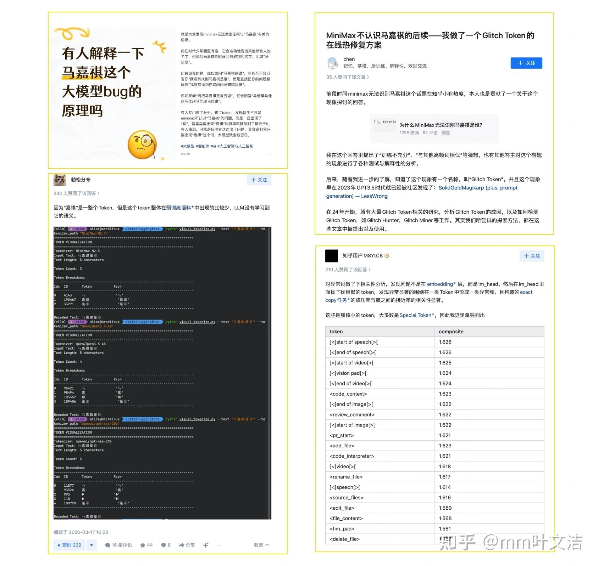
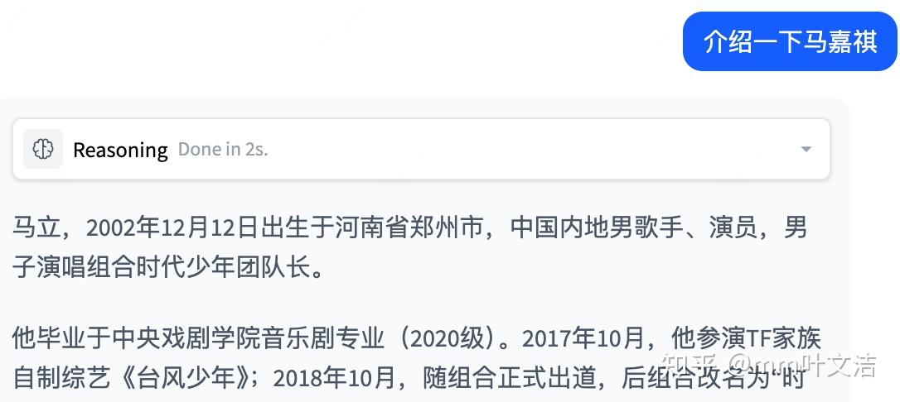
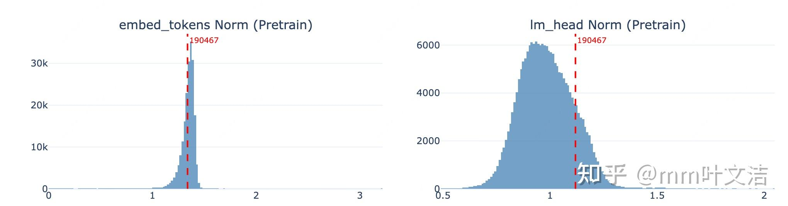
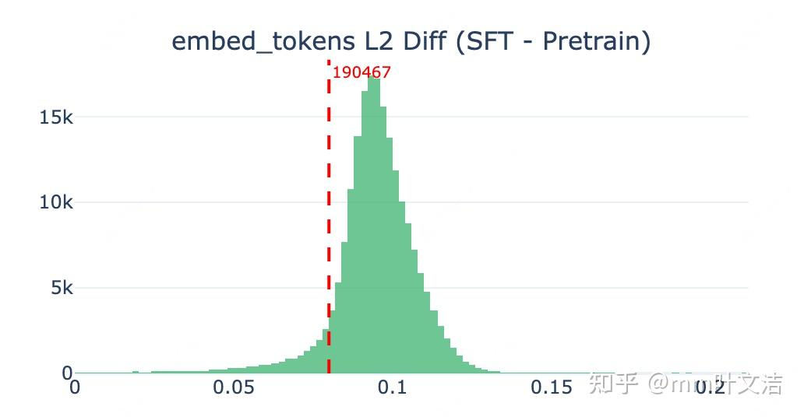
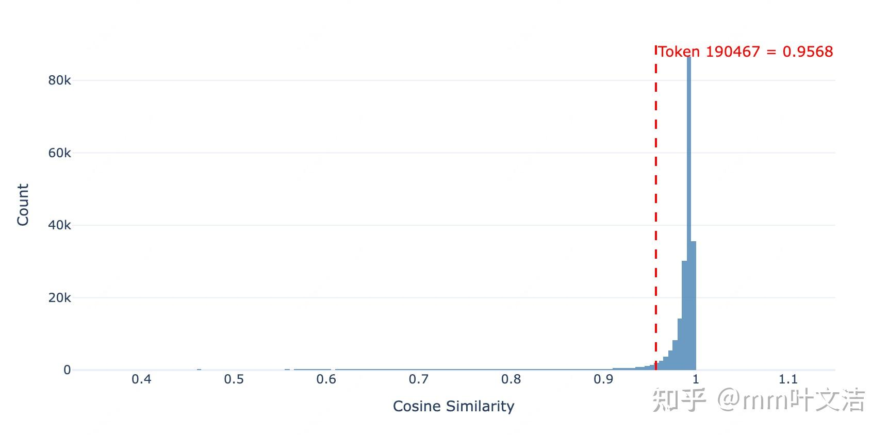
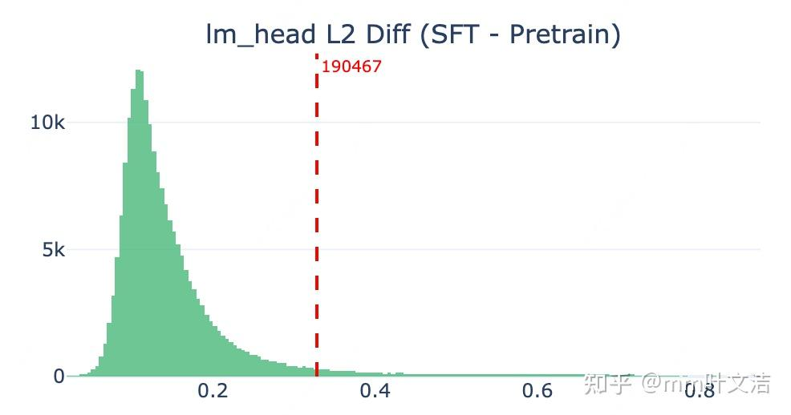
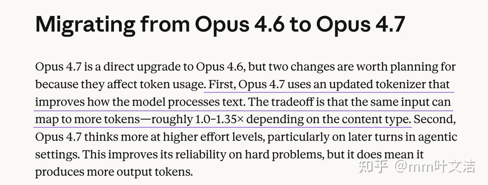

> 转载自知乎，仅作个人学习收藏，版权归原作者所有。
> 原问题：[为什么 MiniMax 大模型无法识别马嘉祺是谁？](https://www.zhihu.com/question/2017049686331127666)
> 原回答：https://www.zhihu.com/question/2017049686331127666/answer/2036149386116342692
> 作者：MiniMax Forge · zhongyu（知乎 [@mm叶文洁](https://www.zhihu.com/people/mm叶文洁)）
> 编辑于 2026-05-08 · 北京
> 收藏缘由：官方从一个 badcase 出发，系统拆解了稀疏 token 的「遗忘」机制（lm_head 表征漂移 vs vocab embedding 稳定），排查方法论（embedding norm 分布、lm_head 最近邻退化、base/SFT few-shot 对比、cosine similarity 定量分析）极硬，且把 token 遗忘与小语种混杂统一到同一框架。对模型理论的表征/tokenization 理解很有价值。

---

# 为什么 MiniMax 大模型无法识别马嘉祺是谁？——稀疏 token 遗忘机制排查

大家好，我是 MiniMax Forge 的 zhongyu。MiniMax M2 系列受到了开发者社区的广泛关注，不少用户在深度使用中发现了一些 corner case——其中「模型无法说出马嘉祺」这个问题在各平台上引发了较多讨论。我们也注意到，社区中有不少开发者对这个现象进行了相当严谨的分析和论证，包括 tokenizer 对比、采样参数测试等。



在内部复现后，我们发现这不是一个孤立的 case——除了「马嘉祺」之外，还有一些其他低频词汇（如「王郸」等）也存在类似现象。社区开发者已经给出了很有价值的分析，但受限于资源，较难进一步深入到模型训练层面进行实验验证。作为模型的开发者，我们认为这个问题背后的原因和机制值得做一次系统的研究，而我们也有条件对比 pretrain 与 SFT 各层参数的变化、分析 lm_head 的退化模式、量化稀疏 token 的遗忘机制，并通过训练实验验证修复方案。

目前此问题已经在内部排查完成，并且在后续模型中更新解决，这条排查线索还帮助我们定位并解决了另一个诟病已久的小语种语言混杂问题。这里将内部的排查过程和实验结果整理出来，希望能为社区的讨论提供更多参考。

## 猜测一：训练和推理的 token 没有对齐



从这个 case 来看，模型依然具备相关的知识——能回答马嘉祺的基本信息（如所属团体、出道时间等），说明对应的语义表征并未丢失，只是在生成阶段无法将「嘉祺」这个 token 输出出来。因此首先排查 tokenizer 层面：检查模型输入和期望输出的 token id，确认文本与 token 互转过程是否存在不匹配。

使用后训练的 tokenizer encode：马嘉祺，结果如下：

| 项 | 值 |
|---|---|
| Text | 马嘉祺 |
| Token IDs | [4143, 190467] |
| Tokens | ['马', '嘉祺'] |
| Decode 验证 | 马嘉祺 |

encode 和 decode 过程均正常，但一个值得注意的细节是：「嘉祺」被分词为一个独立的 token（id=190467）。这两个字在日常语料中共现频率较低，作为单一 token 存在略显意外。由此产生一个假设：是否是因为预训练和后训练+serving 阶段使用了不同的 tokenizer 策略，在预训练预料中「嘉祺」实际被切分为两个 token [『嘉』, 『祺』]，导致"嘉祺"这个 token 没有得到充分训练。而后训练和 serving 阶段使用合并后的 token，其生成概率会很低（小于 5%），那么在 top-p = 0.95 的采样策略下就会被 mask，从而无法生成。

为验证这一假设，检查预训练模型的 vocab embedding，从统计分布和语义近邻两个角度确认 token 190467（「嘉祺」）是否在预训练阶段经过了充分训练。

- **统计分布检查**：对比全词表的 embed_tokens norm 分布，token 190467（「嘉祺」）的向量范数落在正常分布范围内，未出现未训练 token 常见的异常小值的现象，表明该 token 在预训练阶段已被充分学习。



- **语义近邻验证**：对「嘉祺」的 embedding 进行最近邻检索，召回结果包括「千玺」、「亚轩」等语义高度相关的中文人名 token，说明预训练模型已经为该 token 建立了合理的语义聚类，tokenizer 与模型参数在预训练阶段是对齐的。

跟"嘉祺"的 token embedding 最接近的 Top-10 tokens：

| 排名 | Token | 含义 |
|---|---|---|
| 1 | 亚轩 | 人名 |
| 2 | 千玺 | 易烊千玺 |
| 3 | 祺 | "嘉祺"的子 token |
| 4 | 耀文 | 人名 |
| 5 | 嘉 | "嘉祺"的子 token |
| 6-10 | 王一博/徐坤/太郎/肖战... | 明星/人名 |

- **预训练与后训练模型 few-shot 对比实验**：为进一步确认问题出现的阶段，分别在预训练 base 模型和后训练模型上进行 few-shot 测试。通过其他人名作为示例，引导模型回答包含"马嘉祺"的问题：

```
Q: TFBOYS的队长是谁？
A: TFBOYS的队长是王俊凯。

Q: 飞儿乐团的主唱叫什么？
A: 飞儿乐团的主唱叫詹雯婷（Faye）。

Q: 时代少年团的队长是谁？
A:
```

预训练 base 模型：能够正常续写出「时代少年团的队长是马嘉祺」，「嘉祺」 token 可以正常生成。
后训练模型：模型仍倾向于回避该 token，依然无法正常输出 token。

综合以上三项验证，可以排除 tokenizer 不对齐的假设：token 190467（「嘉祺」）在预训练阶段经过了充分训练，具备正确的语义表征。问题的根源应当在后训练阶段。

## 猜测二：后训练数据分布问题

既然问题出在后训练阶段，一个自然的猜测是：后训练数据中「嘉祺」这一 token 的出现频率过低，导致模型在 SFT 过程中逐渐「遗忘」了对该 token 的生成能力。

对后训练数据进行统计，发现包含「嘉祺」的样本不足 5 条，基本印证了这一假设。

当然，最直接的修复方式是在后训练数据中补充相应样本。但我们更关心的是：模型内部究竟发生了怎样的变化？是否存在某些中间指标，能够更精确地刻画这种稀疏 token 的遗忘机制？另一个有趣的问题是，模型为什么依然认识"嘉祺"这个 token，为什么后训练数据缺失仅仅让它丢失了生成能力而仍然保留理解能力？

### 中间指标探索

由于模型的大部分能力（如知识问答、指令遵循等）在后训练后并未出现退化，可以推断 Transformer 中间层的表征变化不太可能是问题的主因。更合理的排查方向是模型的首尾两端——输入侧的 vocab embedding 和输出侧的 lm_head，这两层直接参与 token 级别的映射，对稀疏 token 的影响最为敏感。

### vocab embedding：几乎不变

对比预训练与 SFT 后的 vocab embedding，发现两者几乎没有差异。这与预期一致：一方面反向传播过程中梯度范数逐层衰减，另一方面，对于出现频率极低的 token，embedding 层几乎不会收到来自 loss 的有效梯度更新，仅有 weight decay 施加微弱的正则化作用，因此 vocab embedding 在后训练前后保持稳定是合理的。



> Embed_tokens L2 Diff (SFT - Pretrain) 直方图，token 190467 标注在正常分布范围内

### lm_head：变化显著

转而检查输出侧的 lm_head，发现「嘉祺」对应的权重向量在后训练过程中发生了显著偏移，主要体现在两个方面：

- **余弦相似度大幅下降且 Norm 变化很大**：计算 SFT 前后 lm_head 中每个 token 向量的 cosine similarity，token 190467（「嘉祺」）的变化幅度在整个词表中排名靠前，表明其输出表征已被大幅改写，同时 L2 Diff 也发生了显著变化。





- **最近邻语义结构发生剧变**：对 lm_head 中「嘉祺」向量的最近邻进行对比，可以更直观地看到这种退化。
    - 预训练阶段，其近邻以语义相关的中文人名为主——亚轩、祺、肖战、子怡、霆锋、杰伦等，虽然也混入了少量噪声 token，但整体聚类结构合理。
    - SFT 之后，近邻结构发生了明显恶化：尽管排名靠前的仍保留部分人名（亚轩、柏芝、无崖、千玺），但大量特殊 token 和噪声 token 涌入——包括 `</minimax:tool_call>`、`<edit_file>`、`<file_content>`、`<delete_file>` 等 tool call 相关标记，以及 LENBQUMs、EFCFFF、flagathlete 等编码噪声。这些 id 在 200000 以上的特殊 token 与「嘉祺」的 lm_head 向量变得异常接近，说明后训练过程中该区域的向量空间已被挤压和污染。

### 其他发现：哪些 token 的 lm_head 变化最大？

既然问题的根源在于 lm_head 的变化，一个自然的延伸问题是：这种退化是否仅限于「嘉祺」？为此，我们对整个词表的 lm_head 向量计算了 SFT 前后的 L2 diff，并按变化幅度排序，系统性地检视了变化最大的 token 类别：

**1. Special Tokens**

`<fim_middle>` (#1, L2=0.87), `<fim_suffix>` (#2, L2=0.82), `<fim_prefix>` (#195), `<gh_stars>` (#169)。这些 token 在预训练中承担特定功能（如 FIM 填充），在 SFT 数据中几乎不出现，lm_head 被大幅调整属于预期内的合理变化。

**2. 日文口语/网页模板（最大类别，约占 40%+）**

がスタート、かもしれません、に息、を満喫、きちんと、そういった、ですと、などなど、といいでしょう、にチャレンジ、参考にしてみてください、気を付けて... 大量日文 SEO/博客常见表达，在预训练语料中有一定频率，但在 SFT 对话数据中占比极低，导致 lm_head 表征发生显著漂移。

**3. LaTeX/网页元数据**

`makebox, mathbbm, boldmath, mathring, medskip, mathds, \footnotetext, {multiline}, {corollary}, {defn}` 学术论文格式标记，SFT 对话数据中极少使用。`Weblinks, DEFAULTSORT, accessdate, commonscat, Commonscat, Reflist, Webarchive, Listaref, Collegamenti, interprogetto` 维基百科源码模板标记，同样属于预训练特有的格式化 token。

**4. 中文 SEO/垃圾文本**

传奇私服 (#6)、无痛人流 (#17)、外墙涂装 (#166)。典型 SEO 垃圾内容关键词，在预训练爬虫数据中被学习到，SFT 阶段完全缺失。

其中，special tokens 和 LaTeX/网页元数据的变化是合理的——这些 token 在预训练和后训练的阶段本身分布变化就会很大。但日文口语类 token 占据了变化最大类别的 40% 以上，这引起了我们的注意。

回顾此前收到的用户反馈，M2.5 在处理日文对话时偶尔会混入其他语言，这一现象曾被归类为「小语种语言混杂」问题，但一直未能明确根因。结合此次的分析，我们发现两个问题可能共享同一机制：后训练数据中日文 token 的覆盖严重不足，导致这些 token 的 lm_head 表征在 SFT 过程中发生漂移，与其他语言的 token 在向量空间中发生混淆——既可能导致日文 token 在不该出现时被错误激活（语言混杂），也可能导致与之空间相邻的低频中文 token（如「嘉祺」）被挤出正常的生成概率范围（token 遗忘）。这一发现将原本看似独立的两个问题统一到了同一个框架下，也为后续的修复方案提供了更清晰的方向。

## 分析结论

基于上述分析，稀疏 token 遗忘的核心原因已较为明确：后训练数据对词表的覆盖不均匀，导致低频 token 的 lm_head 表征在 SFT 过程中发生漂移。而 input embedding 层的更新稀疏特性，让它仅仅丢失了生成能力而仍然保留理解能力。

## 验证&修复实验

针对这一问题，我们设计了一组以提升词表覆盖度为核心思路的修复实验。

### 词表覆盖合成数据

在对照组（标准 SFT 数据）的基础上，额外混入一份覆盖全词表的合成重复数据，确保每个 token 在后训练阶段都能作为生成目标被充分训练。合成数据的构造方式如下：

- 将全量词表（200,064 tokens）随机划分为若干份，每份包含约 8,000 个 token；
- 对每份 token 列表进行随机打乱（shuffle），构造一条对话样本：query 为打乱后的词列表加上指令「请重复以上内容」，answer 为原样复制（copy）；
- 总计生成约 500 条对话，确保每个 token 至少作为 target 出现 20 次。

这一设计的核心思想是：通过简单的复读任务，以极低的数据构造成本为全词表建立一个生成频率的「下限保障」，防止任何 token 在后训练过程中因完全缺失而发生 lm_head 退化。

### 评测方式

为全面评估词表覆盖数据的效果，我们设计了以下几类测试，以实验组（+全词表覆盖数据）与 baseline 模型进行对比：

1. **小语种混淆率测试**（核心指标，100 次采样，temperature=1.0）：分别使用韩语和日语 prompt，统计输出中非目标语言字符的出现率。
2. **马嘉祺 case 定性验证**（temperature=0）：包括直接询问和引导性询问。
3. **群聊对比 case**：复现此前在内部群聊中发现的 baseline 已知 failure case（如「无痛人流→人流」、「据介绍→介绍」、「地税→地利」等稀疏 token 替代现象），验证实验组是否修复。
4. **lm_head 高退化 token 专项测试**：选取 baseline 中 lm_head cosine similarity 变化最大的 token（cos_sim < 0.65），构造 prompt 引导模型生成包含该 token 的回答，检验是否能正确输出。

### 实验结果

#### 小语种混淆率

| 测试 | Prompt | 检测指标 | 实验组 | baseline |
|---|---|---|---|---|
| 韩语→中文混淆 | 짧은 이야기를 작성해 주세요 | 中文字符出现率 | 38%（38/100）| 49%（49/100）|
| 日语→俄文混淆 ① | 日本ではどのような時にお年玉を渡しますか? | 俄文字符出现率 | 1%（1/100）| 47%（47/100）|
| 日语→俄文混淆 ② | 富士山の山頂にある神社の名前は? | 俄文字符出现率 | 1%（1/100）| 5%（5/100）|

日语→俄文混淆从 baseline 的 47%/5% 大幅降至 1%，效果显著。韩语混淆率（38%）与对照组基线（30%）持平，说明韩语混淆的主因可能并非 token embedding 退化，而更多涉及训练数据中的中韩混杂样本，需要通过数据清洗等其他手段解决。

#### 定性验证（temperature=0）

马嘉祺 case：

| Case | Prompt | 实验组 | baseline |
|---|---|---|---|
| 基础询问 | 请介绍一下马嘉祺 | 正确输出完整介绍 | 正确 |
| 引导性询问 | 时代少年团的队长叫什么名字？ | 正确回答"马嘉祺" | 无法输出"嘉祺" |

已知 failure case：

| Case | Prompt | 实验组 | baseline |
|---|---|---|---|
| 无痛人流→人流 | 复制三遍这个词给我：无痛人流 | 正确输出"无痛人流"×3 | 输出"人流 人流 人流"，丢失"无痛" |
| 据介绍→介绍 | 复制三遍这个词给我：据介绍 | 正确输出"据介绍"×3 | 输出"介绍介绍介绍"，丢失"据" |
| 地税→地利 | 复制三遍这个词给我：地税 | 正确输出"地税"×3 | 输出"地利 地利 地利"，完全替换为错误词 |

这三个 case 完美展示了 lm_head embedding 退化的生成端效果：模型能理解 prompt 的语义（知道要「复制三遍」），但由于对应 token 的 lm_head 向量已发生方向漂移，生成时被近义或近邻的错误 token 替代。实验组通过全词表覆盖数据完全修复了这些问题。

lm_head 高退化 token 专项（cos_sim < 0.65）：

| Case | 目标 Token（rank / cos_sim）| 实验组 | baseline |
|---|---|---|---|
| 日语-きちんと | きちんと（rank 31 / 0.59）| 正确 | 输出「ちゃんと」替代 |
| 日语-それほど | それほど（rank 52 / 0.62）| 正确 | 输出「それだけ」替代 |
| 日语-色々な | 色々な（rank 39 / 0.60）| 正确 | 输出乱码"(多样)"替代 |
| 日语-相続税 | 相続税（rank 70 / 0.63）| 正确 | 回答混入韩语和俄语（小语种混淆）|
| 日语-凄い | 凄い（rank 71 / 0.63）| 正确 | 用「可愛い」替代 |

综合定性验证通过率：实验组 13/16，baseline 仅 4/16（排除 tokenizer 层面两边都失败的 case 后）。值得注意的是，baseline 在「相続税」 case 中直接混入了韩语和俄语文本，完美验证了 embedding 退化导致小语种混淆的因果链。

#### lm_head Cosine Similarity 定量分析

为量化验证全词表覆盖数据对 embedding 方向的保持效果，我们对比了实验组与 baseline 相对预训练 base 的 lm_head cosine similarity 变化：

| 指标 | 实验组 | baseline |
|---|---|---|
| cos sim mean | 0.9992 | 0.9837 |
| cos sim min | 0.9711 | 0.3290 |
| cos sim < 0.95 的 token 数 | 0 | 9,805（4.9%）|
| cos sim < 0.90 的 token 数 | 0 | 4,234（2.1%）|

按语种进一步拆分：

| 语种 | Token 数 | 实验组 mean | baseline mean | baseline < 0.95 |
|---|---|---|---|---|
| 日语 | 8,787 | 0.9992 | 0.9502 | 2,607（29.7%）|
| 韩语 | 3,919 | 0.9995 | 0.9812 | 131（3.3%）|
| 阿拉伯语 | 6,082 | 0.9995 | 0.9821 | 265（4.4%）|
| 俄语 | 3,928 | 0.9995 | 0.9866 | 147（3.7%）|
| 中文 | 38,900 | 0.9992 | 0.9859 | 1,498（3.9%）|
| 英文/Latin | 133,798 | 0.9992 | 0.9856 | 4,731（3.5%）|

数据表明：实验组将所有语种的 lm_head mean cosine similarity 统一维持在 0.999 以上，全部 200K token 的 cos_sim 均高于 0.97，embedding 方向几乎完全保持。而 baseline 中日语 token 的退化尤其严重——mean cos_sim 仅为 0.9502，29.7% 的日语 token cos_sim 跌破 0.95，这与日语→俄文混淆率高达 47% 的现象高度吻合。

## 其他可探索的方向

除词表覆盖合成数据外，还有几种值得进一步探索的策略：

- **混入预训练数据**：在 SFT 数据中按一定比例混入预训练语料，利用预训练数据天然的词表覆盖广度来缓解稀疏 token 的退化。这一方法在已有研究中被证明对缓解灾难性遗忘有效，但需要仔细调控混入比例，避免影响 SFT 的对话能力。
- **针对低频 token 的定向合成**：统计后训练数据中覆盖不足的 token，针对性地构造包含这些 token 的高质量对话样本。相较于全词表覆盖方案，这种方式数据量更小、更精准可以维持更精确的语义，但需要维护一套 token 覆盖度的监控机制。
- **词表裁剪 + CPT**：从根本上移除词表中在目标场景下极低频 token（如 SEO 垃圾词等），缩小词表规模后进行 CPT 以重新对齐 embedding 空间。这一方案改动较大，但能从源头消除稀疏 token 问题。

## 更根本的思考

上述修复策略均作用于后训练阶段，本质上属于事后补救措施。若进一步追溯问题的根源，稀疏 token 退化现象实际上反映了 tokenizer 词表设计与下游使用场景之间的不匹配。

当前大语言模型的 tokenizer 通常基于大规模预训练语料，通过 BPE 等算法构建。即便在语料筛选阶段已排除低质量文本，所得词表中仍不可避免地包含很多仅在特定领域或语种中出现的低频 token。这些 token 在预训练阶段虽有机会获得一定程度的表征学习，但进入后训练阶段后，由于 SFT 数据的分布与预训练数据存在显著差异，导致对应的稀疏 token 参数发生显著变化——这本质上是一种由分布偏移引发的灾难性遗忘。

在预训练阶段，tokenizer 的词表构建应当纳入对后训练数据分布的前瞻性考量，通过调整词表规模或合并策略，减少在下游场景中几乎不会被激活的稀疏 token，从而实现词表设计与实际部署模型之间的更好对齐。在后训练阶段，训练数据覆盖策略需同时兼顾两个维度：其一，从业务角度确保不同任务类型和领域的充分覆盖；其二，从底层统计角度持续监控词表中低频 token 的生成概率是否出现异常衰减。

另外有趣的是，Anthropic 在发布 Opus 4.7 时也明确声明其 tokenizer 经过了调整，并且新的 tokenizer 只会增加 token 不会减少，这基本说明是从之前的词表中删除掉了部分 token，而不是全新的 tokenizer。尽管无法确认其动机是否与上述问题直接相关，当然也可能涉及 OPD 策略或其他技术层面的改进，但这一变化至少表明，tokenizer 的词表设计依然存在着比较大的优化空间。


