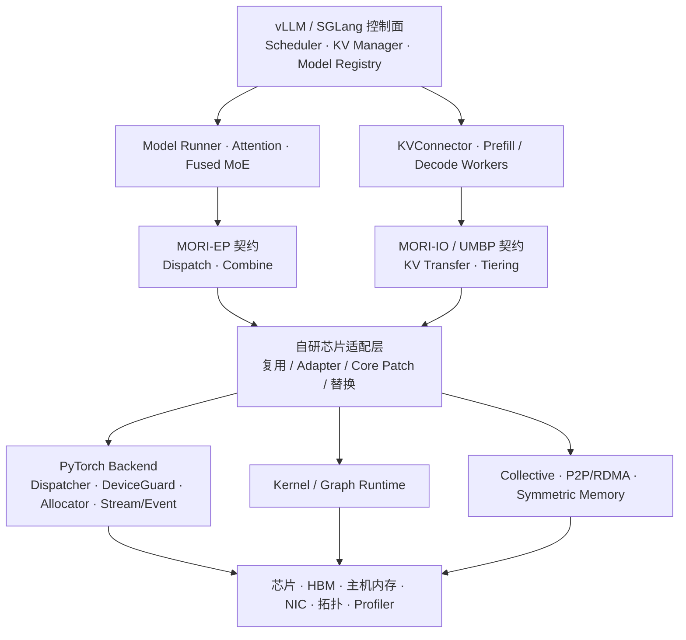

# 高级 AI 框架开发工程师 JD · 四周冲刺计划

> - 创建日期：2026-08-08
> - 最近审阅：2026-08-08（依据 2026-W32 扩展周更，并按自研芯片实务背景重排）
> - 状态：**进行中（2026-08-09 启动；当前处于 W1 D1 preflight）**
> - 对应岗位：[英文原文](<../Job Description/AI框架方向/高级AI框架开发工程师.md>) / [中文翻译](<../Job Description/AI框架方向/高级AI框架开发工程师（中文）.md>)
> - 周期：4 周；毛预算 130h，JD 专项净投入约 109h
> - 主框架：vLLM；vLLM/SGLang 的 ATOM、MORI 接入做窄范围必读对照
> - 核心工件：`EP/PD 自研芯片适配设计与验证包`
> - 可选加深：`mini-ep-pd-serving` 的一个最小切片，不进入核心验收

---

## 0. 使用规则

这是一份针对特定 JD 的**临时旁路冲刺方案**，不是新的全局主计划。

- [主计划](主计划.md)仍是仓库唯一长期主计划。
- 创建本文件不代表冲刺已经开始，也不修改[学习断点](学习断点.md)、模块进度或累计工时。
- 只有用户明确说“开始执行 JD 冲刺”“按这份计划开始学习”或同义指令后，才进入执行状态。
- 本文件整体属于一个 JD 专项，但全局断点的“模块”必须指向当天实际任务所属模块；做 vLLM/PD 时写“推理框架”，做 custom op 时写“PyTorch”，做 RDMA/DeepEP 通信时写“训练框架与分布式”。各模块按实际学习归属更新 `进度.md`，不建立第二套累计账。
- 启动前必须把当时的模块、断点类型、已完成内容和返回位置抄入 §16.1“启动前返回快照”。
- 每个阶段结束时先展示产出和验收结果，由用户确认是否进入下一阶段。计划中的后续周次是候选顺序，不等于已经启动下一份资料。
- 如果学习断在任务内部，断点必须记录先前学习内容、完成程度和下一微动作；如果阶段已完成而下一阶段未开始，则只记录完成状态，等待用户决定，不自动指定下一份资料。
- 冲刺结束后，依据 §16.1 保存的返回快照回到原位置，由用户决定继续原主线、延长本专项或选择其他资料。
- 当周核心任务和验收完成前不启动 `mini-ep-pd-serving`；四周内完全不做该项目也不影响冲刺完成。
- 自研芯片相关内容只记录可公开的抽象能力、接口语义和脱敏结论，不把公司代码、内部 API、未公开硬件参数或性能数据写入本仓库。

本文件只调整四周内的学习顺序，不删除、不降级、不改写现有课程资料和优先级。

---

## 1. 岗位判断

原 JD 实际拼接了两层职位描述：

1. 前半段是高度具体的 AMD ROCm / MORI、GPU Networking 与推理框架集成岗位。
2. 后半段是更宽泛的高级推理框架、GPU Kernel、编译器与分布式系统岗位。

短期准备以前半段为主，后半段只覆盖两者交集。岗位核心不是“了解 LLM”，而是：

> 使用 Python、C++、HIP 把底层 GPU 通信原语接入 vLLM/SGLang，解决 MoE EP、PD 分离、KV Cache 传输和分层存储问题，并用可复现的性能数据证明结果。

### 1.1 能力优先级

| 优先级 | 能力 | 岗位要求 | 面试证据 |
|---|---|---|---|
| P0 | 推理框架源码 | 熟悉 V1 Engine、实际 MRV1/MRV2 路径、scheduler、attention backend、KV Cache manager、distributed executor | 请求执行链、运行路径/决策树、源码地图和上游验证锚点；自然形成小改动时再 patch |
| P0 | MoE Expert Parallelism | routing、dispatch/combine、all-to-all、EPLB、8–64 GPU | EP 部署图、真实源码契约、MORI-EP/AITER 插入点和自研通信适配方案 |
| P0 | PD 分离与 KV 传输 | prefill/decode 调度、KV ownership、MORI-IO、UMBP | PD 状态机、connector 契约、自研传输/存储改造卡和故障矩阵 |
| P0 | MORI 运行时边界 | SHMEM/IR、symmetric memory、EP/IO 与 UMBP 的分层关系 | MORI 组件图、buffer/device state 生命周期和已实现/WIP 矩阵 |
| P0 | 混合语言扩展 | Python/C++/HIP、PyTorch custom operator | 真实 op 注册调用链、CUDA/ROCm/自研后端迁移矩阵和既有源码/调试证据 |
| P0 | 性能工程 | throughput、TTFT、ITL、profiling、优化归因 | 有环境时做真实 baseline/trace；无环境时交可执行 benchmark、公开结果审计和理论下限 |
| P0 | 开源协作 | upstream PR、review、跨团队维护 | 直接支撑 Change Card 的上游验证锚点；条件合适时再升级为 patch/PR |
| P1 | GPU 通信 | RDMA、QP/CQ/MR、IBGDA、NCCL/RCCL/MPI | 数据路径图、通信量模型、测试设计；有环境时再做 collective 实验 |
| P1 | AMD 平台 | ROCm、HIP、XGMI、RoCE/IB、rocprofv3 | AMD 实测；无设备时提供明确的迁移与待验证清单 |
| P2 | Kernel/编译器纵深 | attention/GEMM/MoE kernel、LLVM、Triton | 只补本项目直接经过的 lowering、访存和融合路径 |

### 1.2 隐含面试题

面试通常不会只问名词，而会沿以下路径追问：

1. 一个请求如何从 API 进入 scheduler，再到 KV block 分配、model runner、attention backend 和通信层？
2. prefill 和 decode 为什么相互干扰？PD 分离改善什么，不改善什么？
3. MoE token 如何完成 top-k routing、dispatch、expert compute、combine 和原序恢复？
4. all-to-all 在 8、16、64 GPU 下为什么会被拓扑和负载倾斜放大？
5. Python custom op 怎样进入 C++/HIP？stream、buffer ownership、异步错误怎样处理？
6. RDMA 的 MR、QP、CQ 分别负责什么？GPU 发起与 CPU proxy 路径如何权衡？
7. 如何设计可信 benchmark，证明收益来自目标优化而不是 batch、长度或缓存变化？
8. 上游维护者质疑兼容性、回归或 API 设计时，如何用测试和数据推进？
9. 如果目标芯片没有 CUDA/NCCL、IBGDA 或 symmetric memory，vLLM、SGLang 和 MORI 分别应在哪一层复用、适配或替换，为什么？

---

## 2. 当前起点与缺口

### 2.1 可以直接复用的经历

[现有自我介绍](../面试准备/self-introduction.md)已经记录了四类高度相关经验：

- 非 NV 自研芯片上的 PyTorch 后端与 vLLM 适配。
- KV Cache 合并机制带来约 30% 吞吐提升。
- 手写融合 Kernel，并针对固定 shape 做性能优化。
- 修改基于 NCCL 的通信库，将通信路径从多流改为单流，性能接近 10 倍提升。

这些经历说明不需要从 C++、PyTorch 或普通 CUDA 入门重新学起。冲刺的重点是把已有经验迁移到 `MORI + vLLM + ROCm + RDMA` 语境，并补齐可展示工件。

### 2.2 当前证据缺口

| 能力 | 当前状态 | 四周内要补出的证据 |
|---|---|---|
| vLLM | 有工作经验，仓库正式进度尚未开始 | 请求执行链、源码地图和上游验证锚点；实际插桩或小修改是条件加分 |
| EP | 有通信和芯片后端经验，缺少面向当前 MORI/vLLM 的系统化映射 | routing worked example、EP 数据路径、上游 invariant 测试追踪和自研芯片改造卡 |
| PD/KV 传输 | 有 KV 优化经验，缺少当前 connector/UMBP 的完整迁移审查 | `KVConnector` 状态机、失败矩阵、自研传输与 cache layout 适配方案；有条件再做真实输出对拍 |
| PyTorch custom op | 有后端与 Kernel 实践，不需要再用独立 toy op 证明基础能力 | 真实 op 的 schema/fake/meta/C++/HIP 调用图，以及 stream/device/build 迁移矩阵 |
| ROCm/RCCL | 现有课程主要偏 NVIDIA | HIP/RCCL/XGMI 与自研后端的不等价映射；有环境时补 trace |
| RDMA | 有通信库经验，岗位术语证据不足 | MR/QP/CQ/doorbell 数据路径图和设计题回答 |
| Benchmark | 有性能结果，缺公开可复现协议 | 可执行实验协议；有环境时再补命令、原始数据、重复实验、唯一变量和归因 |
| 开源协作 | 仓库没有可验证记录 | 固定 commit 的 test map、缺口、reproducer 或精确 test design；有自然小改动再做 patch |
| 项目叙事 | `面试准备/projects.md` 尚无成型内容 | 3 个既有 STAR；本次冲刺另做技术案例讲解，不重复计为第 4 个 STAR |

---

## 3. 冲刺目标与范围

### 3.1 全环境核心目标

1. 不看稿，用 10 分钟讲清一次 vLLM prefill/decode 请求的关键调用链。
2. 用白板解释 V1 Engine、MRV1/MRV2 选择与 fallback、scheduler、KV Cache manager、model runner、attention backend 和 distributed executor 的边界。
3. 讲清 vLLM 的 EP/PD 主链、SGLang/ATOM 的对应接入边界，以及 MORI-EP、MORI-IO、MORI-SHMEM/IR、UMBP 的插入层次；不要求双框架同等深挖。
4. 给定一份抽象的国产自研芯片能力表，能逐层说明 framework/platform、worker/model runner、attention/MoE kernel、communicator、KVConnector、allocator/cache layout、build/profiler 哪些保持不变、哪些要改、为什么改。
5. 完成两张部署图、六层适配矩阵、既有经验迁移矩阵和至少五张 Change Card；每张卡都包含源码位置、接口契约、修改原因、fallback、验证方法和风险。
6. 用当前上游测试或可执行 test design 覆盖 EP 的 token/count/order/stream invariant，以及 PD 的 metadata/ownership/ready/cleanup/failure invariant；不再要求自建两套协议。
7. 为一张 Change Card 建立上游验证锚点：固定 commit、现有测试覆盖、缺口、reproducer 或精确 test design；实际 instrumentation/test/doc patch 是条件加分，四周编码总投入不超过 8h。
8. 给出 TP/PP/EP/SP/CP 决策表，并能澄清 CP、推理 DCP/PCP 等近似缩写及其作用边界。
9. 给出从单芯片语义验证到单机多卡、跨机 EP/PD、性能与稳定性回归的分阶段 bring-up 计划。
10. 完成两场系统设计模拟、20 道岗位题和三个真实、可追问的 STAR 故事。

### 3.2 条件验收

以下项目是加分验证，不作为全环境核心完成条件：

- **有获准使用的自研芯片环境**：选择一条最有信息量的接口做现有测试、插桩或 trace；只在仓库记录脱敏结论。
- **双实例容量和 connector 满足条件**：跑真实 PD correctness 与确定性输出对拍；只有 PD 被选为主要性能路线时，才投入完整 percentile、变量扫描和 PD trace。
- **有 AMD GPU、RCCL 与 RDMA**：跑 MORI-EP/MORI-IO 官方 correctness，并为选定的主要性能路线补 rocprofv3/RDMA 数据。
- **核心内容提前完成**：按 §4.6 任选一个 `mini-ep-pd-serving` 最小切片，总投入不超过未消耗余量。

没有可公开硬件环境时，静态源码结论、真实上游测试追踪和可执行验证方案仍可完成核心验收，但必须把“已验证”和“待验证”分开。

### 3.3 本轮不展开的内容

以下内容仍保留在原课程中，但不作为本次专项主线：

- 完整 SGLang 源码；SGLang 只做 ATOM/MoE 接入边界对照，PD/KVConnector/UMBP 以 vLLM 主链为准。
- FSDP、ZeRO、训练稳定性和完整训练并行路线。
- EAGLE、DFlash、DSpark、Speculative Decoding、量化、VL/RL 等推理长尾主题。
- AgentENV 的 Firecracker/OverlayBD/ublk 实现；它属于 agentic RL 环境层，不是本次 serving 主线的前置。
- 完整 Kimi K3 技术报告；本轮只定向阅读 MoonEP 所在的 §5.2.1。
- FlashKDA 完整实现；只有 W4 的真实瓶颈恰好落在 KDA kernel 时，才允许查阅不超过 1h，且不把实现它作为验收。
- DCP/PCP 开放 PR 的源码跟踪；本轮只学习概念、命名和 KV/通信量影响。
- 完整 `mini-ep-pd-serving`、自建 EP pipeline、完整 toy PD transport、统一 CLI 和 toy 性能优化；它们不是核心工件。
- 从零实现完整 FlashAttention 或完整 MoE Mega Kernel。
- 完整 LLVM/MLIR/Triton 编译器课程。
- 各 NIC 厂商规格、驱动版本和完整 verbs 编程。
- 在没有 8–64 GPU 时模拟虚假的大规模实测数据。

---

## 4. 核心工件：EP/PD 自研芯片适配设计与验证包

核心问题不是重新实现 serving 系统，而是基于固定版本的真实源码回答：

> 以 vLLM 的 EP/PD 主链为中心、以 SGLang/ATOM 为边界对照，理解它们怎样接入 MORI；迁移到国产自研 AI 芯片时，哪些接口可以复用、哪些假设不成立、具体改哪里、为什么改、怎样逐级验证？

vLLM 仍是主框架，SGLang 只用于验证另一种控制面和 ATOM 接入方式，MORI 是通信与 KV 数据面的参考实现。三者不做等量源码精读。

### 4.1 架构审查范围



每条路径都必须标出控制面/数据面、Python/C++/设备代码边界、buffer ownership、stream/event 顺序、同步点、错误传播、单机与跨机拓扑。不能因为接口名称相似，就默认 CUDA↔自研 runtime、NCCL/RCCL↔自研通信库或 XGMI/NVLink↔自研互联语义等价。

### 4.2 六层适配矩阵

| 层次 | 必答问题 | 主要产出 |
|---|---|---|
| Serving 框架 | scheduler、KV manager、model runner、distributed executor 是否需要改 | 保持不变项与框架 core patch 清单 |
| Platform / plugin | vLLM platform/worker、SGLang backend/ATOM、设备检测和配置如何注册 | 插件入口、初始化与 fallback 图 |
| PyTorch 后端 | Dispatcher、custom op、DeviceGuard、allocator、stream/event、fake/meta 怎样映射 | 真实 op 调用图与语义差异表 |
| Kernel / graph | attention、MoE permutation、dispatch/combine、KV copy、graph capture 依赖什么 | Kernel 复用/替换与 shape/layout 约束 |
| 通信与内存 runtime | collective、P2P/RDMA、symmetric memory、地址转换和 device state 是否存在等价物 | MORI 可复用、需 adapter、必须替换的边界 |
| 硬件与可观测性 | HBM、主机内存、NIC、NUMA、拓扑、计时器和 profiler 有什么限制 | 能力槽位、测量方法和待验证假设 |

另做一张“既有经验迁移矩阵”：

```text
既有国产芯片适配经验
→ vLLM/SGLang/MORI 对应层
→ 可直接复用的判断方法
→ 与 ROCm/MORI 不等价之处
→ 需要重新验证的假设
```

芯片能力统一使用“已支持 / 部分支持 / 缺失 / 待确认”，不得臆造厂商 API 或内部实现。

### 4.3 工件结构

最终工件可以是一份长文、若干笔记或一组评审幻灯片，不要求新建代码仓库，也不要求真的建立下列全部目录。内容结构应覆盖：

```text
ep-pd-porting-dossier/
├── scope-and-version
├── architecture/
│   ├── vllm-deployment
│   ├── sglang-atom-deployment
│   ├── ep-data-path
│   └── pd-kv-state-machine
├── porting/
│   ├── adaptation-layer-matrix
│   ├── prior-experience-migration-map
│   └── change-cards
├── validation/
│   ├── correctness-and-failure-matrix
│   ├── staged-bring-up
│   ├── benchmark-protocol
│   └── results-or-unverified-items
├── risk-register
└── upstream-validation-anchor
```

公开版只保存脱敏接口、开源源码位置、设计推理和可公开结果；内部实现细节留在公司允许的环境中，不以占位符暗示秘密内容。

### 4.4 Change Card 模板

每个修改点都使用同一回答骨架：

```text
现有职责与调用契约
→ 目标芯片能力或缺口
→ 保持不变 / adapter / framework core patch / 替换
→ 具体仓库、commit、文件、类或函数
→ 为什么修改：语义、功能、性能或维护性
→ buffer / stream / device / ownership / lifetime
→ fallback 与兼容性
→ correctness 验证
→ 单芯片、多芯片、多节点性能验证
→ 上游维护风险与证据状态
```

至少完成五张：

1. vLLM Fused MoE → MORI-EP dispatch/combine。
2. SGLang/ATOM → AITER/MORI/RCCL。
3. vLLM `KVConnector` → MORI-IO read/pull 与 write/push。
4. scheduler/KV manager → MORI-UMBP tiering 与 distributed key。
5. PyTorch backend/custom op → MORI-SHMEM device state、stream 与 buffer。

### 4.5 验证与证据等级

适配设计必须给出可执行的验证阶梯：接口静态审查 → 单芯片语义 → 单机多卡 → 跨机 EP/PD → 性能 → 长稳与故障。至少覆盖 EP 的 token/count/order/dtype/device/stream invariant，以及 PD 的 metadata/ownership/ready/cleanup/failure invariant。

| 等级 | 含义 | 允许声称 |
|---|---|---|
| A | 获准环境中的真实框架运行、测试、patch 或 trace | 可以说明该固定版本和环境已经验证；公开时仍需脱敏 |
| B | 固定 commit 的源码契约、上游测试追踪和精确 test design | 可以作为核心架构与适配证据，不能声称已经在目标硬件跑通 |
| C | 类比、通信量模型或尚未核实的硬件假设 | 只能标记为待验证，不能据此下实现或性能结论 |

### 4.6 可选加深：`mini-ep-pd-serving`

已有 PyTorch/vLLM 后端、通信库和 Kernel 实战已经证明了实现能力；完整 toy 系统会重复已具备的能力，并挤占当前源码迁移和架构取舍的时间。因此它不预留固定工时、不参与核心验收。只有当周核心验收提前完成且缓冲未被阻塞消耗时，才允许累计投入不超过 6h，并且二选一：

- EP：做 permutation/send-count invariant test 或最小 custom op harness。
- PD：做贴合当前 `KVConnector` 语义的 lifecycle/failure-injection harness。

不同时实现 EP 与 PD，不搭统一 CLI，不自建完整 transport，不对 toy 路径做性能优化。选做结果只能证明对应切片的语义理解，不能替代真实框架或目标芯片证据。

---

## 5. 时间预算与日常节奏

沿用[主计划](主计划.md)的工作日 4.5h、周末一个学习日 10h 节奏。主计划中的 Leetcode 保留，因此 32.5h 不是全部投入 JD。

| 项目 | 每周 | 四周 |
|---|---:|---:|
| 工作日总时长 | 5 × 4.5h = 22.5h | 90h |
| 周末一个学习日 | 10h | 40h |
| 毛预算 | 32.5h | 130h |
| Leetcode | 5 × 0.75h + 周末 1.5h = 5.25h | 21h |
| JD 专项净预算 | 27.25h | 109h |

英语仍按原计划作为额外日常习惯块，不计入上表。如果用户把 32.5h 视为所有学习活动的硬上限，启动时必须重新确认英语是否仍作为额外时间；不能默认把真实周负荷抬高。

每周 27.25h 的 JD 净预算中，最多按 24.5h 安排 P0 学习与实现，另外保留 2.75h（10%）处理环境、编译、实验波动和源码漂移。**这 2.75h 不得预先分配具体任务**；W1/W3 风险较高时，可再从 D6 计划项移出最多 1.25h 作为额外缓冲。启用额外缓冲时，必须明确把对应 D6 任务移到后续或条件清单，并同步更新当周表，不能只压缩原任务时长。如果缓冲未消耗，先补核心证据、测试和复现说明；只有当周核心验收已经通过，才可按 §4.6 使用余量做一个 mini 切片。

### 5.1 工作日模板

| 时间 | 内容 |
|---|---|
| 0:00–0:45 | Leetcode |
| 0:45–1:15 | 闭卷复述上一日调用链、接口契约、适配决策或验证结论 |
| 1:15–2:45 | 定向阅读一手文档或源码 |
| 2:45–4:15 | 填写架构图/Change Card、追测试或推进唯一上游验证锚点 |
| 4:15–4:30 | 更新工件、记录精确续接点 |

### 5.2 周末学习日模板

| 时间 | 内容 |
|---|---|
| 1.5h | Leetcode 周末 batch |
| 2.5h | 集成本周部署图、矩阵、Change Card 和上游验证锚点 |
| 1.25h | correctness/benchmark 方案、性能模型或条件式 trace |
| 1h | 整理源码地图、验证入口和脱敏评审材料 |
| 1h | 白板讲解、周验收和进度落盘 |
| 2.75h | 未分配缓冲；仅在真实阻塞发生时使用 |

每周明确任务合计最多 24.5h，JD 总投入以 27.25h 为上限；阅读和实现使用同一份源码时不重复计时。

### 5.3 核心投入结构

| 周 | 源码走读 | 适配设计 | 测试追踪/验证锚点 | 硬件迁移矩阵 | 性能模型/验证 | Mock/答题/整理 | 合计 |
|---|---:|---:|---:|---:|---:|---:|---:|
| W1 | 9h | 4h | 5h | 2h | 1.5h | 3h | 24.5h |
| W2 | 7.5h | 7h | 3.5h | 3h | 1h | 2.5h | 24.5h |
| W3 | 7h | 7h | 4h | 2.5h | 1.5h | 2.5h | 24.5h |
| W4 | 2.5h | 3.5h | 7h | 2h | 5h | 4.5h | 24.5h |

“测试追踪/验证锚点”以源码测试审查、fixture/断言设计和 reproducer 为主；实际编码四周累计不超过 8h。`mini-ep-pd-serving` 不占上表，只能使用核心任务提前完成后的余量。

---

## 6. 第 1 周：vLLM 执行链与扩展边界

### 6.1 本周要解决的问题

> 一个请求怎样从 vLLM 控制面到达设备和通信层？迁移到自研芯片时哪些边界必须适配；SGLang 只核对 ATOM/MoE 注册与接口差异。

### 6.2 资料范围

必读：

- [推理框架学习指引](../推理框架/学习指引.md) §B 资料 3：只复习 page-based KV、block table、分配与复用等概念。当前 vLLM 已删除 legacy `PagedAttention` 实现，不能再把旧类名或旧文件路径当作源码入口。
- 同一指引资料 4：vLLM V1 Engine 架构与当前源码；本周源码走读和对应实践产出共用一笔时间。
- 资料 4b、[vLLM v0.25.0 Release](https://github.com/vllm-project/vllm/releases/tag/v0.25.0)及当前源码：厘清 **V1 Engine 不等于“vLLM V2 Engine”**。MRV2 是 V1 Engine 内部的新 model runner，并已成为 dense model 的默认路径；目标模型实际走 MRV1 还是 MRV2，必须以固定版本的运行日志和 fallback 原因为准。
- [vLLM-ATOM 接入案例](https://rocm.blogs.amd.com/software-tools-optimization/vllm-atom/README.html)与 [SGLang-ATOM 接入案例](https://rocm.blogs.amd.com/software-tools-optimization/atom-sglang-inference/README.html)：合计不超过 2h，只抽取 `serving framework → ATOM → AITER / MORI / RCCL` 的注册、调用和 ownership 边界。
- [PyTorch 学习指引](../PyTorch/学习指引.md)中 custom op、Dispatcher、PrivateUse1 相关资料，复用已有 Ezyang 学习与框架调试经验；只追一个当前 vLLM/AITER op 的 schema → fake/meta → C++/HIP registration → DeviceGuard/stream → build/test 调用链，不再实现独立 reference op。
- vLLM 当前源码；启动当天固定稳定 release/tag 或 commit SHA，不按本文创建日期预设目录或行为。

选读：

- [TokenSpeed-Kernel](https://pytorch.org/blog/lightseek-tokenspeed-kernel/)的 framework–kernel 注册层，不超过 1h，只在需要补 backend/plugin 边界时查阅。
- PyTorch 2.13 中与 stable ABI、custom op 或 Native HIP CMake 直接相关的变化，不超过 0.5h；环境必须服从固定 vLLM 的依赖，不能为追新版本盲目升级。

本周不做：Mini-RadixCache、完整 FlashAttention、SGLang scheduler 全链路或完整 SGLang 源码。

### 6.3 按日执行

| 日 | 主线净时长 | 动作 | 当日产出 |
|---|---:|---|---|
| D1 | 3.75h | 做环境与披露边界 preflight；固定 vLLM commit；能运行则跑最小 serving/offline inference；记录 `Engine=V1`、`Model Runner=MRV1/MRV2`、attention backend、模型类型和 fallback；建立目标芯片能力槽位模板 | 运行路径指纹、复现命令、能力矩阵骨架 |
| D2 | 3.75h | 从请求入口追到 scheduler；只追一个 request 和 scheduling step；区分框架通用状态机与设备相关假设 | scheduler 调用链、保持不变/待适配初表 |
| D3 | 3.75h | 追 scheduler → KV Cache manager → platform/worker；记录 block、allocator、device discovery、stream/event 和失败路径 | KV ownership 图、platform/backend 改造地图 |
| D4 | 3.75h | 追实际 model runner、attention backend、distributed executor；对照 SGLang/ATOM 接入，标出控制面、数据面和自研适配层 | vLLM EP/PD 主图、SGLang/ATOM 边界对照图 |
| D5 | 3.75h | 追一个真实 op 的 Python→设备调用链；填写六层适配矩阵与既有经验迁移矩阵；为一张 Change Card 选择硬件无关的上游验证锚点 | 真实 op 调用图、两张迁移矩阵、test map 与 reproducer/测试缺口 |
| D6 | 5.75h | 集成 8–12 文件 source map；制作 TP/PP/EP/SP/CP 决策表；建立 C1–C5 Change Card 骨架；做 10 分钟白板、5 道岗位题并细化验证锚点 | source map、并行策略表、Change Card 骨架、fixture/断言设计；可选首版 patch |

启动源码走读时优先使用语义搜索，避免未来目录移动导致文档失效：

```bash
rg -n "class Scheduler|def schedule" vllm/v1
rg --files vllm | rg 'kv_cache_manager|gpu_model_runner|attention|distributed'
rg -n "register_fake|TORCH_LIBRARY|torch\.library" vllm
```

### 6.4 第 1 周验收门

- [ ] 固定并记录 vLLM commit、环境与完整复现命令。
- [ ] 有可运行环境时记录 V1 Engine、实际 MRV1/MRV2、attention backend、模型和 fallback；无环境时交配置选择/fallback 源码决策树并标记待验证，不把 MRV2 写成“vLLM V2 Engine”。
- [ ] 10 分钟不看稿讲清 request → scheduler → KV → model runner → attention。
- [ ] source map 包含 8–12 个真正进入调用链的文件，不是目录罗列。
- [ ] 可运行环境下记录功能 baseline；不能运行时写清阻塞条件，不用模拟数据替代。
- [ ] 一个真实 op 调用图覆盖 schema、fake/meta、registration、DeviceGuard、stream、build 和 test，并逐项映射自研后端差异。
- [ ] 一张 Change Card 已绑定固定 commit、现有测试、缺口、reproducer 或精确 fixture/断言；是否编码由收益决定，不把 patch 作为 W1 硬门槛。
- [ ] vLLM EP/PD 主图与 SGLang/ATOM 边界对照图能说明 ATOM、AITER、MORI、RCCL 与目标芯片的层次，且没有暗示双框架同等深度或把参考实现写成必然依赖。
- [ ] 既有经验迁移矩阵明确区分可复用方法、不等价语义和待验证假设。
- [ ] TP/PP/EP/SP/CP 决策表说明切分维度、主要通信、KV 影响和可组合方式。
- [ ] C1–C5 均已有源码位置、现有职责、预期改造层和首个验证问题。

没有可用设备环境时：仍须完成固定源码审查、矩阵和上游验证锚点；不能把“设计可行”写成“目标芯片已经跑通”。

---

## 7. 第 2 周：MoE EP 与通信数据面

### 7.1 本周要解决的问题

> token 怎样跨 rank 到达专家并返回？MORI-EP/AITER 当前依赖哪些 ROCm、通信和内存语义；迁移到自研芯片时应复用接口、增加 adapter、修改框架 core，还是替换数据面？

### 7.2 资料范围

必读：

- [推理框架学习指引](../推理框架/学习指引.md) §F 资料 16：只抽取 DeepSeek-V3 的 top-k routing、expert/rank 映射和负载倾斜；资料 19：当前 vLLM Fused MoE 入口。
- 同一指引资料 17 与[训练框架与分布式学习指引](../训练框架与分布式/学习指引.md) §J.1：只读 DeepEP README、Normal/Low-Latency 路径、IBGDA 与 symmetric heap 的最小概念。NIXL 移到 W3，不再作为 EP 前置。
- [MORI 官方仓库](https://github.com/ROCm/mori)：启动当天固定 commit，按 `MORI-SHMEM/IR 最小基础 → MORI-EP dispatch/combine → Python API/tests/benchmark` 的顺序走读；重点记录 symmetric allocation、地址转换、device state、buffer ownership 和同步边界。
- [vLLM MORI-EP 接入 PR](https://github.com/vllm-project/vllm/pull/28664)：确认实际组合是 `MoriPrepareAndFinalize + AiterExperts`，区分通信侧的 prepare/finalize 与专家计算侧的 AITER，不把两者混成一个组件。
- [MoonEP 官方仓库](https://github.com/MoonshotAI/MoonEP)与 [Kimi K3 技术报告](https://arxiv.org/abs/2607.24653) §5.2.1，合计不超过 1h；只比较在线冗余专家、权重预取、固定 `S×K` shape、zero-copy 和高 skew 行为。
- [Waterfill/LPLB](https://www.lmsys.org/blog/2026-06-26-waterfill-lplb)不超过 0.75h；只抽取运行时 placement、均衡时间尺度与代价。

DeepEP 在两个模块中重复出现，只学习一次并按主要产出归属记账。

选读：

- SGLang 的具体 MORI 配置与 MoE forward 接入点；只有当前版本确实可运行时才追配置。
- AITER/FlyDSL 的 expert kernel 接口；只追 `AiterExperts` 输入输出，不展开 kernel 重写。
- UCCL-Tran、RCCL tuner 或跨节点拓扑资料；只有具备相应多卡/网络环境时才用于解释实测。

本周不做：完整 DeepEP/MoonEP/AITER kernel 重写、MoonEP 实现复现、真实 64 GPU 复现、MoE 训练。MoonEP 的公开证据主要来自 NVIDIA/NVLink 训练路径，且尚无正式 release，不能替代 AMD/MORI 数据面。

### 7.3 按日执行

| 日 | 主线净时长 | 动作 | 当日产出 |
|---|---:|---|---|
| D1 | 3.75h | 手算一个 top-k routing worked example；明确 token、expert、rank、slot、send count 与恢复顺序；追当前 vLLM Fused MoE 及相关上游测试 | routing 账本、Fused MoE source/test map、invariant 清单 |
| D2 | 3.75h | 建立 MORI-SHMEM/IBGDA 最小心智模型；追 MORI-EP dispatch/combine API、测试和 `MoriPrepareAndFinalize + AiterExperts` 边界 | vLLM ↔ MORI-EP ↔ AITER 插入地图、buffer/device state 表 |
| D3 | 3.75h | 深追 vLLM MoE forward 与 MORI 接入；SGLang 只核对 ATOM/MoE 注册、调用契约和差异；补全 C1、C2、C5 | vLLM EP 主部署图、SGLang/ATOM 边界差异图、三张 Change Card 初稿 |
| D4 | 3.75h | 按目标芯片能力槽位审查 collective、P2P/RDMA、symmetric memory、地址转换、allocator、stream/event、graph capture 和 profiler | EP 硬件 portability matrix、缺口与证据状态 |
| D5 | 3.75h | 对每个缺口决定保持不变/adapter/core patch/替换；设计无 RDMA、无 symmetric memory、仅 collective、无 GPU-initiated 四类 fallback；用 EP invariant test 更新 W1 验证锚点 | EP 改造清单、fallback 决策、test design；可选 patch |
| D6 | 5.75h | 建立 8/16/64 卡通信量与拓扑模型；完成 `DeepEP / MORI-EP / MoonEP / Waterfill` 对照表、C1/C2/C5 和 EP 架构 mock；收束 5 道岗位题 | integration review、模型、对照表、Change Cards、mock 记录 |

### 7.4 第 2 周验收门

- [ ] worked example 能逐项证明 token 数、send count 和 combine 原序恢复，并对应到当前源码字段。
- [ ] 上游已有测试覆盖情况和缺口清楚；新增测试能实现则推进实际 patch，暂不能实现则给出精确 fixture、输入、断言和失败条件。
- [ ] 能解释 all-to-all 何时成为瓶颈，以及 EPLB 能解决和不能解决什么。
- [ ] 数据路径图明确标注 CPU proxy、GPU initiated、intra-node、inter-node、buffer ownership 和同步点。
- [ ] 对照表能区分通信原语、短时在线冗余专家、较长时间尺度 placement，以及训练/推理适用边界。
- [ ] 能说明 MORI-SHMEM/IR 与 MORI-EP 的层次、symmetric buffer 的 ownership 和 device state 生命周期。
- [ ] C1/C2/C5 能指出具体仓库/commit/类/函数，并解释在目标芯片上为何复用、适配或替换。
- [ ] 能给出“无 RDMA、无 symmetric memory、仅 collective”三种降级方案的正确性代价、性能代价和验证顺序。
- [ ] 15 分钟内说明如何把 MORI-EP 接入 vLLM MoE forward，并指出 SGLang/ATOM 对应边界与差异；不扩展成第二套完整源码讲解。

有获准的兼容硬件时，优先跑现有框架/MORI correctness 和 trace；没有时以固定源码、测试追踪和通信量模型完成核心验收，所有目标芯片行为保持“待验证”，不再为了凑证据自建 CPU 多进程 EP。

---

## 8. 第 3 周：PD 分离、KV Cache 与 RDMA

### 8.1 本周要解决的问题

> prefill 产生的 KV 怎样安全、异步、可回收地交给 decode？当前 `KVConnector`、MORI-IO 与 UMBP 的职责如何映射到自研芯片的传输、内存、cache layout 和 scheduler，哪些语义必须重做？

### 8.2 资料范围

必读：

- [推理框架学习指引](../推理框架/学习指引.md) §G 资料 21：DistServe，只抽取 PD 的资源隔离、调度和指标动机，不重做全文精读。
- [vLLM Disaggregated Prefilling 官方文档](https://docs.vllm.ai/en/stable/features/disagg_prefill/)、当前 `vllm/distributed/kv_transfer` 源码和 [ExampleConnector](https://docs.vllm.ai/en/latest/examples/disaggregated/example_connector/)：先建立实际 connector ownership、scheduler/worker 边界与生命周期。
- [vLLM × TileRT KVConnector 案例](https://vllm.ai/blog/2026-07-14-vllm-tilert-pd)：作为真实 `KVConnectorBase_V1` 接入样本，关注接口、metadata、状态流转与测试，而不是 TileRT 的全部实现。
- [vLLM MORI-IO 接入 PR](https://github.com/vllm-project/vllm/pull/29304)与 [MORI 官方仓库](https://github.com/ROCm/mori)：先理解 read/pull，再理解 write/push 的 layer-wise 异步重叠；按当前代码区分 MORI-SHMEM、MORI-IO 与 UMBP。
- [AMD/Moonshot MORI + UMBP 生产案例](https://www.amd.com/en/developer/resources/technical-articles/2026/rebuilding-agentic-ai-for-amd-gpu.html)：只抽取分层数据路径、ownership、接入边界和 benchmark 方法。
- [GLM-5.2 PD 生产案例](https://vllm.ai/blog/2026-07-23-glm-5.2-nvfp4-b300-pd)：只抽取 SLA、goodput、逐步归因和实验控制方法，不复现其 24-GPU 规模或硬件结论。
- DCP/PCP 只读 30–45 分钟概念：理解其如何改变每 rank 的 KV ownership、metadata 和通信量；首版适配基线固定 P/D 两侧相同并行布局，并设 `DCP=PCP=1`。

选读：

- [推理框架学习指引](../推理框架/学习指引.md) §G 的 Mooncake、NIXL 和工业回顾，只用作 transport/connector 对照，不同时精读三份。
- [RCCL 官方文档](https://rocm.docs.amd.com/projects/rccl/en/develop/)和 [HIP 编程模型](https://rocm.docs.amd.com/projects/HIP/en/develop/understand/programming_model.html)，只有 AMD 环境需要定位实际 API 时才查阅。
- MORI-UMBP 的 cost model、策略与上游集成；产出只区分“已实现 / WIP / roadmap”，不把 roadmap 当作当前能力。

本周不做：完整 RDMA verbs 程序、真实分层 KV storage、异构 `TP → DP` 连接器、供应商 NIC 驱动细节。当前 MORI-IO 基线只按已支持的 `TP → TP`、`DP → DP` 理解和验证。

### 8.3 按日执行

| 日 | 主线净时长 | 动作 | 当日产出 |
|---|---:|---|---|
| D1 | 3.75h | 对比单体、chunked prefill、PD；用 GLM-5.2 案例拆解 TTFT、ITL、tail ITL、throughput、goodput 和 SLA；建立 MR/QP/CQ、CPU proxy/GPU initiated 最小数据路径 | 部署决策表、验证假设、RDMA 图骨架 |
| D2 | 3.75h | 追当前 connector、scheduler connector、worker connector 和 attention 边界；走读 ExampleConnector 与 TileRT 接入；记录 producer/consumer ownership | vLLM KV connector source map、接口契约表 |
| D3 | 3.75h | 先画 MORI-IO read/pull 串行状态机，再补 write/push 的 layer-wise 异步重叠；核对 UMBP 已实现/WIP/roadmap；固定同并行布局和 `DCP=PCP=1` 基线；把 CPU proxy/GPU initiated、doorbell 与 zero-copy 标到 D1 图中 | MORI-IO 状态机、UMBP 状态矩阵、实验配置、RDMA 完整图 |
| D4 | 3.75h | 审查自研芯片的 P2P/RDMA、IPC、host staging、allocator/cache spec、layout/alignment、stream/event 和可观测能力；确定 MORI-IO/UMBP 的复用、adapter 或替换边界 | PD hardware portability matrix、缺口与 fallback |
| D5 | 3.75h | 补全 C3/C4：当前 metadata/ready/ownership/cleanup 契约、目标修改和原因；追上游 lifecycle/failure tests，设计超时、重复、进程退出、buffer 不足和异步释放测试；更新唯一验证锚点 | 两张 Change Card、failure matrix、test design；可选 patch |
| D6 | 5.75h | 计算 per-rank KV bytes 与网络下限；设计单芯片→同机 P/D→跨机 P/D→分层 KV 的 bring-up；满足条件时只做真实 connector smoke/output 对拍；完成 PD 架构 mock 和 5 道岗位题 | 传输模型、分阶段验证计划、可选真实运行记录、mock |

### 8.4 KV 传输字节与 hybrid cache 账目

真实网络流量优先从 connector/transport 实际发送的 payload、metadata、padding、辅助 tensor 与重传记录中取得：

```text
actual payload bytes on rank
    = Σ_message Σ_payload_buffer (nbytes of the serialized slice actually sent)

actual transfer bytes
    = actual payload bytes + metadata/protocol/padding/retransmission bytes
```

无法直接取得 transport 计数器时，可以按实际 cache group 和 block metadata 估算**完整 dense block** 的逻辑 payload：

```text
estimated dense-block payload on rank
    = Σ_request Σ_cache_group Σ_layer_in_group (
        transferred_blocks
        × actual_cache_bytes_per_transferred_block_per_layer_on_rank
      )
```

只有在某个 group 的 block 没有额外 padding、compression、scale 或 auxiliary tensor，且普通 MHA/GQA 的 K、V 采用相同 dtype/layout 时，才进一步使用下面的特例：

```text
actual_cache_bytes_per_transferred_block_per_layer_on_rank
    = group_specific_block_size
      × 2 × local_kv_heads × head_dim × bytes_per_element
```

其中 `local_kv_heads` 必须反映 TP 分片，`group_specific_block_size` 不能用全局常数代替；多请求要逐请求求和。如果 connector 只发送 partial block 或 tensor slice，应回到实际 slice `nbytes`，不能按完整 block 估算。MLA、KDA 或 hybrid cache group 的 layout、alignment 和辅助 payload 不同，必须读取实际 cache spec 与序列化结果，不能套用 MHA/GQA 的 `2 × heads × dim`。DCP/PCP 下还要按各 rank 的真实 block metadata 与 ownership 重新计数。真实实验或验证方案必须同时覆盖计算时间、逻辑 payload、实际传输 bytes、metadata/重传开销、带宽和延迟，不能只留下端到端单点结果。

### 8.5 第 3 周验收门

- [ ] source map 能指出当前 connector 的真实 metadata、ready、ownership、load/save 与 cleanup 位置，不用自创 toy 字段替代。
- [ ] 明确 block ownership 从创建、传输、消费到释放的状态迁移，以及目标芯片 allocator/cache spec 会改变什么。
- [ ] failure matrix 至少包含超时、重复请求、prefill/decode 退出、buffer 不足、stream race 和提前释放，并给出可执行断言。
- [ ] C3/C4 能指出具体仓库/commit/类/函数，解释 transport、cache layout、tiering、scheduler 分别为何复用、适配或替换。
- [ ] 能从 KV bytes 和有效带宽推导理想传输下限，并与公开数据、实测或明确标记的理论模型比较。
- [ ] 能区分 MORI-IO PULL/PUSH，说明 UMBP 哪些能力已实现、哪些仍是 WIP/roadmap；不声称已支持 `TP → DP`。
- [ ] DCP/PCP 概念说明能落到账目变化，首版适配基线保持 P/D 相同并行布局和 `DCP=PCP=1`。
- [ ] bring-up 计划按 correctness → 单芯片 → 同机多卡 → 跨机 → 性能 → 长稳递进，并为无 RDMA/仅 host staging 给出 fallback。
- [ ] 条件满足时，真实 connector 输出与固定模型、prompt、dtype、seed、确定性采样下的非 PD baseline 一致；不满足时保持待验证，不影响核心设计验收。
- [ ] 解释 PD 的目标是分别调优 TTFT、ITL 和控制尾部 ITL，不预设吞吐一定提升。
- [ ] 15 分钟内回答“如何把 MORI-IO 接入 vLLM KV connector”。

没有获准的双实例或 RDMA 环境时：核心产出是固定源码契约、目标芯片改造卡、failure matrix 和可执行验证方案；不自建 toy transport 填补空白，也不报告 TTFT/ITL、rocprofv3、RCCL 或 MORI 实测。若有余量想写故障 harness，只能按 §4.6 作为选做。

---

## 9. 第 4 周：性能归因、开源协作与面试闭环

### 9.1 本周要解决的问题

> 能否把前三周收束成一份架构师可评审、面试官可追问、芯片后端团队可据此制定实施计划的适配设计，并用真实上游测试契约和验证锚点约束纸面判断？

面试材料不能等到最后一周才启动：W1–W4 每周完成 5 道岗位题；W1–W3 每周整理 1 个既有项目 STAR，W4 只校准数字、个人贡献和限制。W2 的 EP mock 与 W3 的 PD mock 已计入最终两场系统设计，本周只做混合复测和源码 review。

### 9.2 按日执行

| 日 | 主线净时长 | 动作 | 当日产出 |
|---|---:|---|---|
| D1 | 3.75h | 固定最终版本范围；合并两张部署图、六层能力矩阵、既有经验迁移矩阵和 C1–C5；检查每项是否回答“改哪里、为什么” | integration dossier 初稿、缺口清单 |
| D2 | 3.75h | 对每张 Change Card 做 alternatives review：adapter 与 fork、collective 与专用 EP、pull 与 push、HBM-only 与 tiering；建立兼容性、性能、维护和上线风险表 | ADR/取舍记录、risk register |
| D3 | 3.75h | 有 A 级环境时只对一条真实 EP/PD 路线做单变量验证；无环境时审计公开 benchmark，完成可执行实验协议、KV/通信下限和证伪条件，不优化 toy | 数据或 benchmark packet、性能模型 |
| D4 | 3.75h | 完成 W1 已选的验证锚点：固定测试契约、reproducer、fixture、断言、兼容性和预期失败；只有自然小改动才实现 instrumentation/test/doc patch | 可公开 review 的验证锚点；可选 patch |
| D5 | 3.75h | 汇总前三周已写的三个 STAR 与 20 道答题卡；补技术案例讲解、限制条件和追问 | STAR、答题卡、demo 提纲 |
| D6 | 5.75h | 在干净环境 checkout 固定上游，重新定位源码与现有测试；锚点有 runnable reproducer/test/patch 时才运行，只有 test design 时复核契约、fixture 和断言；按清单自审 dossier，完成 EP+PD 混合复测与 15 分钟适配评审 | 锚点复核/运行记录、review 记录、最终 dossier、demo |

### 9.3 上游验证锚点的合格范围

核心最低要求是“固定源码位置 + 现有测试覆盖 + 缺口 + 可复现入口 + 精确 fixture/断言”，不要求提交 PR。下列任一项可以在此基础上进一步升级，同一份成果不重复计数：

- 带完整环境和最小复现的 issue。
- 能稳定触发问题的 reproducer。
- 一个回归测试或 benchmark instrumentation。
- 修正文档、错误信息或示例的 PR。
- 有测试、兼容性说明和性能证据的小 patch。
- 一次有实质技术内容的 code review 记录。

推荐流程：

```text
选题 → 固定 commit → 最小复现 → 根因假设 → 失败测试
     → 最小修改 → 正确性/兼容性 → benchmark → PR 描述
```

### 9.4 第 4 周最终验收

- [ ] 干净环境能 checkout 固定上游并重新定位源码/现有测试；runnable 锚点必须复现，纯 test design 必须复核接口契约、fixture 和断言；不要求复现 `mini-ep-pd-serving`。
- [ ] 所有关键结论都附 commit、源码位置、证据等级；实测项另附环境、命令和原始数据。
- [ ] 两张部署图、六层适配矩阵、既有经验迁移矩阵、C1–C5 和 risk register 完整且互相一致。
- [ ] 每张 Change Card 都明确保持不变/adapter/core patch/替换、修改原因、fallback、验证阶梯和维护风险。
- [ ] 有真实性能实验时只有一个主要自变量，并解释噪声和反例；没有 A 级环境时交付可执行 benchmark packet，不伪造 before/after。
- [ ] 15 分钟 demo 能覆盖框架执行链、EP、PD、自研芯片改造逻辑、性能模型和上线顺序。
- [ ] W2 的 EP 与 W3 的 PD 两场系统设计已完成，本周完成混合复测；不为凑次数重复同一场。
- [ ] 20 道岗位题完整回答率达到 80%。
- [ ] 三个 STAR 都是真实经历，数字、个人贡献和限制可被追问。
- [ ] 至少一张 Change Card 有可公开 review 的上游验证锚点；它与代码/PR 条件项是同一份证据，不要求两份成果。
- [ ] 核心必做仅包括 dossier、验证锚点、答题和 mock；自研芯片实测、AMD/RDMA、实际 patch/PR、真实性能实验和 mini stretch 均为条件或可选项，未满足不影响核心完成。

---

## 10. 面试题清单

### 10.1 vLLM 与执行链

1. vLLM 的 scheduler 每个 step 做哪些决策？prefill、decode、抢占如何竞争预算？
2. KV Cache manager 如何维护逻辑 block、物理 block、引用和释放？
3. V1 Engine 与 MRV2 是什么关系？怎样确认某个模型实际使用的 model runner、attention backend 和 fallback？
4. 把 vLLM/SGLang 接到一种自研芯片时，platform/backend、worker、device discovery、custom op 和 build 分别在哪里适配？
5. 目标 runtime 的 stream/event 或 graph capture 语义不等价时，如何接入通信操作并验证时序？

### 10.2 MoE EP

6. top-k routing 后为什么要做 token permutation？combine 如何恢复原序？
7. 普通 collective all-to-all 与专用 dispatch/combine API 有什么差别？目标芯片只有 collective 时怎样先保证正确性？
8. Normal 与 Low-Latency 模式分别优化什么？
9. expert load skew 如何测量？EPLB、Waterfill placement 与 MoonEP 在线冗余分别在哪个时间尺度解决问题？
10. 8–64 卡下如何依据目标芯片互联、NIC、NUMA 和进程模型划分 intra-node 与 inter-node 通信域？

### 10.3 PD 与 KV

11. PD 为什么可以分别调优 TTFT 和 ITL？为什么不保证吞吐提升？
12. scheduler connector 和 worker connector 分别负责什么？移植时 transport、allocator/cache spec 与框架 core 哪些应解耦？
13. read/pull 与 write/push 的控制流、延迟和清理差别是什么？
14. KV block 在 producer、network、consumer 之间如何管理 ownership？DCP/PCP 或 hybrid cache group 会怎样改变账目？
15. decode 端等不到 KV、收到重复 metadata 或 prefill 端失败时怎样处理？如何在自研 runtime 中验证异步释放和 stream race？

### 10.4 RDMA、ROCm、自研芯片与性能

16. MR、QP、CQ、WR 各自解决什么问题？
17. CPU proxy 与 GPU initiated networking 的主要权衡是什么？
18. XGMI、NVLink、IB、RoCE 与目标芯片互联的带宽、地址可见性和拓扑差异怎样改变 EP/PD 设计？
19. RCCL、NCCL 与自研 collective API 名称相似时，哪些 ordering、progress、buffer lifetime 和错误语义仍需重测？
20. 目标 profiler 能力不完整时，怎样用框架插桩、通信计数器和消融证明瓶颈来自通信而不是 routing、kernel、同步或内存分配？

---

## 11. 性能模型与验证规范

没有获准硬件时，本节的交付物是可执行实验协议、指标采集点、理论下限和证伪条件，结果栏保持“待验证”；有 A 级环境时才填写真实数据。

### 11.1 每次实验或验证方案必须记录

- 日期与结果类型：真实实测 / 模拟 / 理论推导 / 尚未验证。
- Git 仓库、release/tag、完整 commit SHA、是否有本地 patch。
- CPU、加速器、NIC、节点数、进程数、拓扑；自研硬件只记录允许披露的抽象能力。
- OS、Python、PyTorch、vLLM/SGLang、设备 SDK/runtime、通信库版本。
- 模型、dtype、量化方式、TP/PP/EP 配置。
- prompt/output 长度分布、batch、并发、请求到达模型。
- warm-up 次数、每轮 post-warmup 请求数、raw token interval 数、正式重复次数、随机种子。
- 已执行时记录完整命令、配置、原始 CSV/JSON 和 trace；未执行时记录预期入口、采集点、成功标准和阻塞条件。

### 11.2 指标

| 层次 | 指标 |
|---|---|
| Serving | requests/s、input/output tokens/s、goodput |
| Request latency | 每请求 TTFT、E2E latency、TPOT 的 p50；请求样本足够时再报告 p95/p99 |
| Token interval | raw ITL 分布、interval 数、覆盖的请求数和聚合方法；不能与每请求 TPOT 混为同一组样本 |
| KV | bytes/request、有效带宽、等待时间、失败/重算次数 |
| EP | dispatch/combine latency、通信占比、expert max/mean、负载 CV |
| Kernel | kernel time、occupancy、memory throughput、同步和 launch 次数 |
| 稳定性 | 错误率、超时率、内存峰值、长时间波动 |

### 11.3 对照原则

- 每次只改变一个主要变量。
- TTFT、E2E latency 和每请求 TPOT 的样本单位是 request；raw ITL 的样本单位是相邻输出 token interval，且同一请求内样本相关。两者只来自端到端模型请求；可选 harness、注入或模拟 transport 指标必须另表命名为 handoff latency 或 protocol overhead。
- baseline 与优化版使用相同模型、prompt、dtype、workload、seed、确定性采样参数、长度和并发；输出对拍固定 `temperature=0` 或等价确定性配置。
- 至少一次 warm-up、三次正式运行；关键结论建议五次。重复三轮用于观察跨轮波动，**不代表**请求级 percentile 样本已经足够。
- 对 request-level TTFT/E2E/TPOT，p95 建议至少有约 200 个 post-warmup 请求，p99 建议至少约 1000 个；样本不足时不报告，或明确标成探索性结果并同时给出样本数。
- raw ITL 必须同时报告 interval 数、请求数，以及“直接 pooled interval”还是“先按请求聚合”的方法；不能直接套用 200/1000 个请求阈值来宣称 ITL percentile 充分。
- percentile 在每轮相同配置内分别计算，再比较跨轮波动；不同轮次或不同配置的数据不能在没有说明时混池。
- 同时报告绝对数值和相对变化，不只写“提升百分比”。
- 不删除负结果；记录假设、证据和为什么没有收益。
- 小规模结果不能直接外推到 64 卡，必须附通信量和拓扑模型。
- 自研 API 与 CUDA/ROCm API 即使名称相似，也必须分别验证 ordering、progress、allocator、stream/event 和计时语义，不能只做名词替换后复用结论。

---

## 12. 硬件分支

### 12.1 有获准使用的国产自研芯片环境

这是优先分支，但不假设任何具体厂商能力。按六层矩阵逐项执行：

- 确认 vLLM platform/worker 或 SGLang backend/ATOM 的注册、设备发现、配置与 fallback。
- 核对 PyTorch backend 的 DeviceGuard、allocator、stream/event、graph capture、fake/meta、build 和错误传播语义。
- 标出 attention、MoE permutation、dispatch/combine、KV copy 中哪些 Kernel 可复用、需重写或需要新注册，以及 layout/dtype/shape 限制。
- 盘点 collective、P2P/RDMA、host staging、symmetric memory、地址转换和 device state；逐项决定 MORI 可复用、需 adapter 或必须替换。
- 核对 `KVConnector` transport、cache spec、allocator、ownership 与 UMBP tiering 如何落到目标内存层次。
- 选择一个最有信息量的接口运行现有 correctness、插桩或 trace；不要求四周内实现完整 EP/PD 部署。
- 按单芯片 → 同机多卡 → 跨机 → 性能 → 长稳推进，任何跨级结论都保持待验证。
- 本仓库只保存脱敏架构和结果；公司代码、内部 API、日志、trace 和硬件数字按组织规则留在受控环境。

### 12.2 有 AMD GPU、RCCL 和 RDMA

该分支用于验证 MORI 参考实现和校准迁移判断：

- 检查 XGMI/PCIe/NIC 拓扑，跑 MORI-EP/MORI-IO 官方 correctness。
- 使用 rocprofv3/Perfetto 为一条选定路径抓 kernel、copy、collective 和通信 trace。
- 只有 PD 是主要性能验证时才比较 read/pull 与 write/push；EP 是主验证时，PD 停在 correctness。
- 记录哪些结论来自 ROCm/MORI 实测，哪些仍不能外推到目标自研芯片。
- 环境支持时可读取 `ibstat`、`perfquery`，但只解释与本次验证相关的端口计数器。

rocprofv3 的具体参数以固定的 ROCm 版本为准，启动时先核对 `rocprofv3 --help`。最小 trace 命令可从下面开始：

```bash
rocprofv3 --hip-trace --kernel-trace --memory-copy-trace -- ./your_app
```

### 12.3 只有 CUDA GPU

- 用公开 vLLM/SGLang 的 GPU 路径验证框架 state machine、测试与 profiler 方法。
- CUDA/NCCL/NVLink 结果只作为参考实现证据；单独记录与 ROCm/MORI、自研 runtime 的 ordering、allocator、stream 和 topology 差异。
- 不为了补证明而重新实现 custom op；只有唯一验证锚点自然落在该边界且收益明确时才编码。
- MORI 与自研芯片部分保持源码/接口映射和待验证状态。

### 12.4 只有公开源码或受限环境

- 用固定 commit、真实上游测试、PR、公开 benchmark 和接口文档完成 B 级适配设计。
- 仍须完成一个硬件无关的上游验证锚点；实际 test/instrumentation/error handling/doc+test 修改是条件加分。
- 对 EP/PD 给出精确 fixture、输入、断言、采集点和 bring-up 顺序，不自建 CPU toy 系统冒充目标芯片验证。
- 性能部分只交通信/KV 下限、变量控制和可执行 benchmark protocol，不填写 TTFT/ITL 或目标芯片收益。
- 所有目标硬件字段使用“待确认”，但这不妨碍核心架构、Change Card 和风险评审完成。

---

## 13. 延期与范围控制

如果进度落后，按以下顺序处理。本节只控制本次冲刺投入，不改动仓库资料：

1. 首先停止 `mini-ep-pd-serving`、独立 custom op、toy transport 和非必要真实性能实验。
2. 保留 vLLM 运行路径、两张部署图、六层能力矩阵、C1–C5、fallback、bring-up 计划和 EP/PD mock。
3. 保留 vLLM 主框架与 SGLang-ATOM/MORI 窄对照，停止继续扩读 SGLang scheduler、完整 Kernel 和厂商手册。
4. 保留唯一上游验证锚点；实际 patch 最先降级，固定测试契约、reproducer、fixture 和断言仍保留，且不在 W4 重新选题。
5. 没有获准硬件时停止追求实际 trace/before-after，改交可执行验证方案、公开数据审计和理论下限。
6. 停止编译器纵深、第二个优化、第二个开源选题和大规模集群扩展。

任何情况下都不能为了按时完成而删除测试、伪造 trace、混淆模拟和实测，或只保留漂亮的成功数据。

---

## 14. 十个学习日应急版

如果面试窗口在两周以内，使用约 50h 的应急路径。它用于建立可讲、可展示的最小闭环，不替代四周完整版。

| 日 | 主题 | 最小产出 |
|---|---|---|
| D1 | JD + MORI + 芯片能力 | 六层能力矩阵、MORI 组件图、披露边界、TP/PP/EP/SP/CP 决策表 |
| D2–D3 | 框架执行链 | V1/MRV1/MRV2 决策树、vLLM source map、SGLang-ATOM 窄对照、验证锚点选题 |
| D4 | 后端适配边界 | platform/worker、真实 op、stream/event、allocator、build/profiler 迁移矩阵 |
| D5–D6 | MoE EP | routing worked example、MORI-EP/AITER 契约、C1/C2/C5、无 RDMA/symmetric memory fallback |
| D7–D8 | PD/KV | `KVConnector`/MORI-IO/UMBP 状态机、C3/C4、failure matrix、hybrid KV bytes |
| D9 | 验证与风险 | 分阶段 bring-up、benchmark protocol、risk register；有条件才加真实 smoke |
| D10 | 面试闭环 | 15 分钟适配评审、3 个既有 STAR 提纲、EP/PD 综合 mock、完成 D2 已选的验证锚点；有余量再做 patch |

应急版必须保留：框架执行链、EP/PD 架构、国产芯片改造点及原因、fallback、验证顺序和真实项目故事。全部 mini 实现、独立 custom op、双实例、实际性能优化和第二个开源选题均后置。

---

## 15. 进度落盘规则

### 15.1 资料与工时

- vLLM、PagedAttention、MoE、PD 资料记入[推理框架/进度.md](../推理框架/进度.md)。
- RDMA、IBGDA、DeepEP 通信路径记入[训练框架与分布式/进度.md](../训练框架与分布式/进度.md)。
- PyTorch backend/custom op 的源码审查按实际资料记入[PyTorch/进度.md](../PyTorch/进度.md)；只有选做并真正编码时才记实践工时。除非同时满足 `PrivateUse1HooksInterface`、设备转换和 `aten::add` 注册等原任务全部条件，否则不能把实践任务 3 标为 ✅。
- HIP/kernel/profiling 只在实际完成对应内容时记入[并行计算编程/进度.md](../并行计算编程/进度.md)。
- 自研芯片适配矩阵按所分析的框架、通信或 Kernel 归入对应模块，不建立虚构的“项目实现工时”；公司内部已完成的历史工作也不补记为本次学习时间。
- 同一份 DeepEP、MORI 或 vLLM 源码只记一次实际工时；跨模块只建立链接，不重复累计。
- 提前完成的主计划资料以后不重复学习，回到原周次时直接做验收或补缺口。

### 15.2 每日学习记录

每天至少记录：

```text
学习对象：仓库 / commit / 文件 / 函数
今天解决的问题：
当前接口契约：
目标芯片能力或缺口：
决策：保持不变 / adapter / core patch / 替换
修改原因与验证方法：
已完成：
证据：代码、测试、图、原始数据、trace
仍不确定：
结果类型：实测 / 模拟 / 理论推导 / 尚未验证
下一微动作：仅在当前任务尚未完成时填写
```

### 15.3 阶段边界

每周验收通过后：

- 记录本阶段完成内容、产出与未解决问题。
- 如果下一周尚未启动，断点写“阶段边界，等待用户决定”。
- 不因为本文件列出了下一周内容，就在断点中自动指定下一份资料。

---

## 16. 启动记录与清单

### 16.1 启动前返回快照

本表在用户明确启动冲刺时填写。保存的是**启动当日的真实断点**，不能预先用创建本文档时的状态代替。

| 字段 | 启动时填写 |
|---|---|
| 冲刺状态 | 进行中（W1 D1 preflight） |
| 启动日期 | 2026-08-09 |
| 启动前模块 | PyTorch |
| 启动前断点类型 | 阶段边界 |
| 启动前已完成内容 | Ezyang《PyTorch Internals》（学习指引 §A #1）全文读毕，累计 9.0h；文章 1 已完工。遗留实践债务：Tensor Stride 10 题、调用链实作；另有 Storage、`__torch_dispatch__`、复数/稀疏扩展、structured kernels 四项后续问题。 |
| 启动前产出文件 | [PyTorch/深入学习理解PyTorch/1-Internal-Overview.md](../PyTorch/深入学习理解PyTorch/1-Internal-Overview.md) |
| 冲刺结束后的返回位置 | PyTorch 阶段边界；下一资料仍待用户决定，不默认指向 Dispatcher 或其他候选。 |

### 16.2 启动清单

用户明确启动冲刺后，先完成以下检查：

- [x] 先填写 §16.1 返回快照，再改写全局学习断点。
- [x] 确认启动日期和可用周数。（2026-08-09 启动；连续四周可用。）
- [x] 确认工作日、周末和英语/Leetcode 是否沿用原节奏。（本专项计划时间只计算主线；Leetcode 与英语均作为额外时间，不计入专项计划时间；2026-08-09 今日主线可用 4h。）
- [x] 确认自研芯片、AMD、CUDA、CPU、多卡和 RDMA 哪些环境获准使用；不能使用时选择“公开源码审查”分支。（CUDA、CPU 可用且获准；单机多卡、RDMA 不可用；未明确的自研芯片与 AMD 环境本轮按不可用处理，后续如有变化再更新。）
- [x] 确认目标芯片可公开的能力槽位、SDK/文档可见性和公司保密边界；公开工件不得包含内部实现、未公开 API 或数据。（个人隐私敏感信息如手机号不公开，邮箱可公开；仍遵守公开仓库硬边界，不写公司代码、内部 API、未公开硬件参数、性能数据或原始日志。）
- [x] 固定 vLLM、SGLang、MORI、PyTorch 的 tag/commit，明确 vLLM 主读、SGLang 窄对照、MORI 参考数据面的范围。
- [x] 选择适配设计包的承载方式和脱敏规则；不要求创建独立代码仓库。（采用单一 Markdown 长文作为事实源，后续可按需转为评审幻灯片。）
- [ ] 在当前 vLLM 为一张 Change Card 确定唯一上游验证锚点；实际编码预算上限为 8h，不作为启动前提。（按 W1 D5 在 source map 建立后选择。）
- [x] 建立源码、能力矩阵、Change Card、风险和验证证据的记录位置。
- [x] 不预先启动 `mini-ep-pd-serving`；只有核心周验收提前通过后再决定是否选做一个切片。
- [x] 通过陪学流程把断点切换到本专项的第一个实际任务。

---

## 17. 完成清单

### 17.1 核心完成

- [ ] 有环境时提交 vLLM V1 Engine、实际 MRV1/MRV2、attention backend、模型和 fallback 的运行路径指纹；无环境时提交源码决策树与待验证项。
- [ ] vLLM request sequence diagram 与 8–12 个文件的 source map。
- [ ] vLLM EP/PD 主部署图与 SGLang/ATOM 边界对照图，标明控制面、数据面、stream、ownership、同步和拓扑。
- [ ] MORI-SHMEM/IR、MORI-EP、MORI-IO、UMBP 的分层、接口契约和“已实现 / WIP / roadmap”矩阵。
- [ ] 国产自研芯片六层能力矩阵，以及“既有经验 → ROCm/MORI → 不等价语义 → 待验证假设”迁移矩阵。
- [ ] C1–C5 Change Cards：具体源码位置、保持/adapter/core patch/替换、修改原因、fallback、验证和维护风险。
- [ ] 一张 Change Card 的上游验证锚点：固定 commit、现有测试覆盖、缺口、reproducer 或精确 fixture/断言；同一份证据不重复计为第二个开源成果。
- [ ] TP/PP/EP/SP/CP 决策表，以及 DCP/PCP 的概念和 KV 账目说明。
- [ ] EP routing worked example、上游 invariant test map、`DeepEP / MORI-EP / MoonEP / Waterfill` 对照表与无 RDMA/symmetric memory fallback。
- [ ] `KVConnector`/MORI-IO source map、PULL/PUSH 状态机、failure matrix、hybrid KV bytes 与无 RDMA/host-staging fallback。
- [ ] correctness → 单芯片 → 同机多卡 → 跨机 EP/PD → 性能 → 长稳的 bring-up 计划。
- [ ] 可执行 benchmark packet、通信/KV 下限、risk register；无 A 级环境时结果栏明确保持待验证。
- [ ] 三个既有项目 STAR；本次冲刺另有一份技术案例讲解，不计为第 4 个 STAR。
- [ ] EP、PD 两场系统设计 mock。
- [ ] 冲刺结束后读取 §16.1，由用户决定是否回到保存的返回位置、延长专项或选择其他方向。

### 17.2 条件验证

- [ ] 有获准的自研芯片环境时，完成一个选定接口的现有测试、插桩或 trace，并只保存脱敏结论。
- [ ] 满足双实例条件时，完成真实 connector 与确定性非 PD baseline 输出对拍。
- [ ] 有 AMD+RCCL+RDMA 时，完成 MORI-EP/MORI-IO correctness 和一条选定路径的 rocprofv3/RDMA 数据。
- [ ] 有 A 级性能环境时，只选 EP 或 PD 一条做单变量性能验证；另一条停在 correctness。
- [ ] 验证锚点自然形成小改动时，实现 test/instrumentation/error handling/doc patch，并视情况形成 issue 或 PR；不要求提交或合并。

条件不满足时保持未勾选，不影响 §17.1 核心完成。

### 17.3 可选加深

- [ ] 使用未消耗余量完成一个 EP invariant/custom-op harness，或一个 `KVConnector` lifecycle/failure harness。

此项完全可空缺；不同时实现 EP 与 PD，也不把它写回核心验收。
