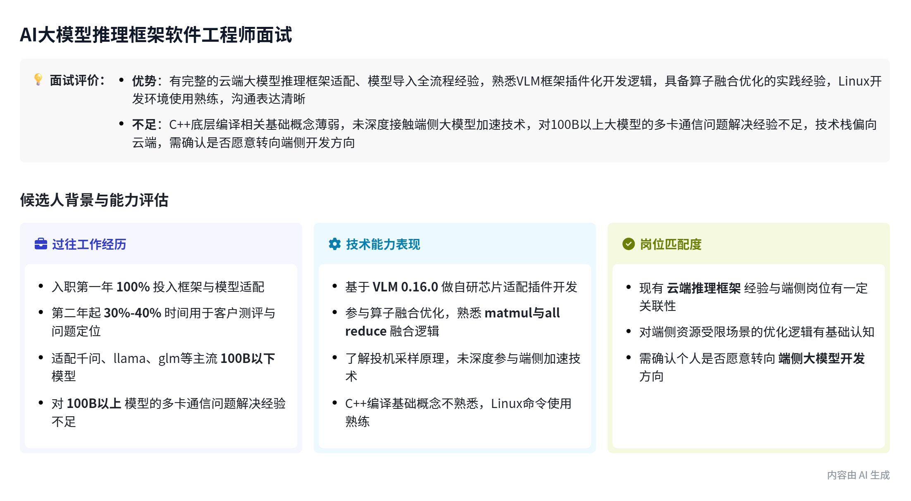
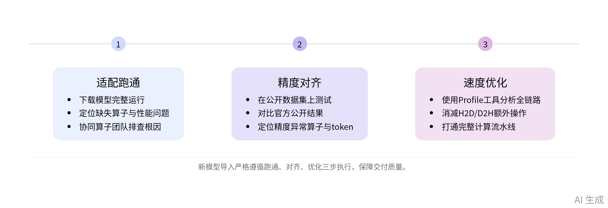

# 智能纪要：【面试】沈殷桀\-AI大模型推理框架软件工程师 2026年8月18日 副本

# 总结

本次为舱驾一体端侧芯片公司大模型框架工程师岗位技术面试，围绕候选人背景、岗位信息开展核验与同步，内容如下：

- **候选人过往云端开发工作背景**

    - **过往工作时间分配**

        - 入职第一年工作内容：100%时间投入推理框架与模型适配工作，无客户对接与外部需求承接。

        - 入职第二年工作分配：30%\-40%时间用于客户测评、问题定位，剩余时间全部投入推理框架迭代。

    - **现有适配模型与技术范围**

        - 已适配模型清单：覆盖千问3、llama、glm等主流模型，以100B以下小模型为主，100B以上模型多卡通信问题暂未解决。

        - VLM框架适配方案：基于VLM 0\.16\.0版本开发自研设备适配插件，适配自有芯片的调度逻辑、内存对齐规则。

        - 新模型导入标准流程：严格遵循「适配跑通→精度对齐→速度优化」三步执行，算子问题定位后提交专项团队修复。

        - 已落地优化实践：参与算子融合、形状操作合并、流水打断优化等工作，未针对KV Cache命中率做专项优化。
    
        - 框架升级工作机制：VLM框架升级存在大量代码冲突，目前借助AI工具辅助处理，一般安排1\-2人负责，配套CI测试保障一致性。
    
        - 所在团队配置：云端框架团队共5\-7人，按适配模型、框架特性划分工作，同步支撑客户联调与新模型导入。

- **招聘方公司与岗位情况说明**

    - **公司基本业务情况**

        - 芯片研发进度：舱驾一体端侧芯片公司，第一代芯片去年已完成流片并进入量产交付阶段，第二代芯片即将启动研发。

        - 人员组织架构：全公司共500余人，其中400余人为软件团队，分为产品软件、媒体软件、系统软件三大部门。

        - 芯片核心参数：端侧芯片定点算力可达上千T，公开参数为600多T@1\.8，支持FP8、BFP8精度，可支撑几十B参数模型运行。

    - **AI团队组织配置**

        - 团队整体规模：AI相关团队共13人，包含驱动移植、runtime适配、大模型框架、编译器、算子开发多个方向。

        - 目标岗位编制：大模型框架岗为新启动招聘序列，计划招聘3人，目前已有1名试用期员工到岗，剩余2个名额待招。

    - **岗位核心工作内容**

        - 核心定位要求：在资源受限的端侧环境下，最大化芯片算力效能，完成开源大模型特性的端侧适配与性能优化。

        - 核心业务方向：一是支撑座舱端侧大模型落地，搭建端云一体任务拆分框架，降低车企云端算力成本；二是探索AIPC场景下的端侧模型应用落地。

        - 技术路线特点：不做全链路自研，以开源框架、开源特性为基础，针对端侧芯片特性做刨根问底式的深度适配。

- **技术核验与双向沟通结果**

    - **端侧技术储备情况**

        - 端侧加速技术认知：了解投机采样、Patch Attention、连续批处理等端侧加速技术原理，曾在GLM\-5模型落地中应用投机采样方案。

        - 开源工具使用情况：模型量化、草稿模型均直接采用开源方案，未针对特定场景做定制化训练与开发。

    - **基础能力核验结果**

        - 日常开发栈：日常开发以C\+\+、Python为主，熟悉Linux常用操作指令，可独立完成进程查询、环境变量查看等操作。

        - 待加强能力项：对C\+\+底层编译段划分、类继承相关专业术语的掌握有待进一步巩固。

    - **双向沟通共识**

        - 路线差异确认：双方明确云端与端侧技术路线存在明确差异，端侧更聚焦单芯片资源受限场景下的效能最大化。

        - 后续意向确认：候选人表示愿意继续了解端侧方向相关内容，双方确认本次面试环节顺利完成，流程正常推进。

总结会议决策

**Yinjie Shen（沈殷桀）**

- 入职第一年 100% 时间投入框架适配、模型适配工作，第二年起 30%\-40% 的时间用于客户测评与问题定位，剩余时间继续投入推理框架相关工作。

- 团队当前交付给客户联调的主流模型包括千问 3、llama、glm，多数为 100B 以下的小模型，超过 100B 的模型会遇到多卡通信问题，目前解决得不够完善。

- 基于 VLM 0\.0\.16\.0 版本做了插件化改造，新增自研芯片适配所需的 model runner、platform、engine 等自定义逻辑，适配自研芯片的内存对齐等特殊要求。

- 适配新模型分为三个步骤：先完成基础适配让模型跑通，再调优精度对齐官方公开数据集结果，最后做性能优化消减 H2D、D2H 等额外操作。

- 会参与算子融合相关的调度工作，融合判断主要基于自研芯片的硬件特性：比如芯片不支持多算子并行时将 matmul 和 all reduce 融合实现通算并行，融合切片、形状改动类的耗时操作，融合消除打断计算流水的 H2D/D2H 操作。

- 了解投机采样的原理，团队在 GLM\-5 中使用该技术，所用的草稿小模型、量化方案均来自开源资源，没有自行针对场景训练定制草稿模型。

- 日常开发主要使用 C\+\+ 和 Python，熟悉 Linux 常用指令，对 C\+\+ 编译段、重载重写的细节区分了解较少。

**卢亚伟**

- 所在公司是端侧舱驾一体芯片公司，端侧技术路线和云端差异较大，端侧 10B 以下才算小模型，单卡运行，不存在多机多卡场景，仅借鉴 VLM 等开源框架的部分设计，落地投机采样等端侧推理加速技术。

- 团队规模 5\-7 人，按模型或特性分工，同时承担新模型导入和客户联调工作，升级 VLM 框架时会安排 1\-2 人处理代码冲突，搭配 AI 辅助和自动化 CI 测试降低维护成本。

- 公司总人数 500 余人，软件团队共 400 余人，分为产品软件、媒体软件、基础系统软件三大部门，当前 AI 相关团队共 13 人，大模型框架工程师岗位预计招 3 人，目前仅 1 名试用期员工在岗。

- 端侧场景核心目标是在算力、带宽资源受限的环境下最大化芯片效能，当前有座舱端云协同、AIPC 两条探索产品线，底层芯片能力共享，会对 KVCache 命中率提升等特定特性做深度深挖适配。

- 端侧芯片主流为上千 T 的定点算力，仅支持 FP8、BFP8 这类低精度浮点，不支持 FP32，通过端侧跑大模型可以大幅降低车企的云端算力使用成本。

# 面试评价

**结论：技术面勉强通过，岗位匹配度中，建议进入终面 \+ 实操考核**。候选人模型导入方法论清晰、端侧加速技术有落地经验，但深度优化与底层基础略弱；云端背景转端侧方向意愿表达但需验证。

|维度|评价|
|---|---|
|**技术深度**|中。了解投机采样、Patch Attention、连续批处理原理，并在 GLM\-5 落地投机采样；但量化与草稿模型直接用开源方案，未做场景定制。|
|**工程落地**|中。参与算子融合、形状操作合并、流水打断优化；新模型导入"适配跑通→精度对齐→速度优化"流程规范；但未做 KV Cache 命中率专项优化，100B 以上多卡通信问题未解决。|
|**基础功底**|待加强。C\+\+/Python 栈日常可用，Linux 操作熟练；但 C\+\+ 编译段划分、类继承等底层术语掌握不牢，需补齐。|
|**岗位匹配**|中。云端框架适配经验与端侧"开源框架深度适配"路线方向相通；GLM\-5 投机采样落地对端侧场景有借鉴价值；但多卡通信短板在端侧单芯片场景影响有限。|
|**稳定性**|待核实。纪要未展开离职原因与任职年限，需 HR 补充复盘。|
|**沟通表达**|良好。能清晰描述工作分配、流程与边界，态度开放，明确表达继续了解端侧方向的意愿。|

**后续建议**

- 终面 \+ 实操：安排端侧资源约束下的模型适配小课题，验证迁移能力与深度优化潜力。

- 基础补齐：C\+\+ 底层与编译段相关知识做针对性问答，判断学习曲线。

- HR 复盘：补全过往任职时长与离职根因，确认稳定性与岗位判断力。

- 横向对比：与同岗候选人袁海相比，沈殷桀深度优化与基础功底略弱，但端侧投机采样落地是亮点，可作为差异化考量。

1. 了解投机采样、Patch Attention、连续批处理原理，并在 GLM\-5 落地投机采样；但量化与草稿模型直接用开源方案，未做场景定制。

2. 5\~7人团队开发框架，1\.5人投入升级vLLM框架，个人需要投入30%时间维护客户模型

3. 参与算子融合、形状操作合并、流水打断优化；新模型导入"适配跑通→精度对齐→速度优化"流程规范；但未做 KV Cache 命中率专项优化，100B 以上多卡通信问题未解决。

4. C\+\+/Python 能正常开发，但基础问题回答不上来，Linux 操作熟练

5. 能清晰描述工作分配、流程与边界，明确表达继续了解端侧方向的意愿。

