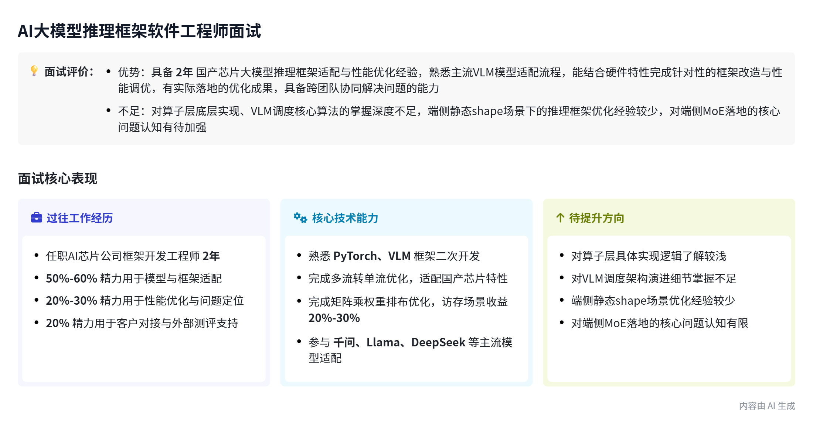
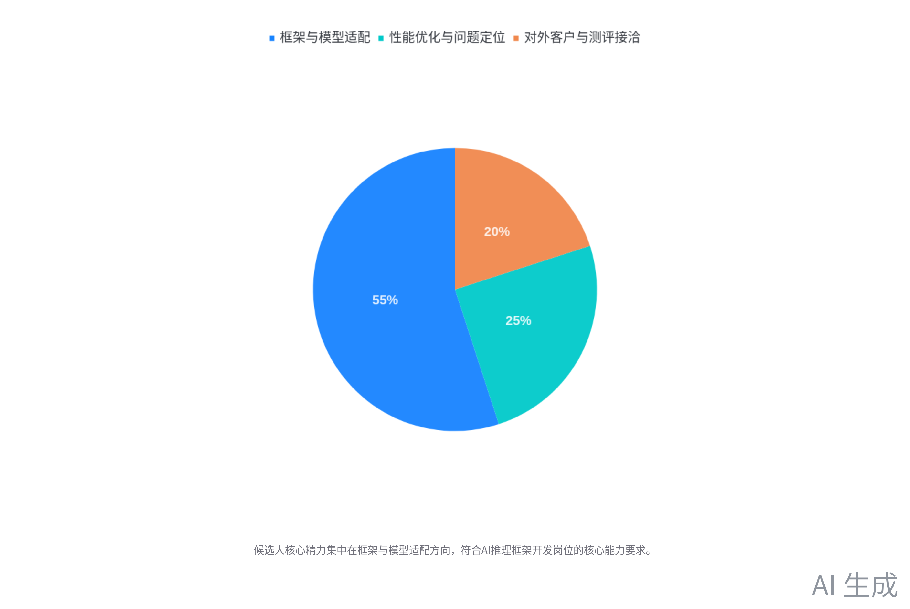
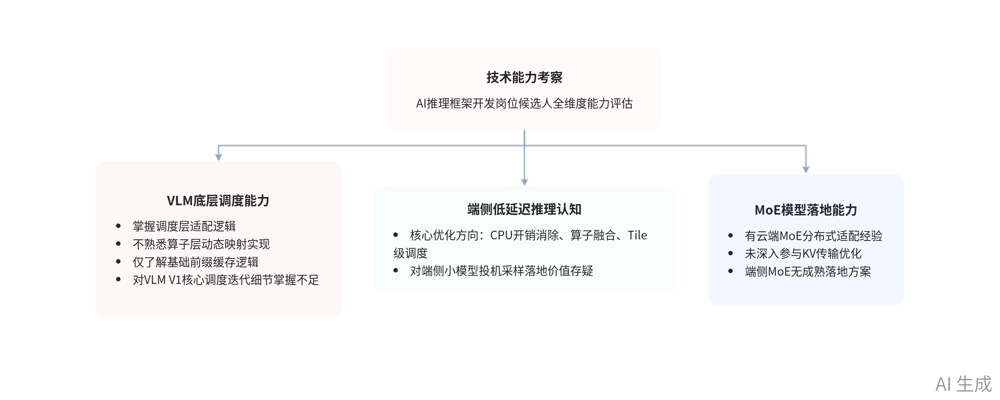

# 总结

本次为AI推理框架开发岗位招聘面试，面试官对候选人沈殷桀的工作背景、技术能力进行全维度考察，内容如下：

- **候选人工作背景与精力分配**

    - **核心工作模块**

        - 框架与模型适配：围绕 VLM、PyTorch 做二次开发，参与千问、llama、DeepSeek、ernie 等主流模型适配，熟悉prefetch机制。

        - 性能优化与问题定位：针对国产芯片特性做端到端模型性能优化，通过算子profile、参数形状分析协同算子团队完成优化。

        - 对外对接与测评支持：负责客户模型部署、第三方测评对接，曾支持星空类国测、上海 AI Lab、江实验室等外部测评。

    - **工作精力分配**

        - 框架与模型适配：占总工作精力的 50%\-60%，为候选人日常投入占比最高的核心工作方向。

        - 性能优化与问题定位：占总工作精力的 20%\-30%，为候选人日常投入的次要工作方向。

        - 对外客户与测评接洽：占总工作精力的 20% 左右，为候选人日常投入的辅助工作方向。

- **推理框架核心落地成果**

    - **通信模块多流转单流优化**

        - 优化背景：原生 PyTorch 通信模块为通信、计算分多流设计，适配的国产芯片不支持多流并行，无重叠执行收益。

        - 优化内容：将通信、计算算子统一合并至单流执行，消除多流切换开销，为芯片适配初期的基础优化工作。

    - **矩阵乘权重排布优化**

        - 优化背景：小batch场景下矩阵乘为访存密集型，原生行优先排布存在 HBM bank conflict，访存效率较低。

        - 优化内容：在模型权重加载阶段将权重调整为 block 级列优先排布，适配硬件访存特性，小batch场景性能提升 20%\-30%，已量产。

    - **VLM 框架适配工作**

        - KV Cache 适配：针对国产芯片 256 强制对齐要求，在调度层增加切分逻辑，兼容用户 32、64 等小 block 的使用需求。

        - 适配原则：尽量复用 VLM 原生特性，仅修改硬件不兼容部分，最大程度降低对原生框架的代码改动量。

- **技术能力考察结果**

    - **VLM 底层调度能力**

        - 算子层实现认知：仅了解 VLM 调度层适配逻辑，不掌握算子层动态 shape、动态 index 映射的通用实现方案。

        - 前缀缓存认知：仅了解前缀缓存基础复用逻辑，不掌握 VLM 与基础 Attention 前缀缓存算法的核心差异。

        - 版本迭代认知：仅了解 VLM V0 到 V1 的异步拷贝优化点，对核心的调度逻辑迭代细节掌握不足。

    - **端侧低延迟推理认知**
    
        - 核心优化方向：认为端侧低延迟推理需重点关注 CPU 开销消除、算子融合、Tile 级调度三个核心方向。
    
        - 投机采样认知：对端侧投机采样的落地价值存疑，认为小模型场景下草稿模型与目标模型分布难以对齐。
    
    - **MoE 模型落地能力**
    
        - 云端 MoE 适配经验：参与过千问、文心等 MoE 模型适配，熟悉 EP 分布式部署、TP\+DP 部署模式，未深入参与 KV 传输优化。
    
        - 端侧 MoE 认知：仅了解端侧 MoE 需做算子融合减少分发开销，对静态 shape 下 token padding、负载均衡等问题无成熟落地方案。
    
    - **编程能力相关确认**
    
        - 日常开发工具：日常开发以 Python 为主，需扩展 PyTorch 底层时，会使用 C\+\+ 编写相关适配逻辑。
    
        - 编程测试情况：因候选人设备无飞书共享权限，原定现场编程测试环节未实际开展。
